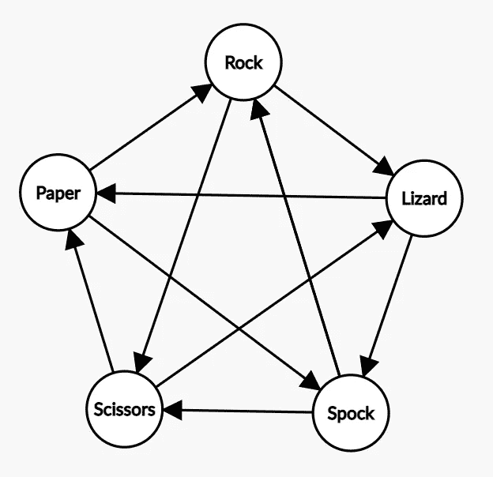
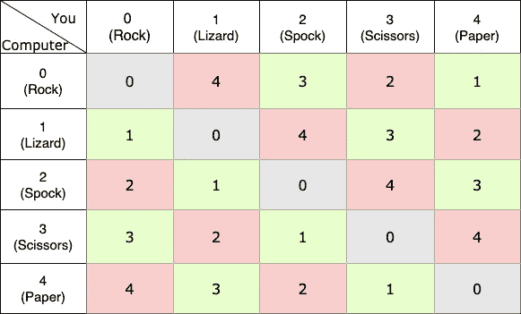

# 数学如何帮助编程的 3 个例子

> 原文：<https://medium.com/geekculture/3-examples-of-how-mathematics-can-help-in-programming-c9c4f3267dde?source=collection_archive---------22----------------------->

数学似乎经常与编程密切相关——你需要了解其中一个才能擅长另一个。这是真的吗？嗯，这很大程度上取决于你工作的领域——如果你从事图形和游戏开发，你可能需要矩阵乘法、向量空间、投影和代数；如果你是数据科学家，你可能需要良好的统计学知识；ML 问题的代数等等。

但是一般来说(至少从我有限的经验来看),一般的程序员使用一点算术和一些基本的代数。

但这并不意味着懂数学对你的日常工作没有帮助，我将用三个简单的例子来证明这一点。

# 1.布尔代数

作为一名程序员，你应该熟悉*布尔值*和 *if 语句*。显然，知道几个简单的规则叫做 [*德摩根定律*](https://en.wikipedia.org/wiki/De_Morgan%27s_laws) 可能会在写作、重构或试图理解更复杂的情况时节省你的时间。

先说个例子。想象你看到了这样的表达:

```
not(not A or not B) **and** not C and not D and not E
```

而你需要理解它，或者更好——重写。我相信你可以在不知道任何逻辑规则的情况下做到这一点，但我也相信这需要一些时间。但是如果你知道德摩根定律，重写这个表达式是相当容易的:

*   析取的否定是否定的合取。
*   连词的否定是否定的析取。

或者在编程中:

*   not (A 或 B) =(非 A)和(非 B)
*   not (A 和 B) =(非 A)或(非 B)

所以现在我们的表达方式可以快速而自信地改写为:

```
A and B **and** not(C or D or E)
```

使用德摩根定律的另一个好处是，除了让代码看起来更干净、可读性更强之外，还可以绕过短路(对于`!A || !B`，大多数语言会停止计算`!A`是否为真，因为这样一来`!B`值是多少就无关紧要了，如果`A`和`B`是函数的话，这一点可能很重要)，如果反转一个值而不是两个值(例如`!(A or B)`而不是`!A and !B`，还可以节省一个或几个 CPU 周期。

# 2.图论

正如史蒂夫·耶格在他的博客文章[“在谷歌得到那份工作”](http://steve-yegge.blogspot.com/2008/03/get-that-job-at-google.html)中所说:

> 每当有人给你出难题时，想想图表。它们是表示任何一种关系的最基本和最灵活的方式，所以任何有趣的设计问题都有一半的机会涉及到图。在转移到其他解决方案类型之前，一定要确保你想不出用图表来解决它的方法。

虽然这可能有点夸张，但是确实有很多问题可以，并且已经用[图论](https://en.wikipedia.org/wiki/Graph_theory)解决了。几乎每次你用谷歌搜索一些东西，在脸书跟踪人们，或者使用地图应用程序寻找最快或最短的路线时，[图论都在发挥作用](https://www.mdpi.com/2411-5134/5/1/10/htm)。

我不会深入图论本身，因为那里有很多精彩的资源(例如 [*图论简介:计算机科学视角*](https://www.youtube.com/watch?v=LFKZLXVO-Dg) by Reducible ),而是从实际例子开始。

想象一下，你需要实现*石头剪刀布蜥蜴斯波克*来和计算机对战(因为那确实是程序员日常处理的那种问题)。规则是:

> “剪刀剪纸，纸盖石头，石头压死蜥蜴，蜥蜴毒死斯波克，斯波克砸碎剪刀，剪刀砍头蜥蜴，蜥蜴吃纸，纸反驳斯波克，斯波克蒸发石头，一如既往，石头压死剪刀。”

最初的本能可能是写类似这样的东西，用大量的 *if* :

```
if computer_action == "scissors" & user_action == "paper":
    print("You loose")
elif computer_action == "rock" & user_action == "paper":
    print("You win")
elif computer_action == "rock" & user_action == "lizard":
    print("You loose")
...
```

这将需要 21 个条件(20 个用于输赢情况，1 个用于 5 个平局情况)。当然，您可以通过嵌套一些案例来优化它:

```
if computer_action == "scissors":
    if user_action == "paper" or user_action == "lizard":
        print("You loose")
    else:
        print("You win")
if computer_action == "paper":
    if ...
...
```

虽然这样看起来好一点，但是如果你需要模拟一个 7，51，或者 [101 个角色](https://www.umop.com/rps101.htm)的游戏呢？

这就是“*思维图*”(并了解一些模运算)可以发挥作用的地方(*):

首先，让我们把游戏想象成一个[有向图](https://en.wikipedia.org/wiki/Directed_graph)，其中边是角色，连接它们的顶点是有向的，因此比赛的获胜者由一个指向它的箭头表示。



尽管这种表示看起来没有简单英语中的规则或一堆 if 语句复杂，但它仍然不是非常数学化。因此，我们将用数字替换字符，即 rock-0、lizard-1、Spock-2、scissors-3 和 paper-4。


现在我们需要一种表示匹配的方式。这可以通过减法来完成——例如，如果你的对手(在这种情况下是计算机)选择了斯波克( *2* )，而你选择了纸( *4* )，我们将这场比赛表示为*2–4 =-2*。请注意，这种表示法确保了玩家选择之间的区别，即如果计算机选择纸( *4* )而您选择斯波克( *2* )，比赛将由相反的数字*4–2 = 2*表示。

如果我们现在仔细观察代表比赛的数字，我们会注意到每场比赛的[模](https://en.wikipedia.org/wiki/Modular_arithmetic#Examples) 5 ( *mod5* )会产生一些有趣的结果——你赢得的每场比赛的结果都是奇数，而计算机赢得的每场比赛的结果都是偶数。



`(computer - you) mod5`

因此，在将游戏表示为图形并使用一些模运算后，我们可以只用几行代码重写我们的解决方案:

```
result = computer_action - user_action
result_mod = result % 5if result_mod == 0: print("It's a tie")
elif (result_mod)%2 == 0: print("You lost")
elif (result_mod)%2 == 1: print("You won")
```

*这种方法仅在下面的[锦标赛图形](https://en.wikipedia.org/wiki/Tournament_(graph_theory))不均匀且 [k-complete](https://en.wikipedia.org/wiki/Complete_graph) 时有效。

# 3.数学归纳

数学通常与一种思维方式联系在一起——也就是说，拥有数学知识(或者，我认为，拥有任何科学背景)的人被期望以一种更有条理、更具分析性的方式思考，因此成为优秀的问题解决者。但是这种技能如何量化呢？有什么具体的东西可以学着应用在日常工作中吗？

数学归纳法是一种数学证明技术，用来证明一个陈述 *P* ( *n* )对每一个自然数 *n* = 0，1，2，3，.。。

使用数学归纳法证明某事的过程相当简单，包括三个主要步骤:

1.  定义一个**基例**，使得证明**首字母 n** 的语句，而不需要假设任何其他情况的知识。
2.  假设语句对 **n=k** 成立。
3.  表明它也适用于随后的**步骤** **n=k+1** (使用步骤 2 中的假设)。

让我们通过一个简单的例子来证明 *1+3+5+⋯+(2n−1)=n* 对于每个 n∈ℤ+(即对于每个正整数)都成立。

步骤:

1.  **基本情况:** *n=1(因为我们为 n∈ℤ+证明了这一点)确实是真的:*

*2 ⋅1–1 = 1*

2.假设语句对 **n=k** : *成立，让结果对 n=k 为真，即*

*1+3+5+⋯+(2𝑘−1)=𝑘*

3.表明它也适用于 **n=k+1** :

*1+3+5+⋯+(2𝑘−1)+(2(****𝑘+1****)-1)=1+3+5+⋯+(2𝑘−1)+(2𝑘+1)=(****𝑘+1****)*

*因为根据我们的假设 1+3+5+⋯+(2𝑘−1)=𝑘(见第 2 步),我们可以将其重写为*

*k***+(2𝑘+1)=(𝑘+1)哪个确实是真的。**

*因此，这证明了该等式适用于任何正自然数，因为它适用于 *1* ，并且由于它适用于每个 *k+1* ，因此，它适用于 *1+1=2* ，然后 *3 (2+1)* 、 *4* ，以此类推，适用于所有正整数。*

*特里斯汀·克利夫兰完美地表达了我们在这里所做的事情:*

> *数学归纳法证明了我们可以在梯子上爬到我们喜欢的高度，通过证明我们可以爬到最低的梯级(基础**)并且从每个梯级我们可以爬到下一个梯级(步骤**)。*****

*****这与编程有什么关系？嗯，正如罗伯特·哈珀在《 [*标准 ML 中的编程*](https://www.cs.cmu.edu/~rwh/introsml/techniques/indrec.htm) 》中所说:*****

> *****递归编程时，归纳思考*****

*****让我们来看一下递归的例子——求 m 的和*****

**********

*****一个可能的解决方案(出于解释原因，代码非常冗长):*****

```
*****def recursive_sum(m):
    if m == 0: 
        return 0
    else: 
        k = m*(m+1)/2 
        k_minus_one = recursive_sum(m-1)
        return k + k_minus_one*****
```

*****这可以分为三个步骤:*****

1.  *****建立一个**基础案例**(本例为 0)。*****
2.  *****寻找 **m=k** 的值。*****
3.  *****使用来自步骤2 的值 **k** 和等式的连续成员 **k-1** (它是 k-1 而不是 k+1，因为我们是按降序移动的)来得到最终答案。*****

*****由于这是一个相当简单的例子，数学归纳法在这里似乎没有什么帮助。但用“思维归纳法”实现递归，可以帮助组织思路，解决更复杂的情况。*****

*****所以说到底——程序员需要数学吗？虽然这取决于领域，但我认为在大多数情况下答案是否定的。然而，正如我们之前所展示的，知道它可能会让你的生活更轻松。*****

*****所以看 Youtube 上不断推荐的数学视频吧，因为你永远不知道它什么时候会有帮助。*****

******我在研究这篇文章时发现的其他阅读材料，但不包括:******

*   *****[Project Euler](https://projecteuler.net/about) —为对数学和计算机编程感兴趣的人设计的一组计算问题。*****
*   *****计算机科学中的数学。*****