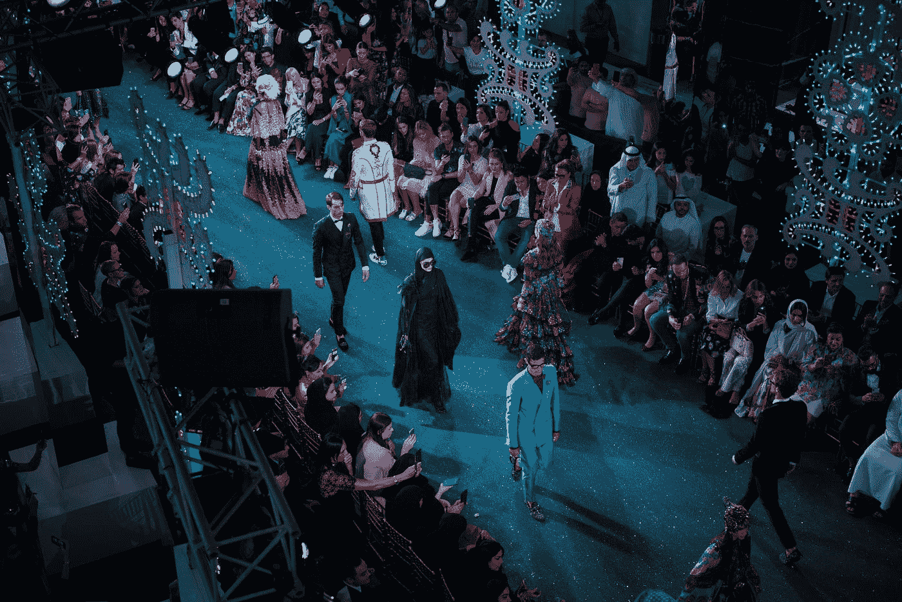
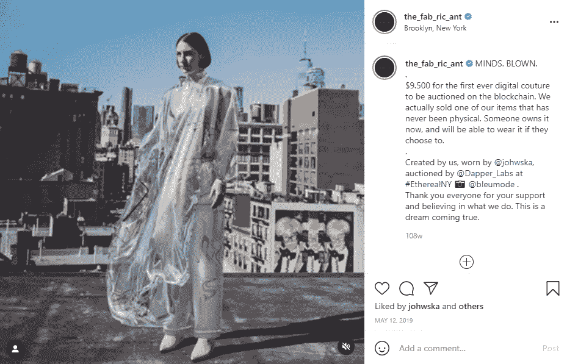
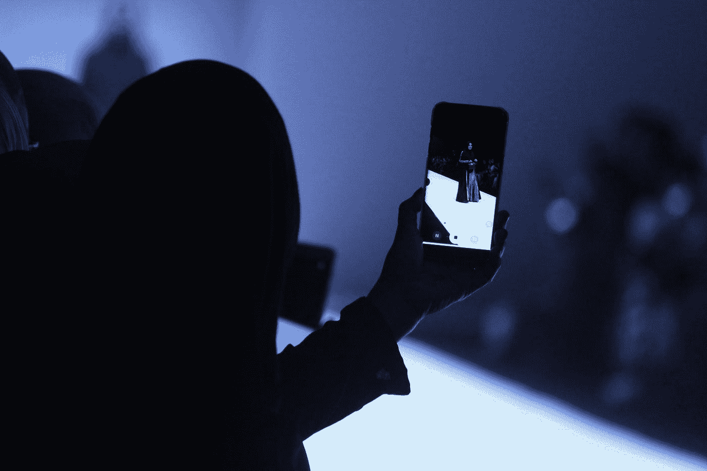
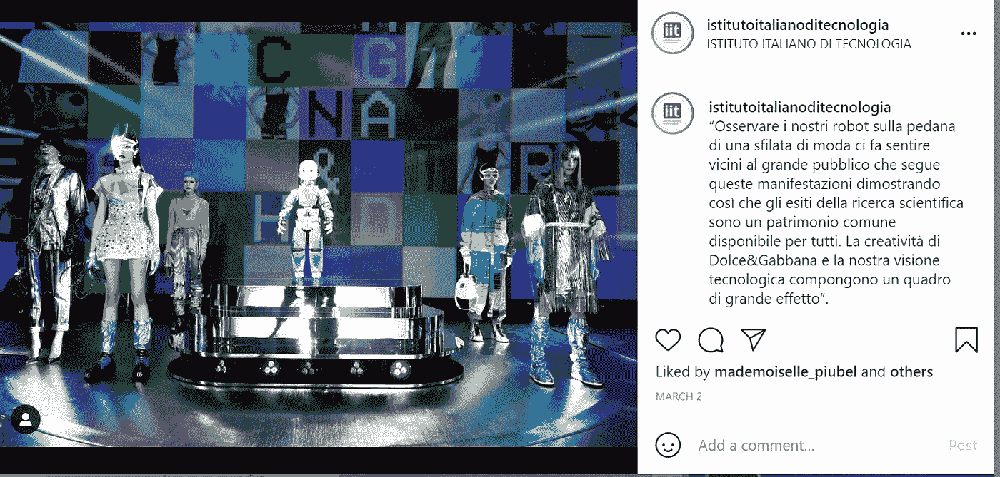
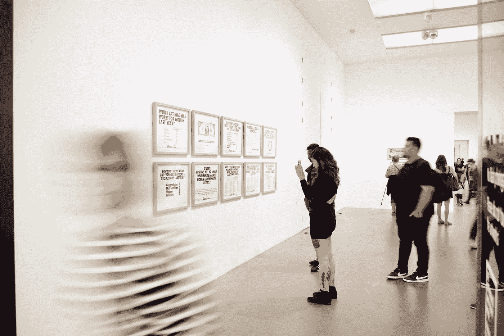

# 当今时尚界的三大未来科技趋势

> 原文：<https://medium.com/geekculture/3-futuristic-tech-trends-of-todays-fashion-industry-be5ea7ec660d?source=collection_archive---------20----------------------->

## 机器人时装秀听起来很有趣

Photo by [Michael Lee](https://unsplash.com/@guoshiwushuang?utm_source=medium&utm_medium=referral) on [Unsplash](https://unsplash.com?utm_source=medium&utm_medium=referral)

与最近许多行业的数字化转型明显加速类似，疫情在很大程度上刺激了时尚科技行业。设计师和零售商不得不调整时尚产品、供应链以及他们的实体店，以更好地满足客户的生活方式，并使购物体验更加轻松。

为了撰写这篇文章，我使用了几个社交倾听工具来寻找时尚界的趋势和创新*(我认为是未来派的)*，一些商店和品牌已经在实施了。

# 虚拟服装

Photo by [Karina Tes](https://unsplash.com/@karinatess?utm_source=medium&utm_medium=referral) on [Unsplash](https://unsplash.com?utm_source=medium&utm_medium=referral)

这是我认为最有趣和最具革命性的创新之一。主要是因为它的可持续发展理念。

[数码时尚](https://www.businessinsider.com/what-is-digital-fashion-the-fabricant-nft-tribute-brand-2021-3?IR=T) 允许顾客购买数码版的服装，品牌会将其覆盖在顾客的照片或视频上。这些时尚单品只存在于[数字空间](https://www.voguebusiness.com/technology/these-platforms-want-to-be-the-farfetch-of-digital-fashion)。

已经有一些品牌和虚拟服装系列。例如，荷兰数码时装屋[的制作者](https://www.thefabricant.com/)还在 2019 年**创造了世界上第一件 [**区块链礼服**](https://luxurylaunches.com/auctions/this-is-the-worlds-first-ever-digital-blockchain-dress-and-it-sold-for-9500.php) 。**

[The screenshot is made by the author for illustrative purposes](https://www.instagram.com/p/BxVzibUopFM/?utm_source=ig_embed). All rights belong to [The Fabricant.](https://www.instagram.com/the_fab_ric_ant/)

2021 年 4 月，只有受邀才能参加的市场[非物质化的](https://thedematerialised.com/)推出了独家 NFT(不可替代代币)系列，仅在 48 小时内[即可购买。](https://www.prnewswire.com/news-releases/exclusive-nft-collection-from-rtfkt-and-the-fabricant-drops-april-16th-on-the-dematerialised-marketspace-301270717.html)这次评选是虚拟运动鞋品牌 RTFKT 和制造商之间的合作。

数码时尚的概念已经超越了高级时尚单品。例如，一个数码时尚品牌， [Dress-X，](https://dressx.com/)是一家平价的国际多品牌零售商，拥有 100 多个数码时尚品牌和 1000 多种服装，价格从 21 美元起。要穿他们的一件时装，顾客需要上传一张自己的照片，照片有三个主要要求:服装、灯光和头发。

## 这再一次证明了虚拟时尚不仅是一个假设的概念，而且已经是现代时尚产业的一部分。

纯数字时尚产品减少了专门为照片或视频购买实物的需求，从而减少了快速时尚造成的浪费。这些服装不需要生产、运输和其他潜在的[污染供应链的组成部分。](https://www.businessinsider.com/what-is-digital-fashion-the-fabricant-nft-tribute-brand-2021-3?IR=T)

# 机器人时装秀

Photo by [Raden Prasetya](https://unsplash.com/@radenprasetya?utm_source=medium&utm_medium=referral) on [Unsplash](https://unsplash.com?utm_source=medium&utm_medium=referral)

2021 年 3 月，Dolce & Gabanna 2021 秋季系列在一场由人体模特和[机器人](https://www.wmagazine.com/fashion/dolce-gabbana-fall-2021-robots)共同展示的秀中亮相。该品牌与专注于人工智能和服务机器人的意大利技术研究所(Istituto Italiano di Tecnologia)密切合作，推出的机器人不仅是展会的模特，还创造了该系列的几个造型。

[The screenshot](https://www.instagram.com/p/CL6vQWNnjfc/) was made by the author for illustration purposes. All rights belong to [ISTITUTO ITALIANO DI TECNOLOGIA](https://www.instagram.com/explore/locations/258757358/istituto-italiano-di-tecnologia/).

# 虚拟时装展览

Photo by [iSAW Company](https://unsplash.com/@isaw?utm_source=medium&utm_medium=referral) on [Unsplash](https://unsplash.com?utm_source=medium&utm_medium=referral)

由于疫情的情况，去年夏天，[米兰数码时装周](https://www.yesmilano.it/en/whats-on/all-events/milano-digital-fashion-week)以数码方式举行。这场仅在网上举行的活动是第一次完全数字化的时装周体验，其中还包括虚拟展厅和展板，也是去年其他时尚行业活动的灵感来源。

我能想到的另一个例子是谷歌艺术文化网站，它允许人们虚拟地参观展览和博物馆。例如，从 2017 年起，我们可以参观大都会艺术博物馆的展览:[川久保玲/Comme des garons:中间的艺术](https://artsandculture.google.com/exhibit/rei-kawakubo-comme-des-gar%C3%A7ons-%C2%A0art-of-the-in-between/sgJSRCff8h7zKA?hl=en)

今天，大多数在线活动都组织得非常好，也更容易参加。除了我已经在线参加的一个在线时尚活动之外，我对即将到来的 [HPE 探索](https://www.hpe.com/us/en/discover.html)感到非常兴奋，听听专家们如何谈论技术的好处以及人工智能如何改善各种行业，这是我为 Medium 写作的主要焦点。

你听说过或实际尝试过这些技术创新吗？如果有，请在评论中告诉我！我想听听你的经历！

至于我，我尝试了 AR 化妆品应用程序和 AR 太阳镜应用程序。从客户体验的角度来看，我真的很享受。我最终买了这个产品，它和 AR 应用程序中的一模一样——一切都非常匹配。