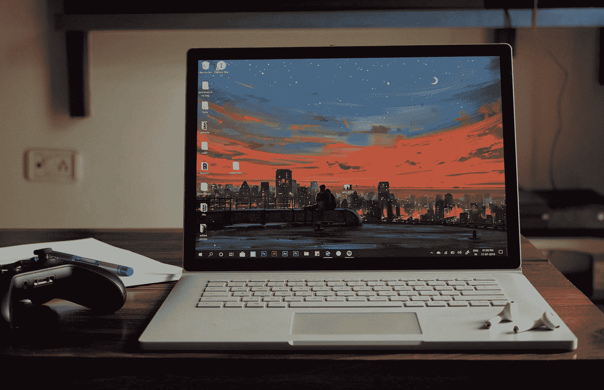

# 现在 3 只高科技股票价格诱人

> 原文：<https://medium.com/geekculture/3-high-tech-stocks-at-attractive-prices-now-e16f2dc82d09?source=collection_archive---------22----------------------->

## 股票

## 这三只高科技股票现在看起来很便宜

Photo by [kabir cheema](https://unsplash.com/@kabircheema?utm_source=medium&utm_medium=referral) on [Unsplash](https://unsplash.com?utm_source=medium&utm_medium=referral)

# 微软

例如，微软( [MSFT](https://www.barchart.com/stocks/quotes/MSFT/overview) )最近在 7 月 26 日公布了出色的 Q2 业绩，自由现金流(FCF)利润率为 [34.3%。MSFT 股票现在的交易价格很便宜。](https://www.microsoft.com/en-us/investor/earnings/fy-2022-q4/press-release-webcast)