# 轻松 UX 的 3 个关键要素

> 原文：<https://medium.com/geekculture/3-key-components-for-effortless-ux-94d4f3dcaba3?source=collection_archive---------16----------------------->

使用你的应用程序会感到费力和迷失方向吗？你可能会漏掉其中一个。请记住，这不是唯一的三个标准，但它们是三个重要的标准。

Photo by [Pablo Arroyo](https://unsplash.com/@pablogamedev?utm_source=unsplash&utm_medium=referral&utm_content=creditCopyText) on [Unsplash](https://unsplash.com/s/photos/easy?utm_source=unsplash&utm_medium=referral&utm_content=creditCopyText).

# 介绍

“去他妈的！”布拉德大叫道，他愤怒地将双臂举向空中。他瘫倒在椅子上。“太难了。我不知道点什么，我害怕点错东西会把我带到错误的地方，我会迷路或破坏网站。”

我设计的一个 web 应用程序的用户测试已经进行了大约 5 分钟。Brad 和他的一群同事已经慷慨地自愿测试该软件并提供反馈。我注意到房间里的许多其他志愿者和 Brad 一样沮丧。事实上，我能感觉到布拉德爆发前四分半钟的紧张气氛。

这个特别的网络应用程序的问题是我经常遇到的一个问题:它不容易使用。该应用程序提供了太多的功能，每个功能都需要很长时间来学习。该应用包含太多的行话和内部知识，作为使用的先决条件。尽管有“方便的”FAQ 部分——它定义了所有的术语，并提供了访问产品各个方面的分步解释——这个应用程序完全不可用。

作为一名 UX 设计师，我认为沉迷于设计功能和抢先解决问题相对容易。人们很容易忽略 UX 设计师的首要目标:轻松的用户体验。

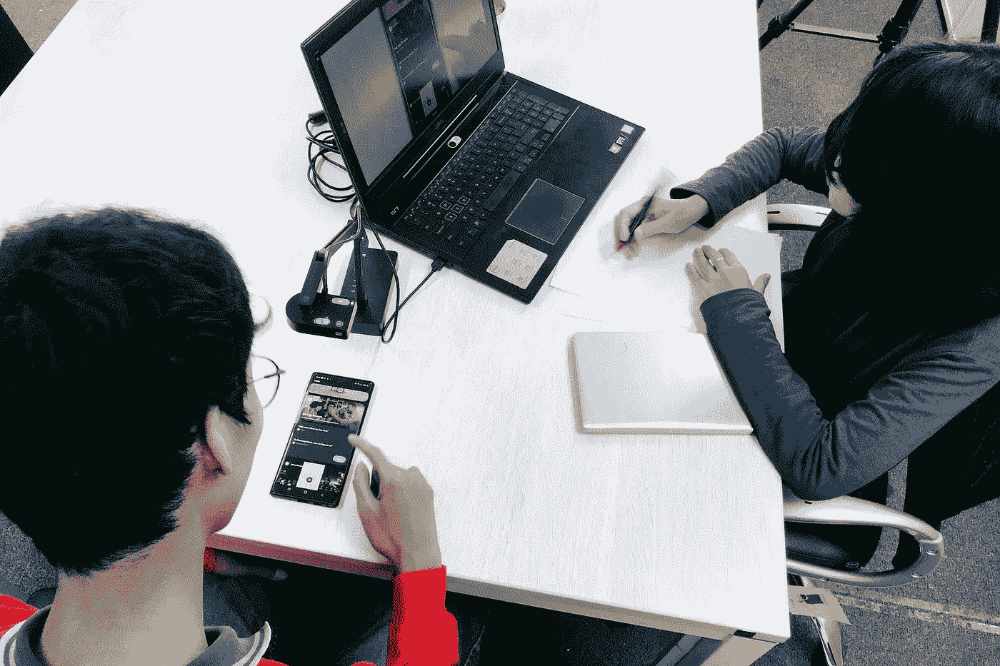

As UX Designers, it’s easy to lose sight of our primary objective: an effortless user experience. Photo by [UX Indonesia](https://unsplash.com/@uxindo?utm_source=unsplash&utm_medium=referral&utm_content=creditCopyText) on [Unsplash](https://unsplash.com/s/photos/user-testing?utm_source=unsplash&utm_medium=referral&utm_content=creditCopyText)

## 什么是“毫不费力的 UX”？

“轻松的 UX”不是一个真正的术语。我五分钟前刚编好的。但你很清楚我的意思。好的应用程序简单易用。本质上，我们不应该强迫我们的用户考虑如何使用我们的产品。我们希望我们的 UX 感觉如此自然，即使是第一次用户也可以直观地访问每一个功能。

对我来说，“毫不费力的 UX”指的是在每一步都将认知负荷最小化的用户体验。Nick Babich 不久前写了一篇[的著名文章](https://uxplanet.org/animated-transitions-in-mobile-apps-412b8e8478e7)，他在文章中讨论了保持最低认知负荷的重要性。巴比奇将“认知负荷”定义为“使用一个产品所需的脑力劳动量。”

“一般来说，”巴比奇澄清道，“使用一个产品需要的努力越多，它就变得越不受欢迎。”换句话说，如果我的应用程序有一个学习曲线，我的应用程序会比它的价值更麻烦。

> 认知负荷是使用产品所需的脑力劳动量。认知负荷会直接影响用户与你的应用程序交互的难易程度。一般来说，使用一个产品需要的努力越多，它就变得越不受欢迎。—《UX 星球》主编尼克·巴比奇

在《不要让我思考》这本书里，可用性专家 Steve Krug 强调了 Babich 的观点，他断言用户花在学习如何使用应用程序上的时间很少。按照克鲁格的说法，“我们不知道事物是如何运作的。我们蒙混过关。”他解释说，用户宁愿随意点击，直到他们到达他们想要的屏幕，而不是阅读用户指南或常见问题部分的一句话。

如果克鲁格是对的，用户更喜欢“蒙混过关”，那么我们希望以一种允许用户相对容易蒙混过关的方式来设计我们的产品。如果用户不会花时间去了解我们产品的细微差别，那么我们应该设计没有细微差别的产品。我们应该用毫不费力的 UX 设计产品。

“[Users] don’t figure out how things work. We muddle through.” — Steve Krug

那么，我们如何才能构建轻松的用户体验呢？在我相对短暂的设计生涯中，我发现三个理念构成了轻松 UX 的核心:(1)一致性，(2)简单性，(3)模拟人类互动。在接下来的段落中，我们将看看一些业内最成功的品牌是如何在他们的产品中应用这三个理念的。我们还将探索任何技能水平和背景的 UX 设计师如何在我们自己的设计中融入这些元素。

# 1.一致性

## **什么是一致性？**

一致性是打造轻松 UX 的第一要素。过去很多人都写过关于一致性的文章，但是对于我们来说，“一致性”指的是以相同的方式呈现相似类型信息的过程，有效地在我们的应用程序中创建模式。一致性非常重要，因为人类的大脑本能地捕捉模式。我们非常擅长这个。

在 2008 年的一篇名为*认知模式识别理论*的论文中，学者皮、廖、刘和写了大量关于人类惊人的模式识别能力的文章。作者认为“模式识别是人类最基本的认知或智能。”人类的基本智力。根据这项研究，我们发现——更重要的是*从*中学习——模式的能力为所有其他人类智能提供了基础。毫不费力的 UX 利用了这种与生俱来的人类能力。

Our ability to find and l*earn from* patterns provides a foundation for all other human intelligence.

如果我们软件的核心功能利用一小组基本模式，用户会发现熟悉我们的软件更容易。一旦他们学会了基本模式，他们就学会了整个应用程序的基础。为了更好地理解一致性，让我们来看看这个概念的实际应用。

## **成功的品牌如何运用一致性？**

微软成功地证明了其 Office 系列产品的一致性。虽然 Word 和 PowerPoint 是截然不同的工具，但是如果你知道其中一个的基本功能，你就知道另一个的基本功能。顶部的工具栏，文件、编辑、查看、插入、格式等菜单，对于 Office 套件中的几乎所有产品来说都是基本相同的。整个套件都有设计一致性。一旦你花了 15 分钟使用 Word，你就可以在 PowerPoint 中左对齐一些文本，或者在 Excel 中打印一份文档。

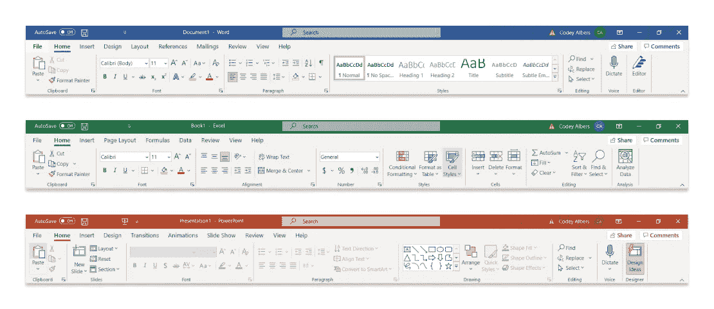

Microsoft shows consistency with the toolbar across their Office suite of products.

脸书移动应用程序提供了另一个一致性的极好例子。现在让我们只关注他们的主页。每个帖子都驻留在自己单独的卡片上。在每张卡片上，用户可以查看发帖人、发帖人的个人资料图片、发帖时间以及发帖内容。每张卡片上的个人资料图片大小相同，每张卡片上的帖子字体和大小相同，每张卡片上的姓名和帖子日期与个人资料图片的距离相同。每张卡片都提供相同的操作:喜欢帖子或评论帖子。每个帖子还包含省略号，可以打开一个包含更多操作的菜单。点击该人的姓名或个人资料图片，用户将进入发帖人的个人资料页面。每个帖子的行为都完全一样。一旦用户与一篇文章互动，他们就会明白主页的其他部分是如何工作的。这就是一致性。

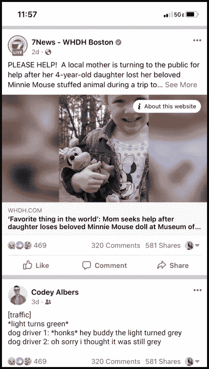

当应用正确时，一致性是如此的微妙以至于你几乎注意不到它。但是当一个应用程序缺乏一致性时，用户会立即感觉到有问题。想象一下，如果脸书主页上的每个帖子都包含不同的行为。想象一下，如果每张卡片上的字体和字体大小不同。到那时，脸书实际上将变得无法使用。

## **我如何将一致性应用到我自己的设计中？**

从小处着手。首先确保 UI 组件的一致性，然后解决 UX 问题。你所有的钮扣都有同样的填充物吗？整个设计中所有 H2 的字体大小都一样吗？解决了设计的视觉一致性后，你可以继续对一致性进行更抽象的解释。下面我们来看一个例子。

在上图中，我们可以看到同一个列表制作应用程序中的两个屏幕。在左侧，用户可以通过点击浮动操作按钮来添加新的列表项。在右边，用户必须点击列表顶部固定的“添加新项”按钮。尽管这些屏幕保持了视觉上的一致性(在两个屏幕上，列表项具有相同的高度、宽度、颜色等)。)，屏幕在按钮位置和按钮类型上缺乏一致性。一致性要求设计者要么选择浮动的动作按钮，要么选择固定的顶部按钮，并将这个概念应用到用户可以添加列表项的每个实例中。让我们再剖析一个例子来说明这一点。

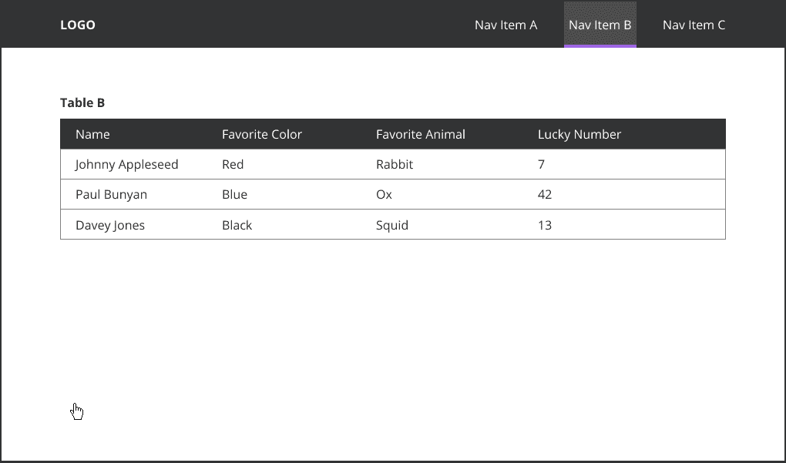

在上面的 gif 图中(它受到我最近工作的一个真实产品的很大启发)，我们看到在同一个应用程序的不同部分有两个表格。在第一个 GIF 中，单击编辑按钮启动一个模态。在第二个 GIF 中，单击 edit 按钮允许用户在线编辑表格数据。这是一个糟糕的 UX 的例子，因为它迫使用户学习两个不同的过程来采取类似的行动。一致性要求设计者只能选择一种编辑行为，并将这一概念应用到用户可以编辑表格数据的每个实例中。

一致性可以被证明是非常重要的，因为人类的智能很大程度上依赖于我们对模式识别的倾向。通过在我们的设计中建立模式和保持一致性，我们减少了设计的认知负荷，导致更平滑和更轻松的 UX。

# 2.简单

## 什么是简单？

简单是轻松 UX 的第二个关键要素。这可能是在我的客户会议上最常用的流行语，也有很多关于如何在设计中实现简单性的文献。但是*是什么意思*？“简单”有几种不同的定义，所以我想让作家兼设计师 Tom Krcha 来解释，我认为他是这个术语的最佳定义者。Krcha 几年前为 Web Designer Depot 写了一篇发人深省的[文章](https://www.webdesignerdepot.com/2016/04/what-does-simplicity-in-ux-design-look-like/)，其中他将“简单性”定义为“在用户需要的时候，尽可能以最直接的方式为他们提供所需的服务”。*在任何给定的屏幕上，在任何给定的用户旅程中，用户应该能够在最短的时间内，以尽可能少的决策完成他们最重要的目标。*

*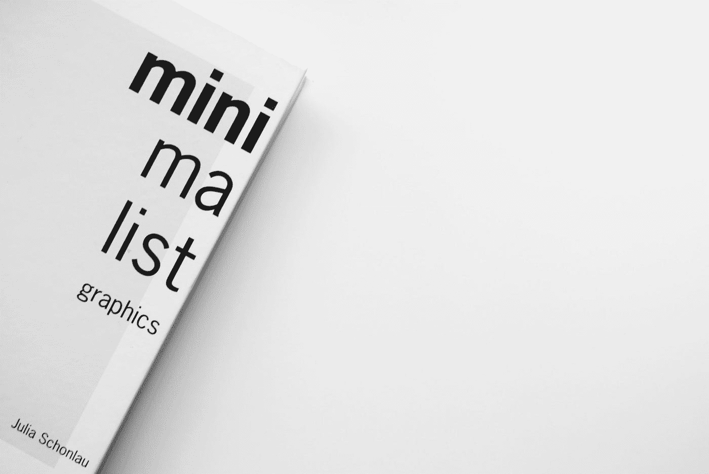*

*Good UX serves users what they need, when they need it in the most straightforward way possible. Photo by [Isabella and Zsa Fischer](https://unsplash.com/@twinsfisch?utm_source=medium&utm_medium=referral) on [Unsplash](https://unsplash.com?utm_source=medium&utm_medium=referral).*

*最轻松的用户体验是精简、平均、解决问题的机器。它们很瘦，因为它们没有多余的脂肪。就像我之前提到的，我们希望在用户体验的每一步减少认知负荷。如果多余的设计元素塞满了屏幕，或者额外的不必要的步骤搅乱了用户流程，我们会让事情变得比需要的更困难。为了更好地理解简单性，让我们来看看这个概念的实际应用。*

## *成功的品牌如何应用简约？*

*Toggl 用他们的时间追踪软件 Track 成功地展示了简单性。他们的产品不仅允许用户跟踪他们花在自己项目上的时间，还可以看到他们的队友如何花费他们的时间。*

*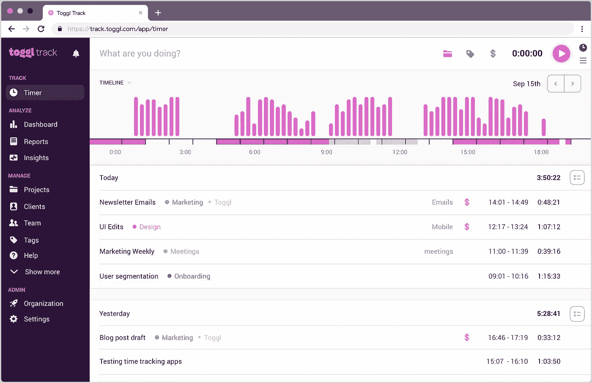*

*Toggl Track successfully exemplifies simplicity.*

*当使用这个软件时，用户的主要目标可能是跟踪他们在特定项目上花费的时间。因此，在屏幕上方的大字中，我们看到“你在做什么？”太棒了。使用该应用程序真的很简单，只需输入你正在进行的项目名称，然后点击“开始”按钮。在下面，用户可以以列表和时间表的形式看到他们最近参与的项目。所以从技术上来说，应用程序*确实在这个屏幕上提供了比需要更多的信息。但是多余的部分不在其中。它不会分散用户对页面上最重要信息的注意力，也不会妨碍用户完成他们在这个页面上的主要目标。如果需要，用户可以返回到以前跟踪的条目，并添加某些标签或项目类别，但这些操作也不会偏离跟踪时间的主要目标。**

## *我如何将简约应用到自己的设计中？*

*从小处着手。从你设计的单一屏幕或用户旅程开始，问问你自己，“用户的主要目标是什么？”当你看着你的设计时，这个目标是不是很清晰？用户完成这个目标需要多少步骤？你能减少步骤的数量吗？任何屏幕上有什么东西会在视觉上分散用户完成目标的注意力吗？*

*我认为当一个设计*缺乏*简单性时，相对容易注意到——即使对于非设计师来说也是如此。一个屏幕可能会感觉太“忙”，或者用户的旅程可能会包含额外的步骤，而这些步骤不会增加用户体验的价值。让我们来练习将简单性应用到我几年前设计的一个明显缺乏简单性的屏幕上。看一看:*

*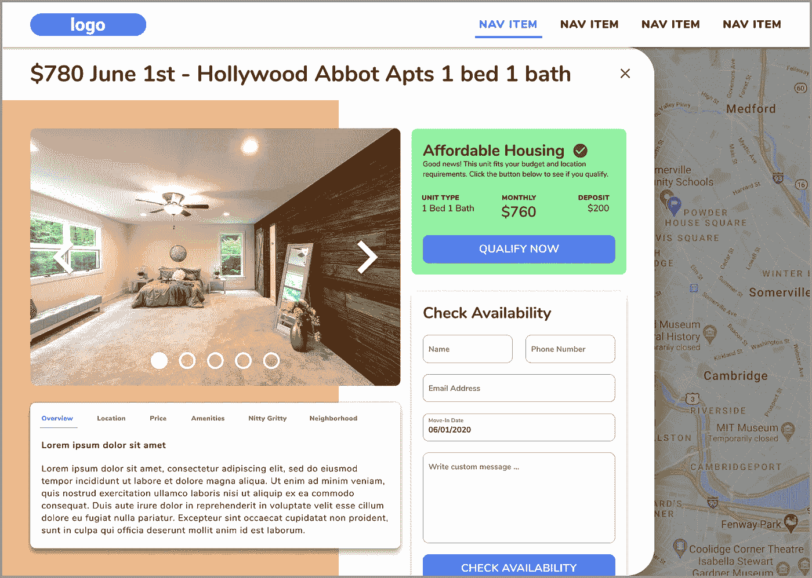*

*This design fails the simplicity test.*

*这个屏幕上发生了太多事情。我为一个类似于 Rent.com 或 Appartments.com 的 web 应用程序设计了这个，但专门用于在给定的区域寻找负担得起的住房。由于几个原因，我没能在这个设计中实现简单性。*

*首先，用户在这个屏幕上的主要目标并不明确。用户在这个页面上的主要目的是查看所列公寓的图片吗？是阅读房源位置、便利设施、价格等的概述吗？？是为了查看房源的可用性吗？是看用户是否有保障房资格？乍一看，它可能是上述任何一种，这意味着设计不够简单。*

*第二，有太多的行动要求和太多的信息显示，所有这些都为用户想要完成的任何事情提供了干扰。如果目标仅仅是查看公寓的图片并得到一个概览，那么“立即确认资格”CTA 和“检查可用性”表单就会偏离目标。如果目标是获得经济适用房资格，那么公寓图片、信息概览标签和“检查可用性”表格会影响目标的实现。还有，为什么我们还能看到背景里的地图？很明显这是某种模型，但是模型背后的地图现在没有任何用处。我可以继续说下去，但我想你明白了。*

*简单可以证明有助于轻松的用户体验，因为它减少了认知负荷。正如我前面提到的，使用一个产品需要的努力越多，它就变得越不受欢迎。如果用户不得不通过视觉混乱来使用你的应用程序，或者如果你的应用程序中的任何给定的过程包含多余的步骤，是时候简化了。*

# *3.模拟人类互动”*

## *什么是模拟人类互动？*

*最后，轻松 UX 模拟人类互动。如果你看看美国一些最成功的应用程序，你会注意到一个趋势。它们中的许多都提供了一种 UX，感觉就像用户在与一个人而不是一个软件进行交流。这对人们来说是最自然的。甚至许多像我一样在社交焦虑中挣扎的人通常至少有一个可以自由交谈的人。我们已经面对面交流了几十万年。这是我们最本能的交流方式。毫不费力的 UX 利用了这种本能。*

**

*Effortless UX simulates human interaction. Photo by [Christina @ wocintechchat.com](https://unsplash.com/@wocintechchat?utm_source=unsplash&utm_medium=referral&utm_content=creditCopyText) on [Unsplash](https://unsplash.com/s/photos/conversation?utm_source=unsplash&utm_medium=referral&utm_content=creditCopyText).*

*我并不是说你的软件必须包含社交成分。相反，我的意思是你的应用程序的逻辑基础应该遵循人类互动的自然流程。我经常看到围绕计算机工作方式设计的应用程序，而不是人类大脑的工作方式。不要那样做。*

## ***成功的品牌是如何模拟人际互动的？***

*许多成功的应用程序在模拟人类互动方面做得很好。我想具体分析一下 Slack。让我们检查一下他们的入职流程，因为创建一个新的 Slack 账户就像是在和一个人交谈。*

*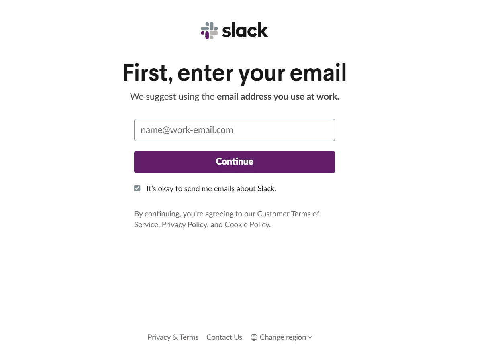*

*这个入职流程使用日常语言。没有一个长而复杂的表格带有技术术语。用简单的英语，Slack 问，“你的工作邮箱是什么？”*

*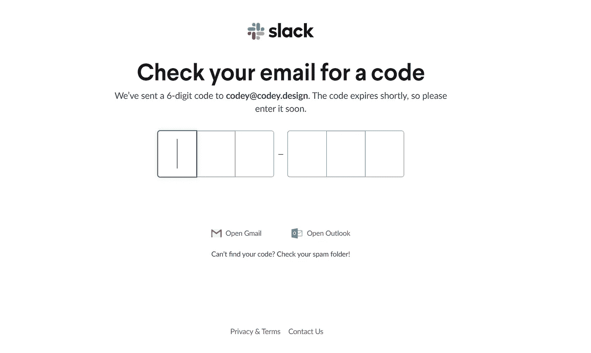*

*当用户进入入职流程的第二步时，系统会非常简单地引导他们输入确认码。我见过许多其他产品对这一步的处理相当糟糕。要么没有关于在哪里可以找到确认码的解释，要么如果你从来没有收到过确认码就没有补救办法，或者两者都有。但是 Slack 继续牵着用户的手每走一步。我觉得我已经在这里表明了我的观点，所以我只向您展示剩余的松弛入职流程，并让您做出自己的分析。要特别注意这个过程有多像一次愉快的私人谈话。*

*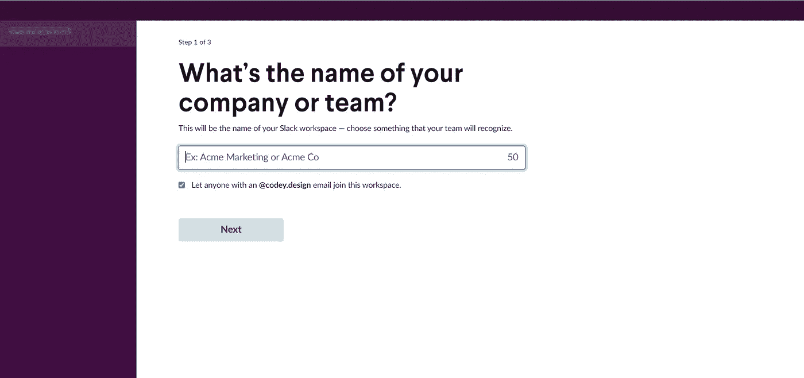**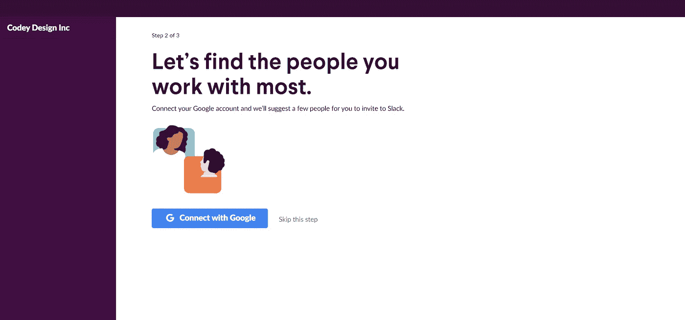**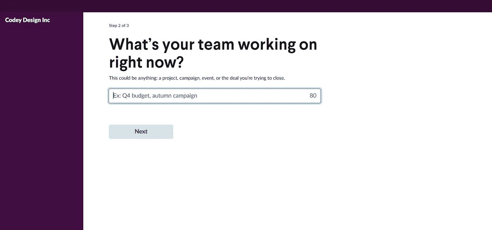**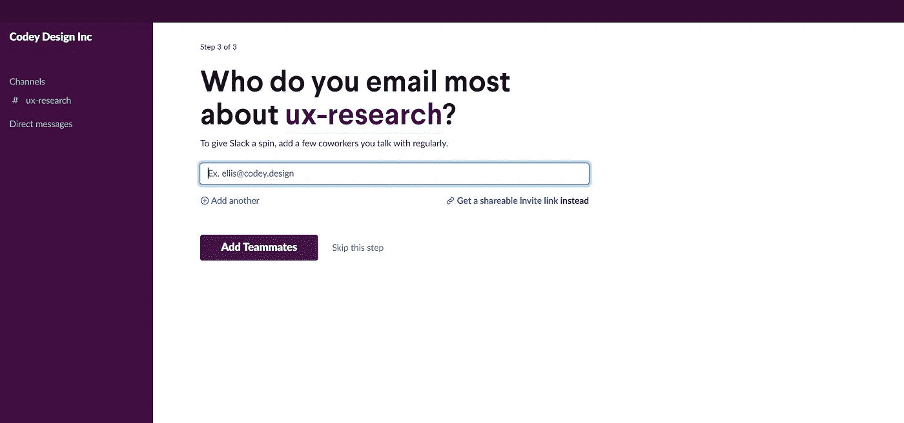**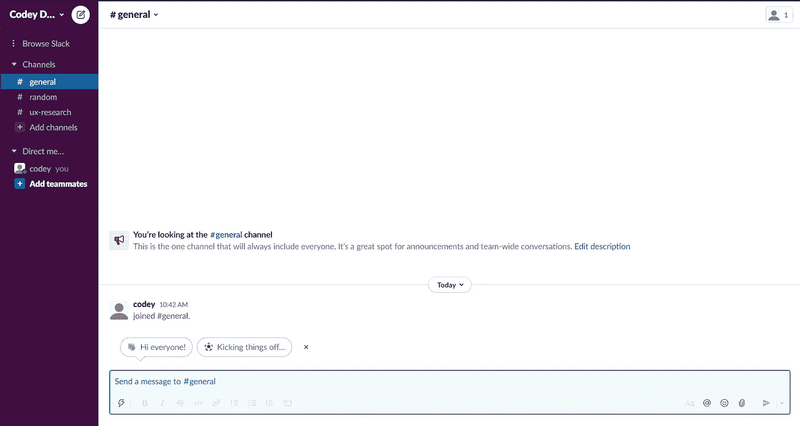*

## *如何在我自己的设计中模拟人类互动？*

*我曾经在 Reddit 上看过一个帖子，上面说“不聪明的人经常试图用大词解释简单的概念，以使自己显得更聪明。聪明的人试图用小词解释复杂的概念，让周围的人觉得自己更聪明。”如果你想在你的设计中模拟人与人之间的互动，那就采用“智能人”的方法。使用小而简单的交互来帮助你的用户在应用上完成更大更复杂的目标。*

*回到 Slack 的例子，建立一个 Slack 账户实际上是一个相当复杂的过程。用户在使用该应用程序之前需要提供大量信息。但是他们把这个过程分解成一个有机的流畅的对话。你的应用中最复杂的流程是什么？你会如何向从未使用过这款应用的人解释它们？这场对话会如何进行？在这个过程中你会遇到什么样的问题和答案？*

**

*Test your app with current users, co-workers, family members, or friends. Photo by [LinkedIn Sales Solutions](https://unsplash.com/@linkedinsalesnavigator?utm_source=unsplash&utm_medium=referral&utm_content=creditCopyText) on [Unsplash](https://unsplash.com/?utm_source=unsplash&utm_medium=referral&utm_content=creditCopyText).*

*以上任何一个问题，你都不用猜答案。你可以与当前用户、同事、家人和朋友一起测试你的应用。从小处着手。以一个屏幕或用户流为例，思考用户在这个屏幕或这个旅程中的主要目标。请从未使用过该产品的人看看这个屏幕或旅程，并尝试实现这个目标。如果他们有问题，鼓励他们提问。如果需要的话，提供一些有用的建议。记下测试用户在测试过程中提出的问题以及您给出的答案。然后调整屏幕或用户旅程以反映该对话。*

*模拟人类互动可以极大地提高 UX，因为人类互动是我们最本能的交流形式。通过围绕人脑的工作方式而不是计算机的工作方式来设计我们的应用程序，我们将为用户建立更无缝的体验，并使使用我们的应用程序变得毫不费力。*

# *结论*

*最终，研究表明，用户宁愿随意点击，直到他们到达他们想要的屏幕，而不是阅读用户指南或 FAQ 部分的一句话。他们喜欢胡乱摆弄我们的产品。因此，我们希望以一种让用户相对容易应付的方式设计我们的产品。如果用户不会花时间去了解我们产品的细微差别，那么我们应该设计没有细微差别的产品。我们应该用毫不费力的 UX 设计产品。*

*你怎么想呢?有没有其他创造轻松 UX 的策略？在你的设计之旅中，你学到了什么，你认为会有助于这次讨论？我很想听听你的想法和建议。*

*在 UX 部门，您是否有难以使用或缺乏的应用程序？我经营着一家精品设计公司，我很想和你谈谈改进你的产品的可能方法！无论你是一个寻求建议的设计师，还是一个对设计服务感兴趣的企业主，我总是很乐意回复电子邮件或进行视频通话。给我发个说明:codey @ codey(点)设计。*

*如果你有兴趣看更多毫不费力的 UX 的例子:看看我的社交网站。我在那里发帖的次数比在这里多得多。*

*[insta gram](https://www.instagram.com/codeydesigninc/)//[Twitter](https://twitter.com/CodeyDesignInc)//[LinkedIn](https://www.linkedin.com/company/codey-design-inc/)//[网站](https://www.codey.design/)*