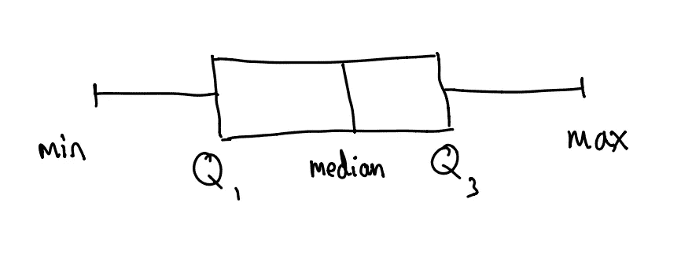
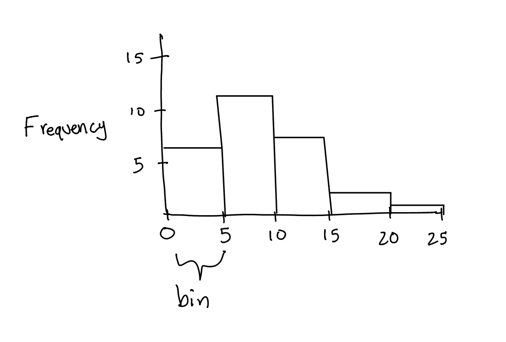
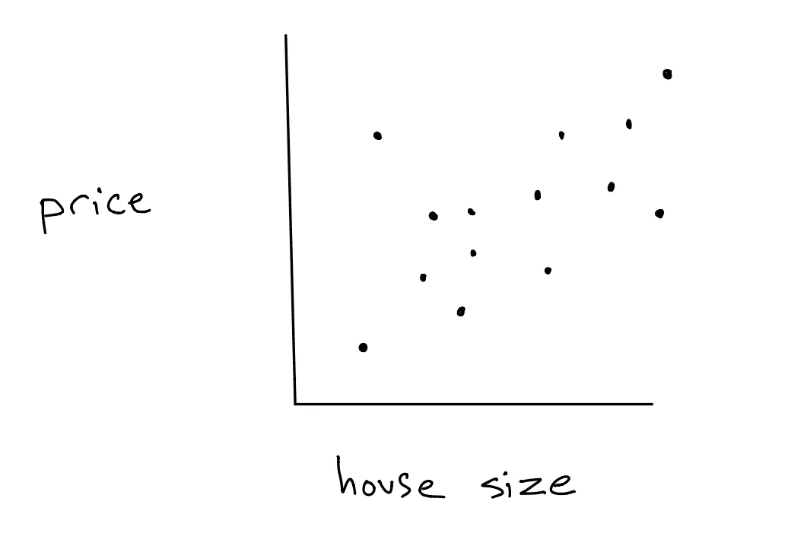
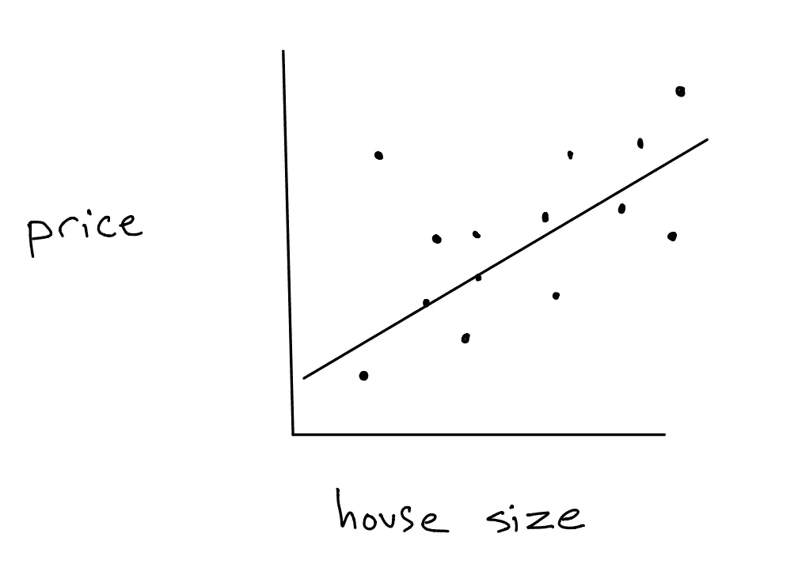

# 可视化统计数据的 3 种主要方法

> 原文：<https://medium.com/geekculture/3-key-methods-for-visualizing-statistical-data-cb89efa6b751?source=collection_archive---------15----------------------->

## 了解箱线图、直方图和散点图的基础知识

Photo by [Isaac Smith](https://unsplash.com/@isaacmsmith?utm_source=unsplash&utm_medium=referral&utm_content=creditCopyText) on [Unsplash](https://unsplash.com/s/photos/graphs?utm_source=unsplash&utm_medium=referral&utm_content=creditCopyText)

在我们的世界里，很少有东西像数据一样强大。正如工程师 w·爱德华兹·戴明所说，

> “没有数据，你只是另一个有观点的人。”

但有时，数据本身不足以解决我们试图回答的问题。毕竟，我们不能仅仅用一个充满数字的电子表格做太多事情。这就是为什么能够将数据转化为我们能够使用的东西是极其重要的。通常，这涉及到将所述数据转换成更容易理解的格式。在本文中，我们将讨论三种最常见的数据可视化方法:箱线图、直方图和散点图。

# 方框图

箱形图总结并显示了五个不同的数据点。按照递增的数字顺序，它们是* *最小值、第一个四分位数、中值、第三个四分位数和*最大值。*

*这些也可以用所谓的上下栅栏来代替**

箱形图采用矩形形状，在矩形宽度范围内向下画一条线，伴随着从左右两侧出来的两条线，有时称为“须状线”。请参考下图，其中所有组件都标有标签。

screenshot from author

现在，我们如何计算所有这些值呢？

*   **最小值:**数据集的最小值。
*   **第一个四分位数(Q1):** 数据集下半部分的中位数。
*   **中位数:**数据集的中间数；使用标准中位数公式。
*   **第三个四分位数(Q3):** 数据集上半部分的中值
*   **最大值:**数据集的最大值。

当查找数据集下半部分或上半部分的中间值时，您可能会注意到一个小问题。假设我们有一组数字{3，6，7，8，9}。说这个数据集的下半部分是{3，6，7} **或** {3，6}，不会不正确。当然，这两组数字的中位数是不同的。幸运的是，数学家们认为没有一种方法比另一种更好。因此，我们可以自由选择如何定义“下半部分”，只要在计算第三个四分位数时保持一致。

此外，在处理构建盒状图的末端(最小值和最大值所在的位置)时，还有一个注意事项。我们还必须考虑什么叫做*下部和上部栅栏。*这两个围栏的公式都包括 IQR，它是通过取第三个和第一个四分位数之间的差计算的(Q3-Q1)；下面列出了它们。

*   **下围栏:** Q1 - 1.5*IQR
*   **上部护栏:** Q3 + 1.5*IQR

我们在较低栅栏和最小值之间的数值较高的*处结束较低须。此外，我们在上栅栏和最大值之间的数值中的*下*处结束上须。然而，如果我们在较低或较高的栅栏上覆盖胡须，我们仍然绘制最小或最大点。*

箱线图很重要，因为我们能够确定异常值，甚至检查正态性。任何超出下限或上限界限的值都被定义为异常值。此外，如果箱线图的分布似乎相对对称，我们可以推断数据集的分布近似正态。

# 直方图

直方图有助于使用*条直观地显示信息。*容器只是一个特定的预定范围，数据集中的数字将落入其中(这些容器不一定需要具有相同的范围)。每个容器都有一个高度，高度决定了每个容器中值的数量。高度越高，数据集中出现的值越频繁，高度越低，数据集中出现的值越少。看看下面的直方图样本。

screenshot from author

正如你所看到的，这个直方图很好地显示了数据。通过查看条形的高度，我们可以说最频繁的值范围是 5-10，最不频繁的值范围是 20-25。此外，通过观察分布的一般形状，我们还可以声称数据集向右倾斜。考虑到这一点，我们可以断言数据集的平均值将大于中值。事实上，创建直方图的目的是确定数据集的分布是否近似正态、偏左、偏右、均匀等。这一步对于使用假设检验极其重要。

# 散点图

散点图描绘了“x-y 平面上”两个相关变量的点。在实验设置中，当有一个受控制的变量影响另一个变量时，我们使用散点图。自变量，即被改变的变量，标在水平 x 轴上，因变量，即因自变量而改变的变量，标在垂直 y 轴上。

example scatterplot relating house size and price

散点图的主要用途是试图确定相关性的类型。最常见的是，我们寻找正的或负的线性关系，或者缺乏线性关系，尽管在某些情况下我们想要寻找二次或甚至三次关系。为此，我们实施了一个称为线性回归、二次回归等的过程。线性回归模型将实际点值和预测点值之间的误差平方和最小化，创建了一条称为最佳拟合线的线*。*

example with possible line of best fit

如果我们看一看这条最适合房子大小和房价之间联系的样本线，我们可以看到它清楚地帮助我们可视化这两个变量之间的关系:在房子大小和价格之间有一个明显的强有力的正关系，这意味着我们应该预期房子大小的增加会导致房价的增加。

# 包扎

可视化的力量经常被低估。虽然对原始数据的分析可以让我们走得更远，但我们有时会错过只有在创建箱线图或直方图时才能看到的关键细节，就像我们可能只注意到在代数表达式中相邻的相似术语。因此，我们都应该努力变得像处理数学方程一样，能够自如地处理图表。记住，给数字一个表达自己的机会。