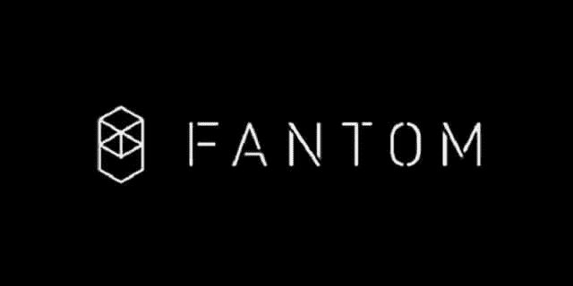

# 最近 Fantom Bullrun 的 3 个主要原因！

> 原文：<https://medium.com/geekculture/3-main-reasons-for-the-recent-fantom-bullrun-30f13d5341ce?source=collection_archive---------14----------------------->

Fantom FTM 的股价正在上涨，尽管加密货币目前正经历一段艰难时期。为什么会这样 FTM 是如何克服困难的？

目前(在撰写本文时)，加密货币正在衰落。例如，比特币、以太坊和大多数第一层替代币都比其高点低 20-30%。然而，Fantom 区块链公司却与这一趋势背道而驰。那是因为，在…