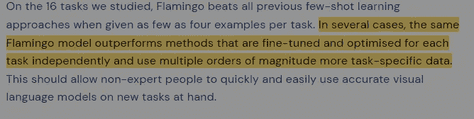
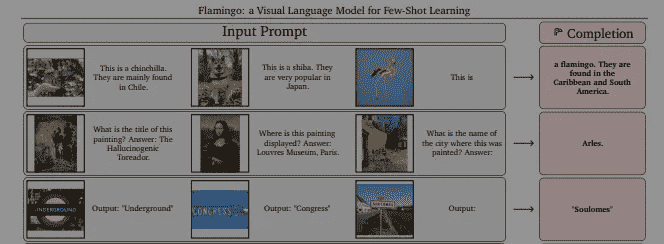
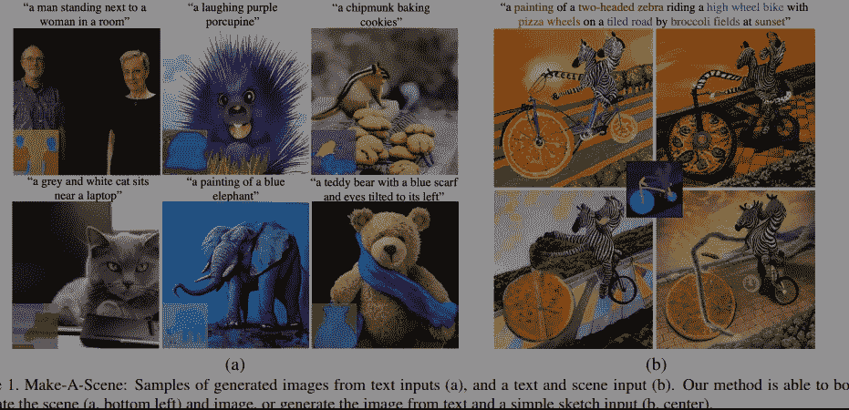
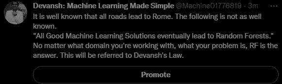
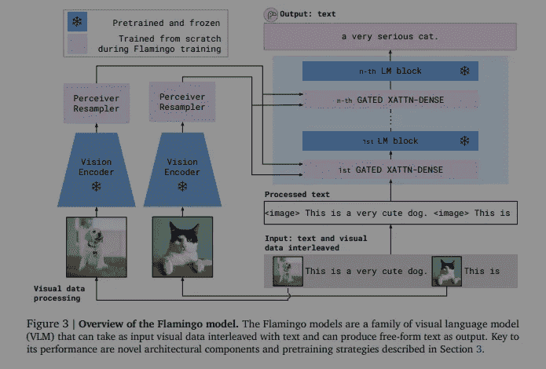
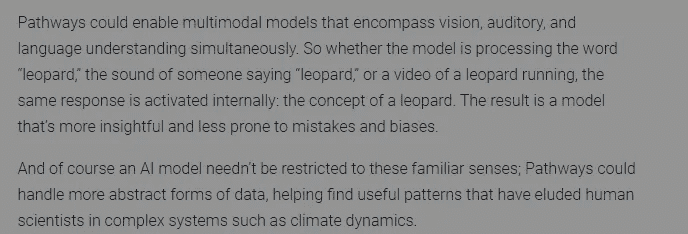
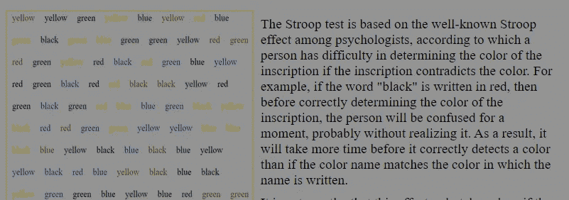
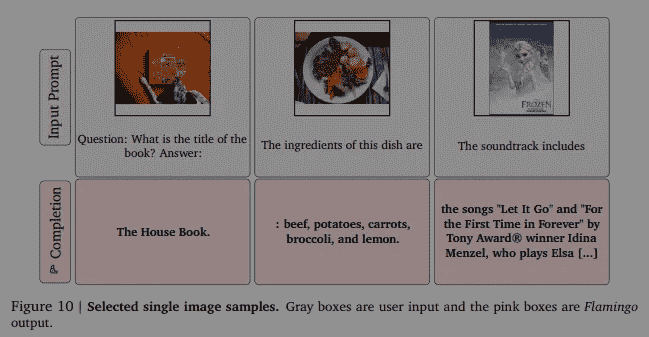
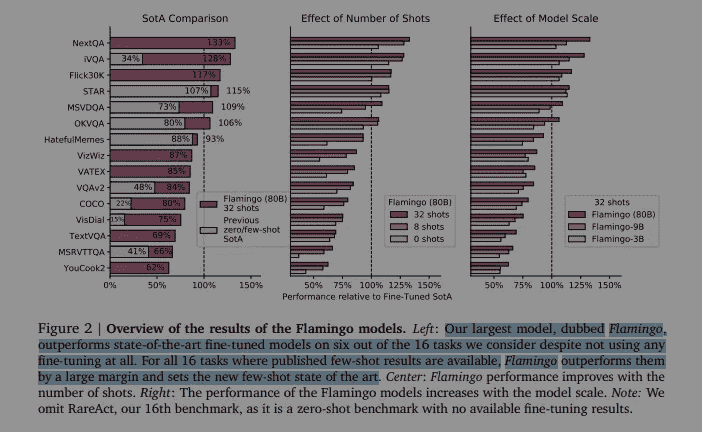
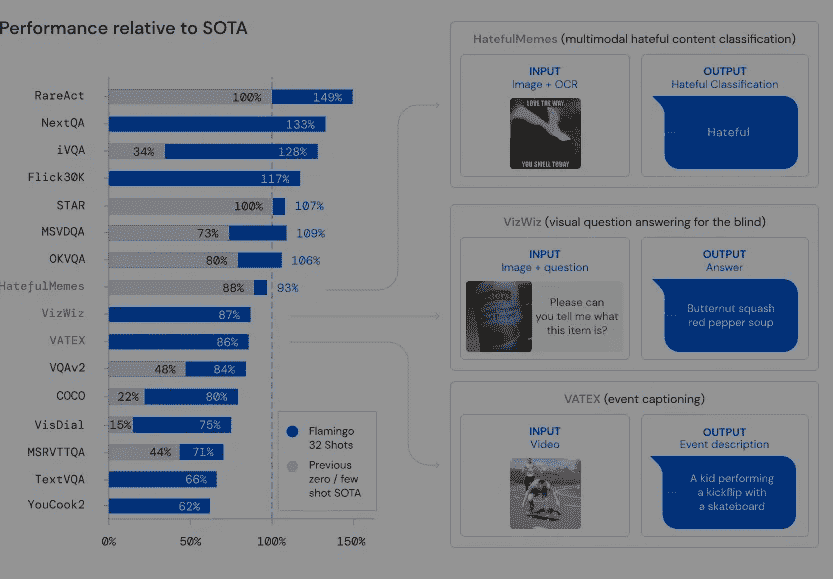

# 3 个被忽视的东西:计算机视觉的大型模型

> 原文：<https://medium.com/geekculture/3-overlooked-things-deepminds-flamingo-a-large-model-for-computer-vision-84cd9d2f738c?source=collection_archive---------11----------------------->

## 继谷歌的 Pathways 之后，这进一步表明了多模态训练的潜力。还有更多

4 月下旬，Deepmind 发布了用单一视觉语言模型处理多项任务的。他们的结果显示，他们提出的模型 Flamingo 在各种任务上都优于之前的 SOTA 模型。

These results are exciting for a variety of reasons. They also carry interesting implications. We will discuss this further on.

在这篇文章中，我将从这本超级激动人心的出版物中回顾一些有趣的内容(以及他们详细的预印本， [Flamingo:一个用于少量学习的视觉语言模型](https://storage.googleapis.com/deepmind-media/DeepMind.com/Blog/tackling-multiple-tasks-with-a-single-visual-language-model/flamingo.pdf))。特别是他们的模型设置非常有趣，因为他们实施的设计选择以及他们可能如何影响人工智能/大规模机器学习的未来。然而，人们忽略了一些重要的细节，这是我想重点介绍的。要想很好地理解这一点，我们先来了解一下该领域背后的脉络。

This level of recognition is staggering. Certainly worth getting excited about

# LLMs 的历史

在过去的几个月里，我们已经看到了 NLP 中大型语言模型的巨大潜力。以超过 1000 亿个参数的神经网络为例，我们可以将这些 LLM 用于各种任务。这使得我们能够创建具有更深层次的知识表示和大量功能的模型。

How adding parameters to the PaLM model adds to the capabilities of the model. Source: [Pathways Language Model (PaLM): Scaling to 540 Billion Parameters for Breakthrough Performance](http://ai.googleblog.com/2022/04/pathways-language-model-palm-scaling-to.html)

然而，所有这些模型主要集中在 NLP 任务上。 [GPT](https://openai.com/blog/gpt-3-apps/) 、 [PaLM](https://ai.googleblog.com/2022/04/pathways-language-model-palm-scaling-to.html) 和[脸书的 OPT](/discourse/metas-challenge-to-gpt-3-and-open-ai-149c9a1f766f) 都主要是语言模型，尽管它们在视觉任务方面取得了一些成功。这些任务对于 NLP 和视觉的结合来说是非常特殊的。最近，我们已经看到了很多从标题生成图像的例子。

Taken from Make-A-Scene. The quality of images that Meta’s AI generates is stunning. [Read about how this ties into their MetaVerse aspiration](/geekculture/machine-learning-for-the-metaverse-why-metas-ai-lab-is-so-random-42975ab28a26)

Deepmind 团队在视觉和语言模型的训练中采取了类似的方法。然而，他们把注意力集中在视觉任务上。下面是他们的模型在非常有趣的汤怪测试中的一个例子。

 [## Open AI 的 DALL-E 2 打造的 DeepMind 火烈鸟 vs 汤怪

### 摘自:https://www . deep mind . com/blog/用单一视觉语言处理多项任务-像视频和…

youtube.com](https://youtube.com/shorts/5wIzbZi5Tuc?feature=share) 

所有的背景都清楚了，让我们来深入了解一些让我印象深刻的事情。

# 多模态训练继续不负众望。但是…

对于那些最近一直关注我的内容的人，你知道我对这个想法越来越感兴趣。传统上，我们为不同的任务开发不同的模型。每个数据集/任务都有自己的定制模型。我们还意识到，我们可以使用定制的网络来完成不同的任务。这导致了用于视觉的 CNN 和用于 NLP 的 RNNs 的发展。这些都是专门为他们的领域。

Obviously, Random Forests are the greatest technique known to man. All other ideas are fighting for second place. For more wisdom, check out my Twitter.

然而，《变形金刚》对此颇有微词。[正如我在这里详细介绍的那样](/p/f98f684db34f)，注意力机制在 NLP 和 CV 中都有很大的用处。这使它们成为大规模多模态训练的理想选择，这种训练在深度学习中获得了更多的牵引力。

The guiding property is interesting. As we scale into more abilities, we might just see one final model do everything. [This would align well with Google’s Pathways vision](/geekculture/google-ai-sparks-a-revolution-in-machine-learning-403f4dbf3e70)

多模态训练简单地说就是用多种输入来训练你的模型。例如，我们可以看到，我们同时使用文本和图像来获得最终结果。这种系统的优点是模型有更多的信息来运行。这使得他们对领域有了更深入的了解。

Taken from Introducing [Pathways: A next-generation AI architecture](https://blog.google/technology/ai/introducing-pathways-next-generation-ai-architecture/)

我感兴趣的是，多模态训练的程序似乎会导致一个与我们现有的非常不同的结果。与人类不同，[火烈鸟不受斯特鲁普测试](https://youtube.com/shorts/WQknR9SgpHE)的影响。如果非要我猜的话，这是因为人类不用“冷冻”模型，这让我们更容易被影响。对这一点和这种差异的可能后果进行更深入的分析将是重要的。

[Taken from here](https://metodorf.com/tests/stroop_matches_colors.php)

# 模型冷冻难题

团队分享的结果无疑是令人兴奋的。Flamingo 正在实现一些在 5 年前被认为是不真实的事情。这仅仅是开始。

Think of how many use-cases just the examples in this image have.

然而，这篇论文的作者提出了两个有趣的事情。为了理解它们之间的关系和重要性，我们先来理解一下模型冻结的概念。冻结模型只是阻止新的输入数据改变其权重。这用于迁移学习等领域，我们使用基线预训练模型，并针对特定情况对其进行微调。这已经有了很大的成果，火烈鸟也不例外。

> 如果从头开始训练，两种情况下的性能都会大幅下降(视觉编码器下降 11.8%，LM 下降 10.2%)，这再次凸显了预训练的重要性。有趣的是，从我们良好的初始化开始，同时还允许解冻权重，也会导致性能下降(解冻视觉编码器时下降 3.9%，解冻 LM 时下降 5.5%)。这是一个“灾难性遗忘”的例子(McCloskey 和 Cohen，1989)，其中模型在训练新目标时逐渐忘记其预训练。

所以冻结预训练模型可以提高性能？没什么令人震惊的。然而，在他们的预印本的第 33 页(不，这不是打印错误)，作者提出了一个中肯的观点，“*我们的模型建立在强大的预训练因果语言模型的基础上，作为一个副作用，直接继承了它们的弱点*”。这显然是我们需要调查的事情。特别是当我们得到有偏见的数据集，或者旧模型面临的其他潜在问题时，这可能会成为一个问题。把握这一点至关重要。

> 另一方面，虽然我们的消融证明了从冻结语言模型中继承的语言模型先验的重要性，但我们怀疑它们可能在开放式对话环境中观察到的偶然幻觉和无根据猜测中起作用

# ML 模型需要一个“我不知道”

作者们出色地涵盖了他们作品的各个方面。我真正欣赏的一件事是他们如何报道 Flamingo 在对抗测试中的表现。这里我们可以看到，当被问及有意误导的问题时，Flamingo 给出了一些有趣的答案。

This is likely due to the fact that during training the model is forced to answer something

诊断这些问题对于将解决方案集成到更敏感的用例中非常重要。中间的“幻觉”可能是总是假设提示总是真实的结果。加入一定程度的“怀疑”或许有助于解决这个问题。另外两个原因可能是因为 ML 模型通常没有“我不知道”的选项。这需要整合。目前的 goto，模型置信度，还不够好。

在我的管道中，我通常使用非确定性模型和/或估计量集合来量化预测的可靠性。[这是受标签分散背后的想法的启发，我在这里讨论](/mlearning-ai/evaluating-label-dispersion-is-it-the-best-metric-for-evaluating-model-uncertainty-e4a2b52c7fa1)。然而，测试 Big Tech ML 的规模非常不同。所以不确定可行性会有多大。如果你对如何解决这个问题有任何想法，请在下面的评论中分享。

Maybe I’m making too much of it. These results are insane.

不过，不要误会。《火烈鸟》的作者们所取得的成果简直令人震惊。但是每个人和他们的妈妈都可以告诉你。这就是为什么，我想把我的文章集中在这些我认为需要更多关注的领域。

本文到此为止。如果你想进入 ML，t [他的文章给了你一个逐步发展机器学习能力的计划](/geekculture/how-to-learn-machine-learning-in-2022-9ef2ea904986)。它使用免费资源。与其他训练营/课程不同，该计划将帮助你发展基本技能，并为你在该领域的长期成功做好准备。

Thank you all for the love.

对于机器学习来说，软件工程、数学和计算机科学的基础至关重要。它将帮助你概念化，建立和优化你的 ML。我的每日时事通讯，[Coding interview make simpled](https://codinginterviewsmadesimple.substack.com/)涵盖了算法设计、数学、最近的技术事件、软件工程等主题，让你成为更好的开发人员。 [**我目前正在进行全年八折优惠，所以一定要去看看。**](https://codinginterviewsmadesimple.substack.com/subscribe?coupon=1e0532f2)

我创建了[编码面试，使用通过指导多人进入顶级科技公司而发现的新技术，使面试变得简单](https://codinginterviewsmadesimple.substack.com/p/faqs-and-about-this-newsletter?r=4tnbw&s=w&utm_campaign=post&utm_medium=web)。时事通讯旨在帮助你成功，避免你在 Leetcode 上浪费时间。我有一个 100%满意的政策，所以你可以尝试一下，没有任何风险。[您可以阅读常见问题解答，并在此了解更多信息](https://codinginterviewsmadesimple.substack.com/p/faqs-and-about-this-newsletter?r=4tnbw&s=w&utm_campaign=post&utm_medium=web)

如果你也有任何有趣的工作/项目/想法给我，请随时联系我。总是很乐意听你说完。

以下是我的 Venmo 和 Paypal 对我工作的金钱支持。任何数额都值得赞赏，并有很大帮助。捐赠解锁独家内容，如论文分析、特殊代码、咨询和特定辅导:

https://account.venmo.com/u/FNU-Devansh

贝宝:[paypal.me/ISeeThings](https://www.paypal.com/paypalme/ISeeThings)

# 向我伸出手

使用下面的链接查看我的其他内容，了解更多关于辅导的信息，或者只是打个招呼。另外，查看免费的罗宾汉推荐链接。我们都得到一个免费的股票(你不用放任何钱)，对你没有任何风险。**所以不使用它只是损失免费的钱。**

查看我在 Medium 上的其他文章。https://rb.gy/zn1aiu

我的 YouTube:[https://rb.gy/88iwdd](https://rb.gy/88iwdd)

在 LinkedIn 上联系我。我们来连线:[https://rb.gy/m5ok2y](https://rb.gy/f7ltuj)

我的 insta gram:[https://rb.gy/gmvuy9](https://rb.gy/gmvuy9)

我的推特:【https://twitter.com/Machine01776819 

如果你正在准备编码/技术面试:【https://codinginterviewsmadesimple.substack.com/ 

获得罗宾汉的免费股票:[https://join.robinhood.com/fnud75](https://join.robinhood.com/fnud75/)