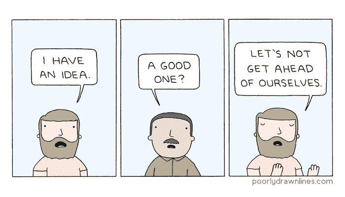
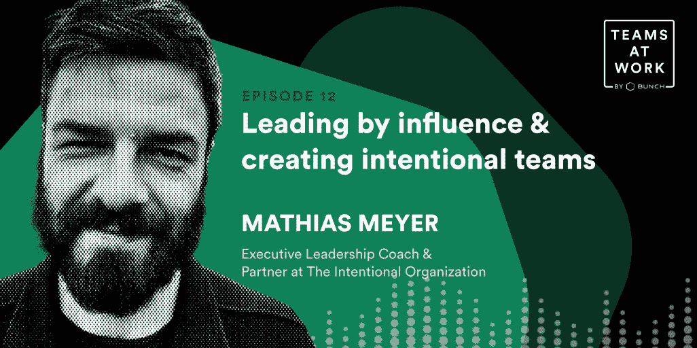

# 让你的团队参与任何事情的 3 个短语

> 原文：<https://medium.com/geekculture/3-phrases-to-get-your-team-on-board-with-anything-47d6fcf1ac59?source=collection_archive---------8----------------------->

有多少次，你想到了一个令人兴奋的新计划，但当你把它带到你的团队时，它被否决或遇到了意想不到的阻力？🥲

获得认同对带来改变至关重要，但这可能是一项艰巨的工作，需要的时间比你预期的长得多。

Mathias Meyer 是蔻驰首席技术官和技术创始人的执行领导，他说:“这一切都是为了向你的团队展示什么是可能的……邀请他们为你如何实现即将到来的美好未来献计献策。”

这里有 3 个常用短语可以帮助你获得你需要的买入费！

# 🤔问“如果…会怎样”的问题

当你把变化定位为“如果”,它帮助人们想象未来*可能*是什么样子，让他们好奇而不是感到威胁。

例如，当 Mathias 想在他的团队中提出一个新流程时，他是这样说的:

*“目前我们的发布过程每个月都会发生，想象一下，如果它每周、每天……只要我们愿意，我们会做些什么？”*

*“如果……我们可以调整我们的开发流程，这样我们就可以更快地修复错误和响应客户，那会怎么样？”*

还有一个问题你可以问…

# 🤷‍♀️“可能发生的最糟糕的事情是什么？”

commercetools 的产品主管 Andrea Stubbe 说*“当你邀请人们大声抱怨为什么一个想法很糟糕，为什么它不可能实现时，这既有趣又有助于公开表达担忧，所以你可以一点一点地解决它们。”*

当 Andrea 建议在他们的产品中引入一个主要的新功能时，她知道这会面临一些阻力。为了让每个人都进入状态，她说了这样一句话，“如果我们这样做，我们的前端开发团队就会精疲力竭，他们都会辞职。我们真的不应该这样做”。

戏剧化和夸大可能出现的问题有助于揭示你的团队更深层次的恐惧。**这种策略对于那些有争议的“我们过去试过这个”话题尤其有效。**

这里还有一个短语…

# 🤩是的，还有…

这两个简单的词有很大的力量:它们鼓励更多的发散思维，并帮助你的团队基于彼此的想法。

你可以这样来设置:
*“我们会有足够的时间来探索风险和担忧，但为了探索潜力，让我们来做一个练习:当你听到一个想法时，试着用‘是的，而且……’来回应，不要说‘不，但是……’*

最后但同样重要的是…当你致力于改变时，**把它作为一个实验**。🧪

请人们试用一两个星期，并提前预定一个时间段，收集对进展情况的反馈。一旦时间到了，作为一个团队聚在一起决定你是保持、改变还是抛弃这种新的工作方式。

有时候，只需要一个简单的问题就能开始影响变化。通过在你的口袋里有一个问题和短语的列表，你会让你的团队考虑机会，这是一个很好的开始！

***想培养自己的沟通技巧，以便更有效地获得团队的认同吗？下载*** [***一堆 AI 领导力蔻驰***](https://apps.apple.com/app/apple-store/id1500872908?pt=121075759&ct=mathias%20tip%20on%20medium&mt=8) ***app 每天 2 分钟成为更好的领导者。***

喜欢马蒂亚斯对此的评论吗？查看我们的[工作中的团队播客第](https://open.spotify.com/episode/1QEVaaROBhv51Nlmy2lexd?si=22acba6fea68491d)集，其中介绍了他对[建立有意团队](https://intentionalorganization.com/)和通过影响力进行领导的建议。

🐦[在 Twitter 上关注我](https://bit.ly/3qwwVNB)或[查看我们的 YouTube 频道](https://bit.ly/3uaB8ZH)了解更多关于科技领导力的内容。

💌你也可以订阅每周简报，这是我的周日领导时事通讯。