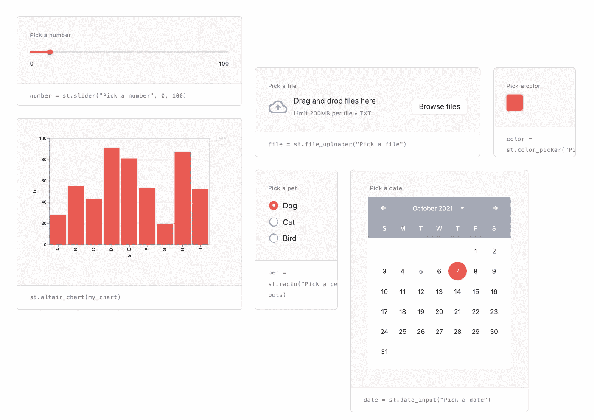
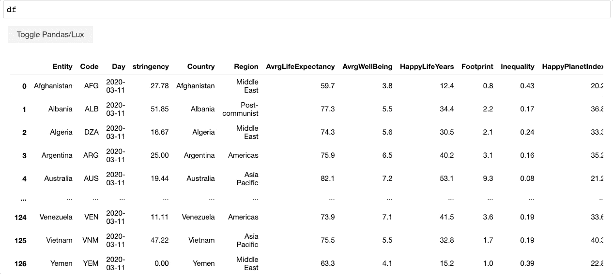

# 面向低代码数据科学的 3 个 Python 包

> 原文：<https://medium.com/geekculture/3-python-packages-for-low-code-data-science-5dfec9b0acc?source=collection_archive---------15----------------------->

1.[米托](https://docs.trymito.io/)

[米托](https://docs.trymito.io/)是 Python 的电子表格接口。米托允许用户执行数据科学操作，如探索性数据分析、可视化和读取 Excel 文件。您在米托中进行的每次编辑都会在下面的代码单元格中生成等效的 Python。该软件包为用户提供了一个可视化的环境来进行数据分析(该环境应该是熟悉的，因为它是根据电子表格建模的)，并为用户生成所有代码，从而节省了去 Stack Overflow 或 Google 的时间。


From Author

米托具有数据透视表等功能:


From Author

以及深入研究数据集汇总统计数据的能力:


From Author

米托还提供:

*   合并
*   过滤
*   整理
*   添加和删除列
*   保存和重放分析(宏)
*   还有更多！

要安装米托，请运行以下命令:

```
python -m pip install mitoinstaller
python -m mitoinstaller install
```

然后打开 Jupyter 实验室，调用有丝分裂表

```
import mitosheet
mitosheet.sheet()
```

这里是完整的[安装说明](https://docs.trymito.io/getting-started/installing-mito)。

[2。流线型](https://streamlit.io/)

Streamlit 是一款制作交互式数据应用的神奇工具。在 Streamlit 中，您可以构建一个用户友好的用户界面，允许同事和外部最终用户与数据集交互。用户不只是可以浏览笔记本来查看分析，而是可以自己与分析进行交互，更改参数和切换可视化，以便更清楚地理解作者的观点，并提出自己的观点。

对于数据科学家和数据科学团队来说，在数据科学垂直领域之外有效地交流他们的分析变得越来越重要。Streamlit 使数据科学团队托管数据应用成为可能，从工程到财务到营销的每个人都可以参与其中。

要开始使用 Streamlit 的开源框架，请运行以下命令:

```
pip install streamlitstreamlit hello
```



[https://streamlit.io/](https://streamlit.io/)

上图显示了您可以使用 Streamlit 制作的交互式小部件。该工具允许您将 Python 脚本的特定部分(或全部)转换成这些小部件，这些小部件可以托管在网页上，以便最终用户轻松访问。

这里是[完整的文档](https://docs.streamlit.io/en/stable/)。

3.[勒克司](https://github.com/lux-org/lux)

Lux 是本文中唯一一个只关注图表的软件包。Lux 不是给用户一个创建图表的环境，而是允许用户传入他们的数据框架，然后它会自动生成并建议用户可以从中选择的图表。这是制作精美图表的一种非常快速的方法，尤其是当你重复制作非常标准的图表时。可视化包的实际编码会降低工作流的速度。莱克丝是一个很好的方法来规避这一点。



[https://github.com/lux-org/lux](https://github.com/lux-org/lux)

要导入 Lux:

```
import lux
import pandas as pd
```

如果您有机会使用这些软件包，请留下您的评论:)