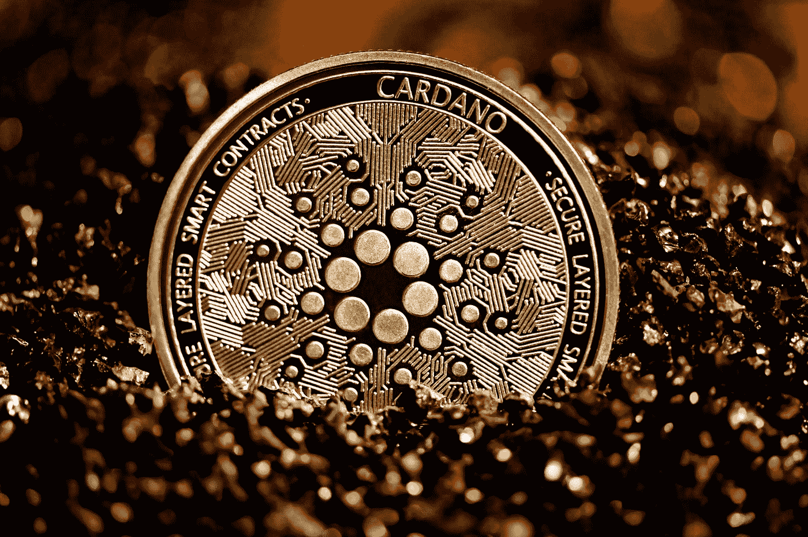

# 卡尔达诺的新更新对霍德勒来说是个好消息的 3 个原因(也有不是的 3 个原因)

> 原文：<https://medium.com/geekculture/3-reasons-cardanos-new-update-is-good-news-for-hodlers-and-3-reasons-it-isn-t-925014e44bb4?source=collection_archive---------15----------------------->

## 关于卡达诺智能合约你需要知道的一切。

Photo by [Executium](https://unsplash.com/@executium?utm_source=medium&utm_medium=referral) on [Unsplash](https://unsplash.com?utm_source=medium&utm_medium=referral)

虽然比特币和以太坊高高在上于加密货币生态系统之上，但其他代币也在获利。卡尔达诺公司(Cardano)一直在取得进展，截至 9 月份，其总市值为 720 亿美元，位居第三