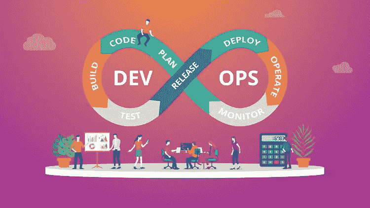

# 我作为开发人员学习 DevOps 的 3 个原因

> 原文：<https://medium.com/geekculture/3-reasons-i-am-learning-devops-as-a-developer-ee72bdd6d806?source=collection_archive---------3----------------------->

作为一名软件开发人员，我为什么要学习 **DevOps** ？

当我开始质量工程师的工作时，我注意到对其他技能的高度需求，这些需求被媒体和自己对工程师/开发人员在日常工作中做什么或需要知道什么的理解所忽略。

# 1.操作系统和 Linux