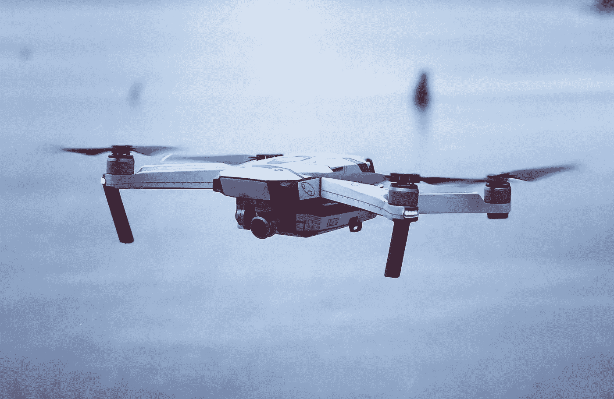

# 未来你会爱上 Octocopter 航班而忘记汽车的 3 个理由

> 原文：<https://medium.com/geekculture/3-reasons-youll-love-octocopter-flights-and-forget-cars-in-the-future-48a03858cd5b?source=collection_archive---------30----------------------->

## 地球对空气

Photo by [David McBee](https://www.pexels.com/ru-ru/@davidmcbee?utm_content=attributionCopyText&utm_medium=referral&utm_source=pexels): [Pexels](https://www.pexels.com/ru-ru/photo/392024/?utm_content=attributionCopyText&utm_medium=referral&utm_source=pexels)

你可能喜欢阅读关于未来的想法。很耐人寻味，你期待这么多事情很快发生。

交通是未来的重大变化之一。我们过去常常开自己的车，但是如果我告诉你，你很快就会适应空气，那会怎么样？