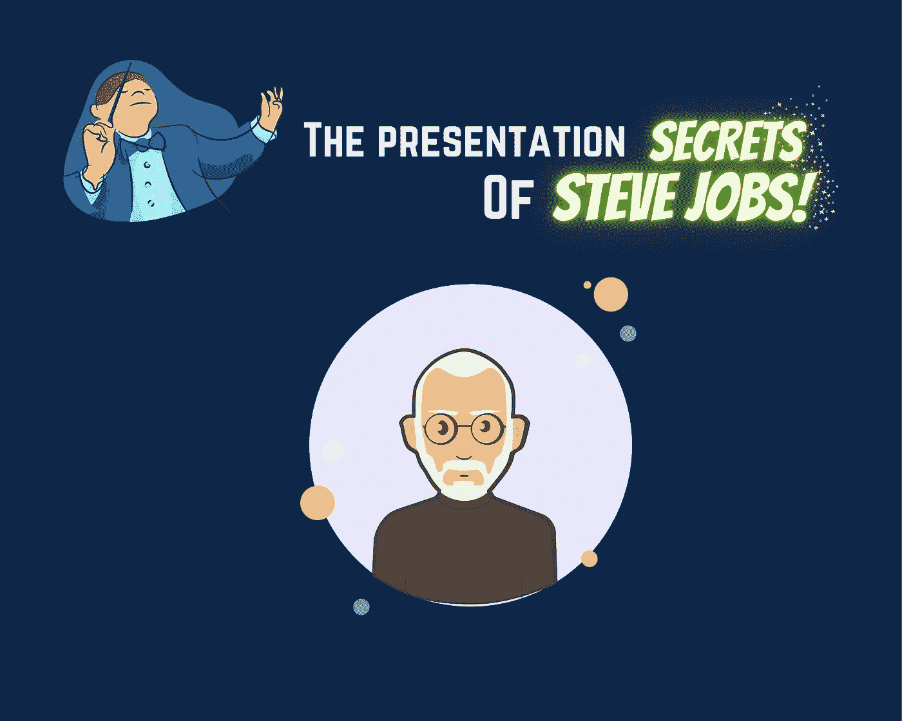

# 成功演示的 3 个秘诀

> 原文：<https://medium.com/geekculture/3-secrets-for-a-successful-presentation-or-demonstration-827b87572d6d?source=collection_archive---------11----------------------->

## 史蒂夫·乔布斯在任何演讲中取得成功的技巧和诀窍

你可以拥有世界上最好的产品，但这并不意味着你会在销售该产品的第一天就缺货。因为第一，人们不了解产品。第二，他们不认识卖家。这就是营销超级重要的原因。