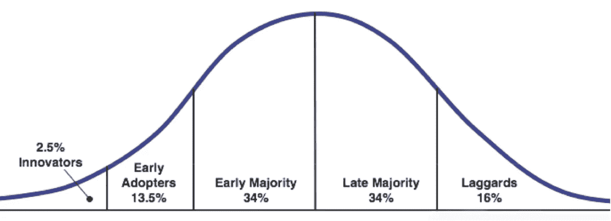

# 加密熊市即将结束的 3 个迹象！

> 原文：<https://medium.com/geekculture/3-signs-the-crypto-bear-market-is-coming-to-an-end-3aef47c79aa2?source=collection_archive---------5----------------------->

Many speculate that the bear market might come to an end despite the current bad market. Here’s why:

加密货币经历了**动荡的一年**，比特币和以太坊等主要货币的价值大幅下跌。然而，许多专家认为当前的秘密熊市即将结束，我们将很快看到价格的**复苏。以下是当前加密熊市可能很快结束的三个原因:**

## 1.加密货币的采用增加

Many argue that we’re currently in the phase of “Early Adopters” with crypto in the tech adoption curve

当前加密熊市的主要原因之一是**缺乏广泛采用**。目前，加密用户仅占全球人口的一小部分，这限制了市场的上行潜力和流动性。当更多的人开始使用加密货币时，我们将看到**需求增加**，这将导致**价格上涨**和**波动性降低**。

此外，随着采用率的增加，我们可能会看到更多的机构投资者进入市场，这将为 T21 提供更大的稳定性。因此，尽管当前的市场条件可能具有挑战性，但重要的是要记住，它们并不代表加密货币的长期潜力。

## 2.加密货币合法化

Many countries such as India, Japan and South Korea have legalized crypto in recent years

在过去的几年里，许多国家已经采取措施将加密货币合法化，这让投资者对市场的长期前景更有信心。特别是**日本**和**韩国**都已经通过了承认比特币为合法支付形式的法律，美国商品期货交易委员会也已经批准了比特币期货合约。随着更多的**政府**转向**使加密货币**合法化，投资者的信心可能会继续增强，导致价格反弹。

## 3.技术进步

Many smart people from Web2 have moved to Web3, accelerating the tech advancement in crypto

加密货币仍处于早期阶段，未来几年可能会有许多技术进步。在未来几年，我们可能会看到新的和**改进的存储和消费加密货币的方式**。这有助于重振市场，让它变得更加容易接近，更加用户友好。

此外，随着越来越多的**企业**开始**接受加密货币**作为支付方式，我们很可能会看到需求增加和相应的价格上涨。虽然加密货币的未来仍不确定，但相信该技术的人对其长期前景保持乐观。

🐦也可以查看我们的 [**推特账号**](https://twitter.com/CryptoHub210?s=20&t=ts3bUBYtX7g0s5_ClYnL_A) 获取更简短的分析

🤑加入我们的 [**电报频道**](https://t.me/officialcryptohub) 与志同道合者互动

💰欢迎 [**关注我们**](/@officialcryptohub0) 获取更多此类分析

👋业务请求: [**电报:联系@cryptohubtiktok**](https://t.me/cryptohubtiktok)