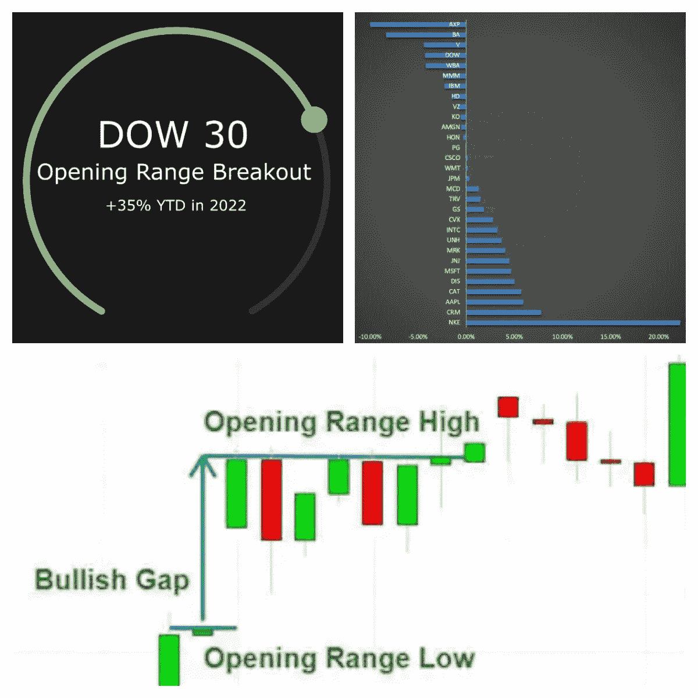
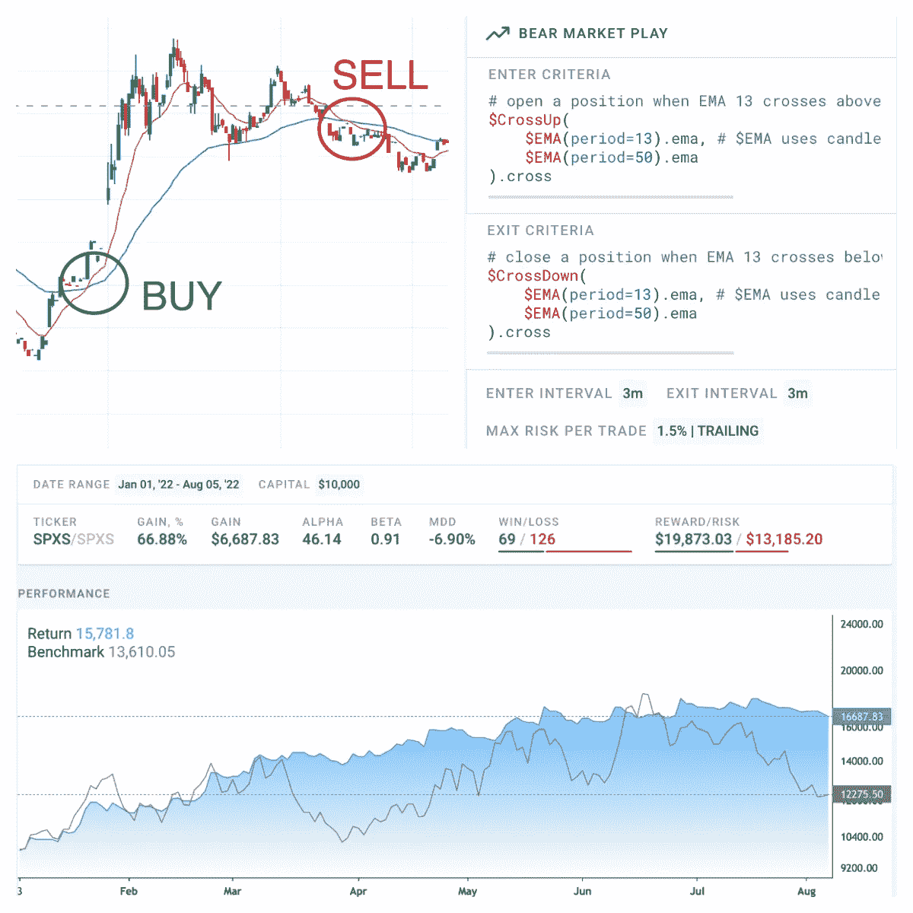

# 到目前为止，2022 年盈利的 3 个简单的日内交易策略

> 原文：<https://medium.com/geekculture/3-simple-day-trading-strategies-that-turned-profit-in-2022-so-far-a4d0c04da687?source=collection_archive---------7----------------------->

虽然每天交易者都相信他们能赚钱，但是很多人尝试日内交易却以净亏损告终。交易可能是一场斗争。有些人与它的精神层面作斗争，有些人最终在寻找点石成金的过程中变得过于复杂。

在这篇文章中，我们提出了简单的交易策略，它们的结果和背后的论点。我们的方法表明，采用简单而一致的策略可以获得财务回报。

# #1:道琼斯 30 指数开盘区间突破

开盘区间突破是一个简单而流行的交易策略，许多人在日常交易中使用。这个想法是，公开的价格行为通常会确立当天的趋势和情绪。开盘价聚集在每日高点或低点附近的趋势得到了历史市场行为的统计证据。

这个策略本质上非常简单，但要找到合适的股票进行交易可能很复杂，因此我们坚持使用道琼斯工业平均指数成份股。你可以很容易地从[https://www.cnbc.com/dow-30/](https://www.cnbc.com/dow-30/)那里得到名单

**策略和结果**

*   所有道琼斯 30 指数股票
*   过滤掉那些与昨天收盘价差距超过 1%的股票
*   当价格高于开盘价| 1 分钟图时，输入多头头寸
*   仅在 DJIA 价格高于昨天收盘价的时候交易
*   在下午 3:57 收市前退出，不要持有过夜

从 2022 年 1 月 1 日到 2022 年 8 月 10 日期间的结果相当不错，年初至今上涨 35%，超过了下跌 8%的道琼斯 30 指数。以下是每只交易股票的收益。

DOW 30 Opening Range Breakout

# # 2:3 倍杠杆熊市交叉

你能识别熊市吗？如果是的话，有一个交易策略*“Direxion Daily S&p500 Bear 3X Shares ETF”*$ spx。这个想法相当简单:在熊市中，股票往往会上涨，这使得反向 ETF 上涨，-3 倍的杠杆增加了日间交易所需的波动性。

**策略和结果**

*   在 EMA 13x50 交叉图| 3 分钟图上输入 SPXS 多头头寸
*   在 13x50 交叉向下| 3 分钟图上退出
*   1.5%跟踪止损

注意，在策略中，我们总是在下午 3:57 收市前退出，从不持有过夜。

从 2022 年 1 月 1 日到 2022 年 8 月 5 日期间的业绩超过了$ SPXS 买入并持有，利润约为 67%，仅下降了-6.9%。

3x Leverage Bear Market Cross

# 第三名:GME·埃马·克罗斯

$GME 仍然受到很多关注。例如 [r/GME](https://www.reddit.com/r/GME/) reddit 社区有 361，000 名成员，每天有 5-10 篇帖子，参与相当活跃。此外，GameStop 作为一家公司，并不回避提高零售兴趣，并积极投身于市场狂热。在这种环境下，我们应该能够从快速上涨和下跌中赚钱。

**策略和结果**

整个想法是不要太复杂，所以我们用 10 分钟均线 4x8 均线交叉，3%的跟踪止损。下面是为懒惰的读者提供的两张图片，展示了从 2022 年 1 月 1 日到 2022 年 8 月 10 日期间约 170%利润的战略和结果。

请注意，在策略中，我们总是在下午 3:57 收市前退出，从不持有过夜，以避免无法控制的疯狂波动。

$GME EMA Cross

所有提出的策略都是在[打破公平算法实验室](https://breakingequity.com/algo-lab)开发、测试和执行的。 [Breaking Equity](http://breakingequity.com/) 是一个自动化交易平台和市场，供散户投资者构建、购买和出售主动策略。它让积极策略变得更实惠、更具包容性，以确保散户投资者利用对冲基金的技术和数据，从而创造公平的竞争环境。

免责声明:在采取任何策略之前，先做好调查和尽职调查。这篇文章不是一个金融/投资建议，是为了教育目的而呈现给读者的。