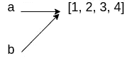

# 3 个简单的 Python 概念将推进你的职业生涯

> 原文：<https://medium.com/geekculture/3-simple-python-concepts-that-will-advance-your-career-9ed18cf08f5c?source=collection_archive---------1----------------------->


Python 是一种编程语言，由 Guido Van Rossum 于 1991 年创建。尽管它已经存在了很长时间，只是最近才引起业界的注意。在过去的几年里，越来越多的公司开始用 Python 开发项目，主要是为了它提供的快速开发。因此，对 Python 开发人员的需求正在增加，并且在未来几年还会继续增加。以下概念对于任何希望在未来赶上这股浪潮的开发人员来说都是必不可少的。

1.  **上下文管理器** 上下文管理器允许您以最佳方式分配和释放(管理)资源。如果处理不当，这些资源会产生一些非常奇怪的银行，让你抓耳挠腮。上下文管理器确保资源的所有方面都得到正确处理。您可以通过使用带有关键字的**来使用它们。使用上下文管理器最常见的用例是操作文件。对文件执行操作后，需要正确关闭它。上下文管理器可以很容易地为您做到这一点，跳过一些具体的细节:**

```
with open('myfile.xtx', 'r') as f:
    content = f.read()
```

请注意，我们从未调用过`f.close()`方法。上下文管理器会自动为我们处理它，即使出现异常，它也会尝试这样做。有许多可以使用上下文管理器的用例(例如`aiohttp.ClientSession`)，当然，您也可以创建自己的用例。

2.**类型提示** 类型提示使你能够写出清晰的、自我解释的代码。应用它的方法是“暗示”参数的类型和函数的返回值。例如，我们希望验证用户输入的文本总是一个整数。为此，我们编写了一个函数，根据我们的验证返回`False`的`True`:

```
def validate_integer(user_input):
    ...
```

既然您已经知道了这个函数的作用，那么通过查看定义就很容易理解了。但是，如果没有上面的描述，事情就没那么简单了。`user_input`参数的类型是什么？它从哪里来？已经是整数了吗？如果不是呢？该函数是否返回任何东西，或者只是引发一个异常？这些问题可以通过重构代码来回答，如下所示:

```
def validate_integer(user_input: str) -> bool:
    ...
```

现在这个函数更容易被解读，即使是第一次看这个的人。

3.**了解列表和字典** 这是新开发人员常见的误区。假设您创建了一个列表`a`，然后将这个列表赋给一个新变量:

```
>>> a = [1, 2, 3]
>>> b = a
```

现在，尝试在`b`列表中追加一个新值，然后打印这两个列表:

```
>>> b.append(4)
>>> print(b)
[1, 2, 3, 4]
>>> print(a)
[1, 2, 3, 4]
```

奇怪的是，新值已经被添加到两个列表中！这是因为在 Python 中分配列表时，除非另外指定，否则不会复制列表。相反，会创建一个对该列表的新引用。



Variable b is just a reference to the list

这意味着两个变量中的操作将被反映到同一个列表中。为了制作列表的副本，您需要使用`.copy()`方法:

```
>>> a = [1, 2, 3]
>>> b = a.copy()
>>> b.append(4)
>>> print(b)
[1, 2, 3, 4]
>>> print(a)
[1, 2, 3]
```

上面描述的几点只是有经验的开发人员记住的一些 Python 见解。当然，和任何语言一样，熟能生巧。