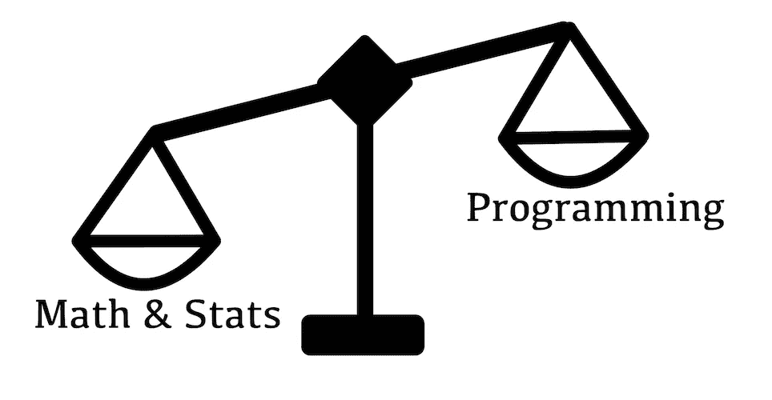
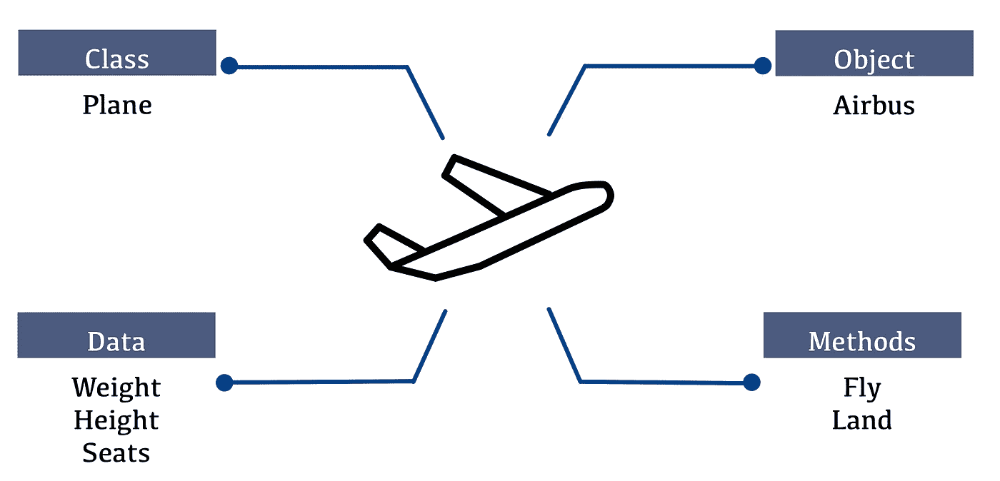
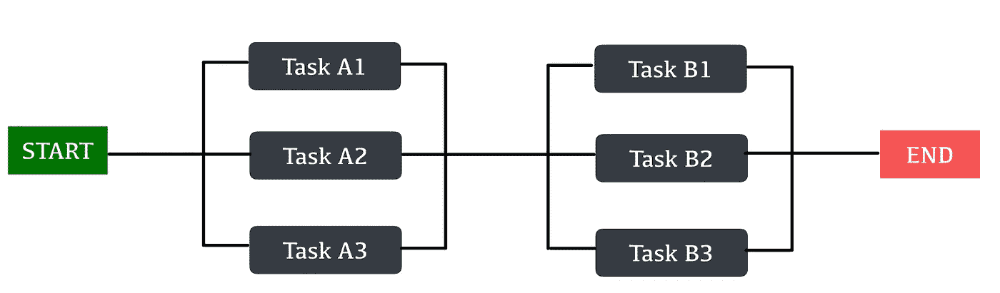

# 数据科学家应该知道的 3 个软件工程概念

> 原文：<https://medium.com/geekculture/3-software-engineering-concepts-data-scientists-should-know-f5a9d1da681f?source=collection_archive---------16----------------------->

Photo by [Startup Stock Photos](https://www.pexels.com/@startup-stock-photos?utm_content=attributionCopyText&utm_medium=referral&utm_source=pexels) from [Pexels](https://www.pexels.com/photo/man-standing-while-holding-red-marker-pen-facing-marker-board-7369/?utm_content=attributionCopyText&utm_medium=referral&utm_source=pexels)

# 介绍

数据科学家是一个需要掌握一套硬技能的职业。当谈到这些技能时，人们通常会想到数学或统计学，因为它们有助于理解数据的底层模式和机器学习算法的复杂性。然而，有一项技能却没有得到足够的重视:编程。

澄清一下，我所说的编程技能不仅仅是写代码做某事的能力。大多数专业技术人员都可以做到。但是，我关注的是编写高效、可靠、可重用、最重要的是可读的组织良好的代码的能力。

在本文中，我们将了解为什么数据科学家应该学习编写干净的代码，并介绍有助于做到这一点的 3 个软件工程概念，以及它们如何提高生产率。

# 目录表

> [为什么编程会被忽视？](#d46f)
> [面向对象编程](#6674)
> [单元测试](#adad)
> [并发计算](#e26d)

# 为什么编程被忽视了(为什么不应该被忽视)

与代码是可交付产品的软件项目不同，代码在数据科学项目中的角色是不同的。通常，数据科学项目以机器学习模型或分析报告的形式产生输出。代码只是派生模型的方法，不会被部署或交付给用户。因此，只要正确生成输出，代码质量通常不是主要问题。

尽管表面上看起来没什么问题，但这可能会产生昂贵的隐性成本。低质量的代码对团队的生产力伤害很大。团队成员很难理解彼此的代码，因为它的设计很差，导致进展缓慢。随着新代码破坏旧代码，错误会更频繁地出现。这些只是可能让参与项目的每个人都遭受痛苦的噩梦的几个例子。

Photo by [Andreas Klassen](https://unsplash.com/@schmaendels?utm_source=medium&utm_medium=referral) on [Unsplash](https://unsplash.com?utm_source=medium&utm_medium=referral)

有大量的软件工程原则可以解决这些问题。但是，由于我们正在构建一个数据科学产品，而不是软件，只有基本的就足够了。如果你应用了我将要提到的三个概念，你的代码将会更有条理，你的生产率将会显著提高。

# 面向对象编程

在数据科学项目中，数据科学家通常编写代码来处理函数形式的数据。当另一个地方需要相同的代码时，他们通常会复制它，最终，代码变得一团糟。面向对象编程(OOP)的概念可以解决这个难题。OOP 是结构良好的代码的支柱。这个概念提出了将代码组织成包含*数据*的*对象*和封装其业务逻辑的*方法*的范式。应用 OOP 将使我们的代码更有组织性、可重用性和灵活性，从而节省开发时间。

虽然有一些先进的技术如*多态*和*多重继承，但是*数据科学项目通常不需要像软件项目那样复杂的代码结构。所以，大多数时候，对*类*和*对象*的基本理解就足以编写干净的代码。

Object-Oriented Programming(Image created by the author)

# **单元测试**

编写结构良好的代码的一个关键好处是易于验证，这就引出了第二个概念:*单元测试*。简而言之，单元测试是为了测试函数或对象是否正常工作而编写的代码。对于那些不熟悉软件测试的人来说，编写代码来测试代码可能听起来很奇怪。你为什么要做这种事？答案是:我们希望测试是自动化的。由于代码是由一群开发人员开发的几个单元组成的，所以不可能有人会彻底理解每一部分并能测试整体(即使可能，也是浪费时间)。这就是为什么我们需要自动化测试过程。

当构建机器学习模型时，我们通常使用提供开箱即用的复杂算法实现的库。然而，模型构建只占 30-40 %,因为数据科学项目的大部分工作是数据预处理和特征提取。一个小小的错误可能会导致模型不准确，调查起来既困难又费时。因此，确保提供给模型的数据是正确的是至关重要的，而做到这一点的最佳方法是验证生成数据的代码是否正常工作。

# 并行计算

最后我们要谈的是*并发计算*。并发计算允许多个任务同时运行，这可以显著加快执行时间。为了应用这个概念，你必须将你的代码设计成一系列的任务。这是设计代码的另一个重要原因，因为设计良好的代码非常容易并发执行。

在本文提到的三种计算方式中，并发计算带来的好处最快。数据科学家通常会处理大量数据，处理这些数据可能需要数小时。有效地定义处理步骤和应用并发计算可能会将几个小时变成几分钟，这使您可以将时间花在适合您技能的有趣任务上。此外，现在许多公司使用云服务提供商的计算资源。这些机器是按使用时间来定价的(它们很贵)，节省计算时间意味着更便宜的运营成本，这样公司就可以把钱花在别的事情上。也许其中一些会成为你的加薪。看到了吗？速赢。

Concurrent Computing (Image created by the author)

# 结论

编程是数据科学家日常工作的一大部分。本文介绍了 3 个软件工程概念，它们将有助于在从事数据科学项目时提高编程技能和生产率。使用它们会让你的工作变得有效和愉快，整个经历也会变得愉快。