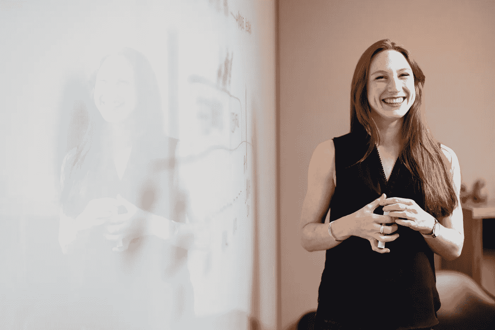

# 软件工程师的 3 大趋势

> 原文：<https://medium.com/geekculture/3-solid-trends-for-software-engineer-6d29dfbd4464?source=collection_archive---------13----------------------->

## 2021 年引起工程师关注的技术

Photo by [ThisisEngineering RAEng](https://unsplash.com/@thisisengineering?utm_source=unsplash&utm_medium=referral&utm_content=creditCopyText) on [Unsplash](https://unsplash.com/s/photos/software?utm_source=unsplash&utm_medium=referral&utm_content=creditCopyText)

2021 年慢慢结束，只剩下三个月了。不出所料，这些技术不会停留在同一位置，只会继续发展。新的概念和想法被采用，而旧的被废弃。