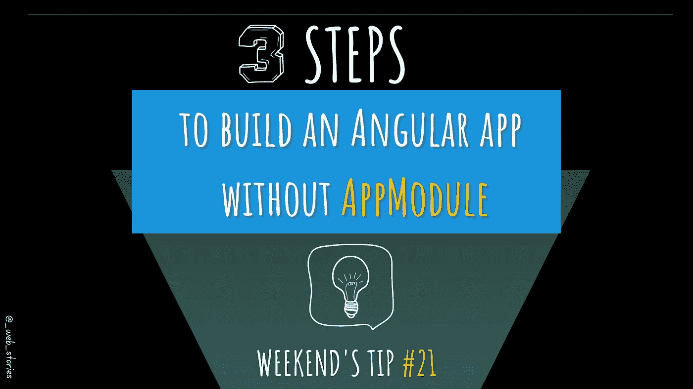

# 不使用 AppModule 引导 Angular 应用程序的 3 个步骤

> 原文：<https://medium.com/geekculture/3-steps-to-bootstrap-an-angular-app-without-appmodule-4985b49127ef?source=collection_archive---------1----------------------->

## 引导独立组件

By FAM

## 你好👋

今天的技巧是关于将 Angular AppComponent 转换为独立组件，并引导组件而不是模块。

要了解有关独立组件的更多信息: