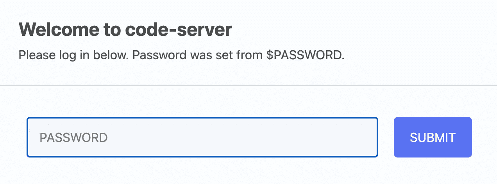
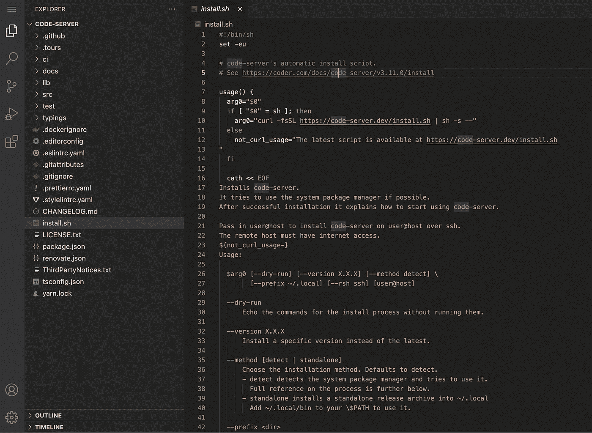

# 从任何地方编码的 3 个步骤

> 原文：<https://medium.com/geekculture/3-steps-to-code-from-anywhere-45401247f479?source=collection_archive---------5----------------------->

## 自承载 Visual Studio 代码服务器


Photo by [Ilya Pavlov](https://unsplash.com/@ilyapavlov?utm_source=medium&utm_medium=referral) on [Unsplash](https://unsplash.com?utm_source=medium&utm_medium=referral)

**灵活性。**也许你有多台设备可以用来编码。也许你工作的地方有一台 Mac，家里有一台 Windows 机器。也许你只是想从 iPad 或 Android 平板电脑上编写代码，或者，为什么不呢，也许你需要快速解决一个 bug，而你的口袋里只有你的智能手机。不管是什么原因，这个简短的教程将帮助您创建一个可以在任何计算机上使用的 IDE 服务器。

在这个时代，所有的东西都在移动或者被移动到了云端。几年前，一个来自 coder.com 的团队使用 TypeScript 为一个流行的 IDE Visual Studio 代码做了同样的事情，并在 MIT 许可下将该项目开源。

# 观众

软件开发人员、DevOps 工程师、QA 自动化工程师或任何拥有或能够从某处获得基于 Linux 的服务器的人

# 先决条件

*   基于 Linux 的服务器，至少具有 1gb RAM 和 2 个 CPU 内核

# 步伐

**[ 1 ]。安装必要的软件**

要安装代码服务器，您只需在您的 Linux 服务器上运行以下命令:

```
curl -fsSL https://code-server.dev/install.sh | sh
```

**[ 2 ]。在 Linux 服务器上运行它**

在同一个 Linux 服务器中，创建一个变量，将您的特殊密码放入其中，并为此代码服务器选择一个端口。我这种情况，用的是 8080。

```
PASSWORD=my-custom-password
code-server --auth password --bind-addr 0.0.0.0:8080
```

**【3】。使用您最喜欢的浏览器访问云 IDE**

在你的设备上打开浏览器，输入服务器的 IP 地址和端口。您将看到类似于以下截图的内容:



在那之后，瞧！您应该可以在那里找到 Visual Studio 代码 IDE。



尽情享受吧！

# 高级部分

当然，每个用例都是不同的，我无法在几个段落中涵盖所有内容。我不想让这篇文章太长，但是有些事情你可能需要考虑，比如:

*   使用 SSH 或服务器连接的路由器进行端口转发
*   在 Docker 容器中运行
*   启用 HTTPS 并使用“让我们加密”配置 SSL 证书
*   在后台运行代码服务器
*   经常升级软件

# 更多信息

*   官方文件:[https://coder.com/docs/code-server/latest](https://coder.com/docs/code-server/latest)
*   源代码:[https://github.com/cdr/code-server](https://github.com/cdr/code-server)
*   官方码头项目:[https://hub.docker.com/r/codercom/code-server](https://hub.docker.com/r/codercom/code-server)
*   社区维护的 Docker 项目:[https://github.com/linuxserver/docker-code-server](https://github.com/linuxserver/docker-code-server)