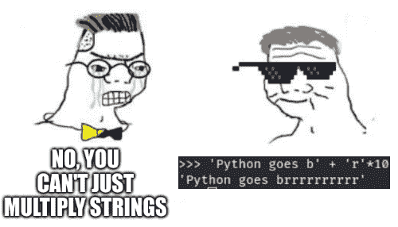
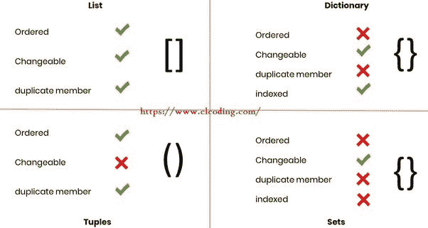

# 字符串、列表、字典、元组和集合(快速代码-Python)

> 原文：<https://medium.com/geekculture/3-strings-lists-dictionaries-tuples-and-sets-quick-code-python-84232f05a3df?source=collection_archive---------6----------------------->


Credit: Unsplash.com

在**快速代码-Python** 系列的**第三章**中，我们将了解 Python 中可用的各种关键数据结构，以及一些实用的代码片段，这些代码片段在日常编码过程中是必不可少的。

> 注意:我已经以线性的方式编写了**快速代码-Python** 系列，这样即使是新手也可以按照这个系列来理解 Python 实际能做什么。对于擅长基础知识的人来说，你可以跟随这个系列来更新你的概念，或者选择这个系列中你想了解更多的章节。

我将格式和用户输入操作作为博客的一部分添加进来，因为有些人不熟悉从用户那里获取输入和使用`.format()`方法调用变量。

1.  **格式和用户输入操作**
2.  **字符串和布尔值**
3.  **列表**
4.  **字典**
5.  **元组和集合**

我们开始吧。

# 1.格式和用户输入操作

## 格式

在理解用户输入操作之前，我们需要理解使用`.format()`方法编写打印语句(方法只是属于一个对象的函数)。

```
x = 34
y = 55
Z = x*y
M = x/y
print('Multiplication = {}, Division = {}'.format(Z,M))**O/P: 
Multiplication = 1870, Division = 0.6181818181818182**
```

现在，还有另一种使用 format 方法的方式。

```
X = 34
Y = 55print('Multiplication = {}, Division = {}'.format(X*Y,X/Y))**O/P: 
Multiplication = 1870, Division = 0.6181818181818182**
```

我们得到相同的输出。第二种方法效率更高，但是当你有更多的操作要做时，最好像第一种方法一样分配变量并打印出来。

## 用户输入

我们需要提示用户输入一个特定变量的值，这个变量将用于程序的执行。现在，让我们使用 python 中的 input 操作从用户那里获得输入。

要获得用户输入，我们需要做的就是输入`input()`

```
a = int(input("Enter a number: ")) 
b = int(input("Enter another number: "))print('Multiplication = {}, addition = {}'.format(a*b, a+b))**O/P: 
Enter a number: 5
Enter another number: 6
Multiplication = 30, addition = 11**
```

请注意，您(代码要求您输入)输入的是数字 5 和 6，而不是一些默认值。

> 打印数字的平方和立方

```
x = int(input("Enter a number: "))#converting x into an integerprint('The square and cube of {} is {} and {}'.format(x, x*x, x*x*x))**O/P: 
Enter a number: 6
The square and cube of 6 is 36 and 216**
```

Python 接受所有字符串形式的输入，当我们需要对来自用户输入的数字进行算术运算时，这就成了一个障碍。这就是我们将`int()`放在第 1 行的原因，我们需要将字符串转换成整数。

> 将公里/小时转换为英里/小时

```
kmh = int(input("Enter speed in km/h: "))
mph =  0.6214 * kmh
print("Speed in Km per hour = ", kmh, "KM/H")
print("Speed in Miles per hour = ", mph, "MPH")**O/P:
Enter speed in km/h: 100
Speed in Km per hour = 100 KM/H
Speed in Miles per hour = 62.13999999999999 MPH**
```

> 计算矩形的面积和周长

```
width = int(input("Enter Width: "))
length = int(input("Enter Length: "))area = width * length
perimeter = 2 * (width + length)print('Area = {}, Perimeter = {}'.format(area, perimeter))**O/P:
Enter Width: 3
Enter Length: 4
Area = 12, Perimeter = 14**
```

# 2.字符串和布尔值

python 中的字符串只是一系列字符。您可以使用字符串中可用的方法在 python 上进行各种操作。

```
name = "shreedhar"
print(name)
z = type(name)
print(z)**O/P: 
shreedhar
<class 'str'>**
```

记得我告诉过你，python 默认将所有用户输入存储为一个字符串，即使你将两个数字相加而不将它们转换为整数，它也只是将它们相加为两个字符串而不是数字。

```
a = input('enter first number: ')
b = input('enter second number: ')
print('the answer is : {}'.format(a+b))**O/P: 
enter first number: 4
enter second number: 5
the answer is : 45**
```



credit: Reddit(programming humor)

> 来自迷因的代码(上图)

```
'python goes b' + 'r'*10O/P:
'python goes brrrrrrrrrr'
```

> 让我们添加两个字符串来打印我的 Twitter 用户名

```
first_name = "@shreedhar" 
last_name = "v16"
username = first_name + "_" + last_name
print("My twitter username is : ",username)**O/P: 
My twitter username is :  @shreedhar_v16**
```

有许多方法可以应用到我们的字符串函数来进行各种操作。

```
**#converting a string to uppercase** y = 'shreedharv16'
z = y.upper() 
z**O/P:
'SHREEDHARV16'****#splitting our string** y = 'shreedhar_v16'
z = y.split('_')
z**O/P:
['shreedhar', 'v16']**
```

我们还可以从输出的列表中得到一个特定的字符串。字符串中第一个字符的存储位置从 0 开始。


Credit: Real Python

字符串切片和操作

```
**#splitting our string** y = 'shreedhar_v16'
z = y.split('_')
z**O/P:
['shreedhar', 'v16']****#taking the 1st and 2nd element**
print(z[0])
print(z[1])**O/P: 
'shreedhar'
'v16'**
```

布尔值只是返回真或假的值。当您编写一些高级 python 代码时，您可以将它们用作标志。

```
x = 10
y = 20
print(x>y)
print(x<y)
print(x==y)
print(x!=y)**O/P:
False
True
False
True**
```

> 显示用户名、密码和检查用户是否活动的代码。

注意:\n 用于在我们的打印语句上指定一个新行

```
name = "[@shreedharv16](http://twitter.com/shreedharv16)"
password = '********'
active_user = Trueprint('Username: {} \nPassword : {} \nActive User: {} \n'.format(name,password,active_user))**O/P:
Username: @shreedharv16 
Password : ******** 
Active User: True**
```

> 从邮件地址中删除姓名的代码

```
inp_str = input("Enter your e-mail address:")
out_str = inp_str.split('@')
print('The name from the mail id is ',out_str[0])**O/P:
Enter your e-mail address:shreedharv1234@gmail.com
The name from the mail id is  shreedharv1234**
```

> 从邮件地址中计算你的名字的字母数的代码

```
inp_str = input("Enter your e-mail address:")
out_str = inp_str.split('@')print('There are {} characters in your username'.format(len(out_str[0])))**O/P:
Enter your e-mail address:shreedharv16@gmail.com
There are 12 characters in your username**
```

# 3.列表

列表是元素的有序集合。列表是可变的，这意味着它允许列表中有重复的成员。

让我们创建我们的第一个列表

```
my_first_list = [1, 2, 3]
my_first_list**O/P: 
[1, 2, 3]****#creating a nested list**
my_list = ["shreedhar", [3, 3, 3]]
my_list**O/P:
['shreedhar', [3, 3, 3]]**
```

在第二个示例中，成功打印了重复元素

访问列表和嵌套列表(列表中的列表)中的元素

```
names = ['shreedhar', 'joe', 'aj']
print(names[0])
print(names[1])
print(names[2])**O/P:
shreedhar
joe
aj**list_of_contents = ['01',['23','IA'],'ef']
print("second element in the second list is : ",list_of_contents[1][1])**O/P:
second element in the second list is :  IA**
```

我们需要理解什么是切片索引。

`list[:]`打印列表中的所有元素

`list[2:4]`从位置[2]和[3]打印元素。请注意，上限[4]减少了 1。列表中的上限值始终为(n-1)。

`list[2:5]`打印从[2]到[4]的元素

`list[:2]`打印列表中的最后两个元素

`list[2:]`打印列表中第二个位置的元素

`list[:-1]`打印列表中的最后一个元素

```
names = ['sara', 'john', 'aj','dimple','kv']
print(names[:2])
print(names[2:4])
print(names[2:5])
print(names[:])
print(names[2:])**O/P:
['sara', 'john']
['aj', 'dimple']
['aj', 'dimple', 'kv']
['sara', 'john', 'aj', 'dimple', 'kv']
['aj', 'dimple', 'kv']**
```

让我们看看列表中其他可用的方法

```
**#add a new element** names = ['sara', 'john', 'aj','dimple','kv']
names.append('zoe')
print(names)**O/P: 
['sara', 'john', 'aj', 'dimple', 'kv', 'zoe']****#remove john from the list** names = ['sara', 'john', 'aj','dimple','kv']
names.remove('john')
print(names)**#delete using the index number** del names[0] 
pirnt(names)**O/P: 
['sara', 'aj', 'dimple', 'kv', 'zoe']
['aj', 'dimple', 'kv', 'zoe']**
```

如果你曾经使用过除 python 之外的任何其他编程语言，你会知道即使是排序或反转列表这样的基本操作也需要很多行代码来运行它。


Credit: Reddit(progrmaminghumor)

但是 python 只需要几行代码就可以完成这项任务

```
**#sort a list** my_list = [50, 20, 30, 10, 40, 15, 45]
my_list.sort()
print(my_list)**O/P:
[10, 15, 20, 30, 40, 45, 50]****#reverse a list** my_list.reverse()
print(my_list)**O/P:
[50, 45, 40, 30, 20, 15, 10]**
```

> 从您原来的朋友列表创建一个新的朋友列表，该列表只包含每个组的姓氏

```
friends_list = [['joe','sam','tina'],['aj','kd','cody'],['trucker','carl','sussie']]**#creating an empty friends list** friends_list2 = []friends_list2.append(friends_list[0][-1])
friends_list2.append(friends_list[1][-1])
friends_list2.append(friends_list[2][-1])
friends_list2**O/P:
['tina', 'cody', 'sussie']**
```

# 4.字典

字典是一个键-值对，用于将数据存储在可以通过键访问的值中，就像我们如何使用索引值访问列表一样。

字典的一般格式是，

```
dict = {'key1':'value1',
           'key2':'value2', 
           'key3':'value3'}
dictO/P:
{'key1': 'value1', 'key2': 'value2', 'key3': 'value3'}
```


credit: benjamin dicken

> 为手表产品创建字典

```
**#product dictionary** product = {"Name": "Watch",
           "Color": "Blue",
           "Brand": "Fossil"}
product**O/P:
{'Name': 'Watch', 'Color': 'Blue', 'Brand': 'Fossil'}****#adding year to the dict** product["Year"] = "1887"
print(product)**#deleting color key** del product["Color"]
print(product)**O/P:
{'Name': 'Watch', 'Color': 'Blue', 'Brand': 'Fossil', 'Year': '1887'}
{'Name': 'Watch', 'Brand': 'Fossil', 'Year': '1887'}**
```

您还可以通过`.keys()`和`.values()`方法检查字典的键和值

```
**#check the keys** product.keys()**O/P:
dict_keys(['Name', 'Brand', 'Year'])****#check the values** product.values()**O/P:
dict_values(['Watch', 'Fossil', '1887'])**
```

> 使用字典查找班级的平均分和总分

```
mark_list = {"sam": 89,
             "aj": 78,
             "kd": 45,
             "mk":90}
print('The total marks : ',sum(mark_list.values()))
print('The average mark : ',sum(mark_list.values())/4)**O/P:
The total marks :  302
The average mark :  75.5**
```

# 5.元组和集合

## 元组

元组可以定义为不可变的 python 对象，它们是序列，就像列表一样，只是列表是可变的(可修改的)，而元组是不可变的(不可修改的)。唯一不同的是，列表使用`['list_name1']`，而元组使用`('tuple_name1')`

创建我们的第一个元组

```
my_tuple1 = ('sam',323,'joe',304,'hello',123)
my_tuple2 = (3,4,5,'karin')
print(my_tuple1)
print(my_tuple2)**O/P:
('sam', 323, 'joe', 304, 'hello', 123)
(3, 4, 5, 'karin')**
```

访问元组与访问列表是一样的

```
print(my_tuple1[3])
print(my_tuple2[:-1])
print(my_tuple1[3:])**O/P:
304
(3, 4, 5)
(304, 'hello', 123)**
```

让我们试着给创建的元组赋值

```
my_tuple1 = ('sam',323,'joe',304,'hello',123)
my_tuple1[2] = 33**O/P:
TypeError: 'tuple' object does not support item assignment**
```

因为一个元组是不可变的，我们不能为一个现有的元组赋任何新的值，这就是为什么我们会得到一个类型错误。

你甚至不能删除元组中的元素

```
my_tuple = (430, 23, 22, [14, 44])
del my_tuple[3]**O/P:
TypeError: 'tuple' object doesn't support item deletion**
```

但是，不要担心，我们可以使用列表向元组添加值

```
names = ('shree','joe',23,[33,44])
names[3][0] = 25
print(names)**O/P: 
('shree', 'joe', 23, [25, 44])**
```

## 一组

集合可以被定义为一个无序的项目集合，不允许在其中出现任何重复项。我们可以使用`{'value1'}`创建一个集合

创造我们的第一套

```
my_set = {1, 2, 3}
print(my_set)**O/P:
{1,2,3}**
```

向集合中添加重复项，并且仅在存储和打印时移除重复项

```
my_set = {1,2,3,4,3,2}
print(my_set)**O/P:
{1, 2, 3, 4}**
```

将集合应用于列表会删除列表中的重复项，并将它们转换为集合

```
my_list = [1,2,3,2]
my_set = set(my_list)
print(my_set)**O/P:
{1, 2, 3}**
```

> 将您的名字添加到集合并将集合转换为列表

```
names = {'john', 'karen','aj','sj'}
names.add('shree')
print(names)**O/P:
{'sj', 'shree', 'aj', 'karen', 'john'}**names_list = list(names)
print(names_list)**O/P:
['sj', 'shree', 'aj', 'karen', 'john']**
```

博客到此结束。

这张图片总结了我们讨论过的所有话题。初学者会犯的主要错误是为不同的类型改变括号的类型。如果你犯了错误，不要担心，这可以通过不断的练习来解决。



credit: www.clcoding.com

希望您已经理解了所解释的各种数据结构。仅仅阅读博客是不够的。通过在 IDE 上复制粘贴来运行代码。自己改变变量，看看输出如何变化。最后，试着自己写代码。

查看**快速代码-Python** 系列的上一章[这里](/geekculture/solving-math-problems-using-python-quick-code-python-52b1b37a79d5)。