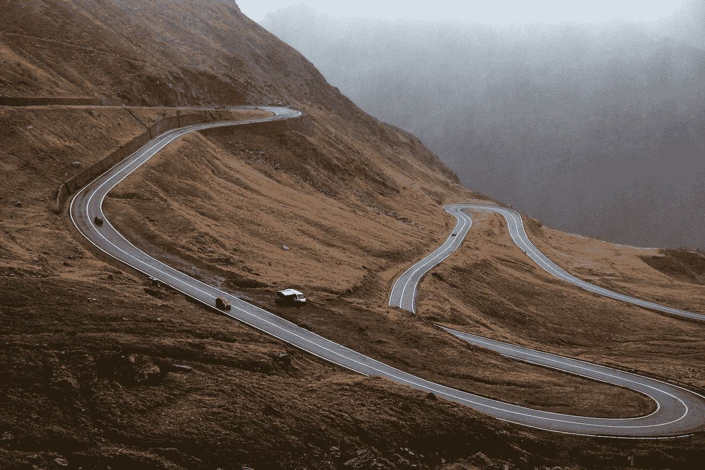
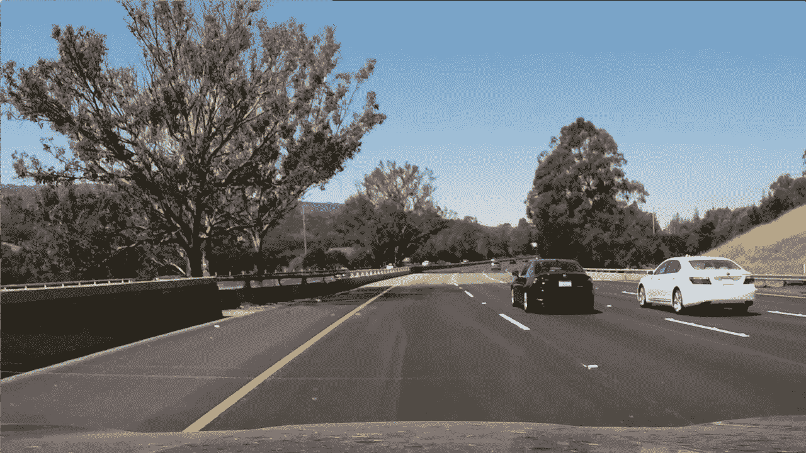
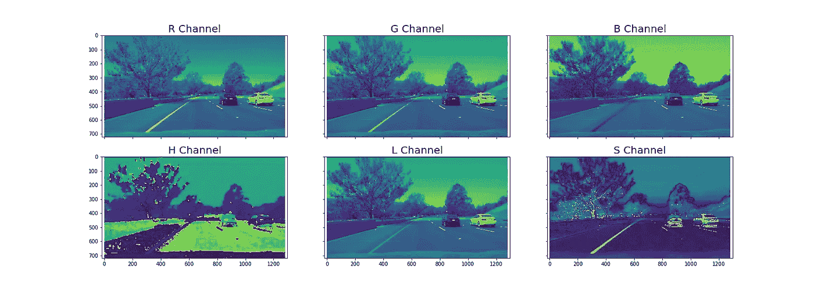
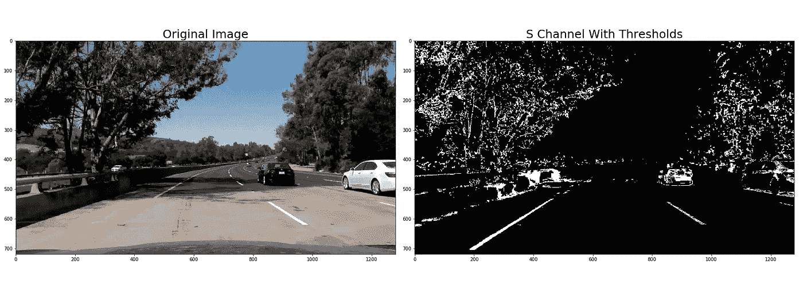
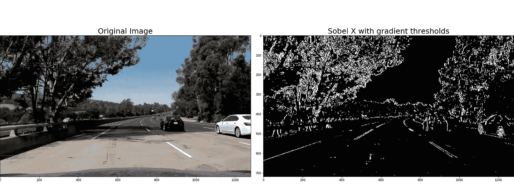
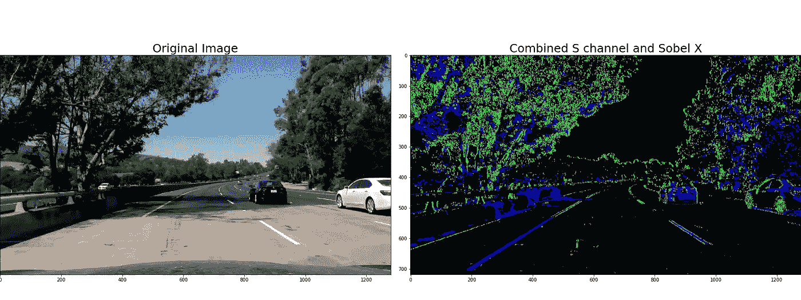
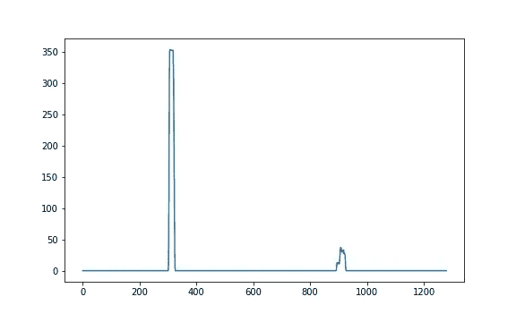
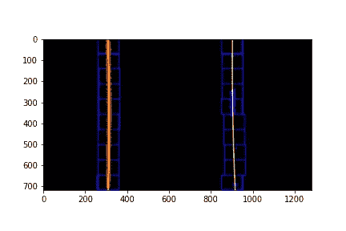
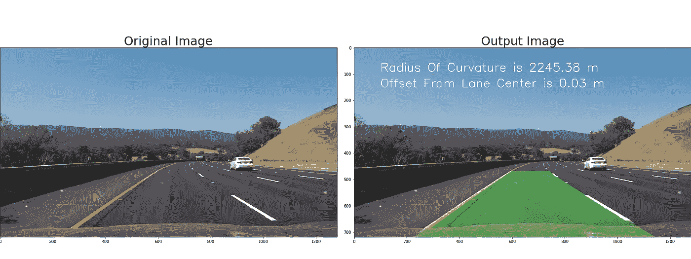
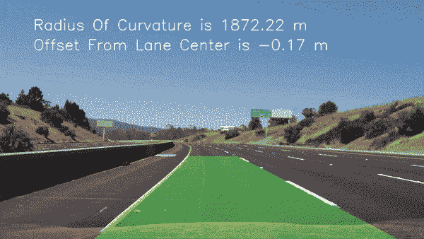

# 自动驾驶汽车可以用来处理急转弯的 3 项技术

> 原文：<https://medium.com/geekculture/3-techniques-to-tackle-steep-turns-and-varying-light-conditions-342bfb0e9845?source=collection_archive---------0----------------------->

## 无人驾驶汽车在不利条件下的感知！

Photo by [Maria Teneva](https://unsplash.com/@miteneva?utm_source=medium&utm_medium=referral) on [Unsplash](https://unsplash.com?utm_source=medium&utm_medium=referral)

一辆自动驾驶汽车需要感知 ***不同颜色*** 的车道线，并在 ***变化的光照条件下*** 准确检测车道。它还应该知道 ***车道曲率*** ，除了速度和汽车动态，以确定保持在车道上所必需的转向角度。

Sample Image From Udacity’s Self Driving Car Nano-Degree course

我们将看看一些技术，无人驾驶汽车可以用来在这种变化的条件下寻找车道线。

# 技术

1.  色彩空间
2.  索贝尔算子
3.  曲率半径

# 色彩空间

RGB 色彩空间适用于带有白色通道的图像。它对其他颜色的车道有限制。让我们探索其他颜色空间，如 HSV(色调、饱和度、值)和 HLS(色调、亮度、饱和度)等。

> 色调代表与亮度变化无关的颜色。明度和值是测量颜色的明度或暗度的不同方法。饱和度是色彩的量度。

带有黄色车道线的图像被分为 RGB 和 HLS，如下所示。

仅有的 R、G 和 S 通道显示对应于黄色车道线的高像素强度。 ***蓝色通道的黄色像素强度为零*** 。

通过选择最佳通道和该通道的正确颜色阈值，我们现在可以更准确地识别黄色车道线，如下所示。

然而，即使是 S 通道也无法检测阴影区 下的黄色车道 ***。***

# 索贝尔算子

由于车道线是垂直的，我们可以以更智能的方式使用梯度来检测更有可能是车道的陡峭边缘。

> 对图像应用 Sobel 算子是一种在 x 或 y 方向上获取图像导数的方法

通过选择 x 方向的梯度(Sobel x 算子)并调整该梯度的强度，我们现在可以找到 S 通道(在前面的部分中)无法检测到的车道部分，如下所示。

现在，我们可以将上述每种技术(Sobel x 和 S 通道)识别的像素结合起来，在不同的光照条件下更准确地找到黄色车道线，如下所示。

即使我们的算法现在可以检测不同颜色和不同光照条件下的车道， ***当它遇到突然的弯道*** 时，它仍然可能失败。

# 曲率半径

车道曲率的知识对于汽车保持在车道上是必要的。透视变换改变了我们的视角，从不同的视点和角度观看同一个场景。鸟瞰图，让我们拟合一个多项式车道线。然后，我们从多项式中提取车道曲率。

Perspective Transformed Image

绘制直方图并找到上图左半部分和右半部分的峰值，给出左车道和右车道的起始位置，如下所示。

Histogram To Find Left and Right Lane Bases

## 推拉窗

使用起始位置，并在图像上应用滑动窗口技术，我们可以用多项式拟合车道线，如下所示。

Polynomial Fitted Lanes

## 曲率半径和从车道中心的偏移

像素被转换为米，多项式拟合被重新计算以确定以米为单位的曲率半径，如下所示。

# 结果

连续的帧在相似的位置具有车道线。因此，为了找到下一帧中的车道像素，我们可以在某个裕度内搜索先前检测到的车道线位置。

上述技术的应用使得汽车在不同的照明条件下(明亮的光线和阴影区域)，以及在陡峭的弯道 ，准确识别不同颜色(黄色和白色)的 ***车道，如下图所示。***

As it moves, Cars can detect lanes accurately.

最后的视频是我的“高级车道发现项目”的输出，该项目是 Udacity 自动驾驶汽车纳米学位项目。

这篇文章是我的上一篇文章的高级版本。*请阅读关于 Canny 边缘检测和 Hough 变换*的详细内容。

 [## 自动驾驶汽车可以用来寻找车道的 4 种技术

### 让电脑看见！

medium.com](/swlh/4-techniques-self-driving-cars-can-use-to-find-lanes-fcb6dd06b633) 

*原载于*[*https://github.com*](https://github.com/buddha216g/Computer-Vision/blob/master/002-Advanced-Lane-Finding.md)*。*