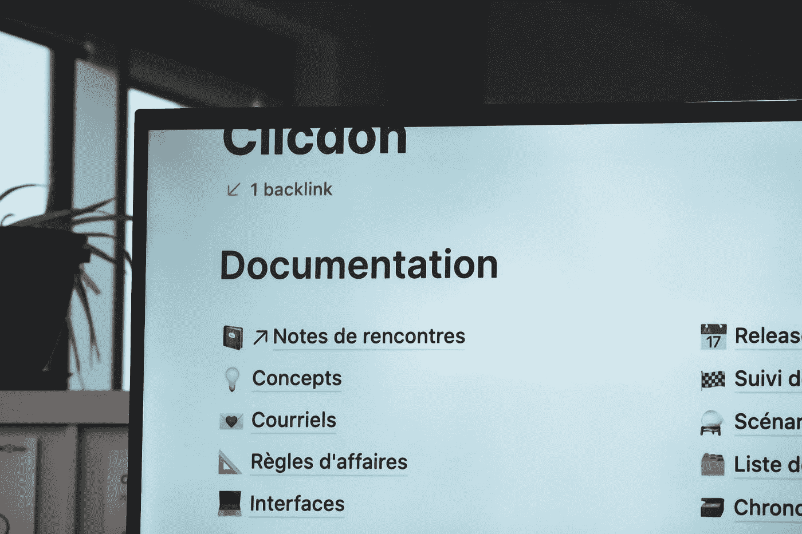

# 构建内部开发者门户的 3 个技巧

> 原文：<https://medium.com/geekculture/3-tips-for-building-an-internal-developer-portal-29e27e4fe7a4?source=collection_archive---------11----------------------->

Photo by [Sigmund](https://unsplash.com/@sigmund?utm_source=unsplash&utm_medium=referral&utm_content=creditCopyText) on [Unsplash](https://unsplash.com/s/photos/documentation?utm_source=unsplash&utm_medium=referral&utm_content=creditCopyText)

大多数公司雇佣和构建 DevOps 团队来提高软件开发过程的生产力。然而，在有些情况下，DevOps 团队充当了软件开发和运营或部署之间的障碍。

DevOps 团队的成员通常致力于构建和识别程序中的瓶颈。但是，如果他们没有…