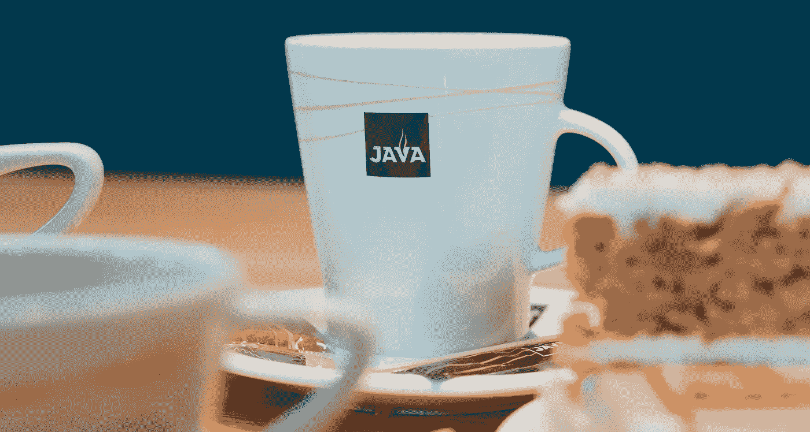

# 关于如何将您的 Java8 Web 应用程序码头化的 3 个技巧

> 原文：<https://medium.com/geekculture/3-tips-on-how-to-dockerize-your-java8-web-application-988dca034c6d?source=collection_archive---------32----------------------->

Java Programming is like a cup of good coffee

Java 是一种强大的编程语言，它本身提供了许多好处。然而，通过将这种语言与 docker 容器相结合，Java 能够比以前更容易地部署在 web 上。

首先初始化 OpenJDK 的版本，让 Java 包含在 docker 容器中。