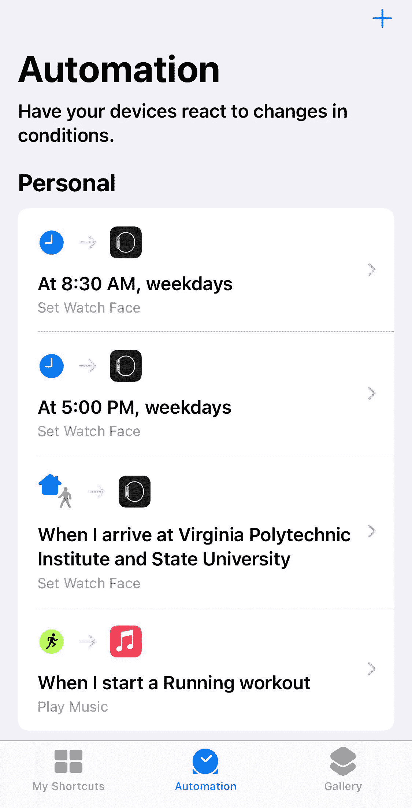

# 让你和你的 Apple Watch 更有效率的 3 个技巧

> 原文：<https://medium.com/geekculture/3-tips-to-make-you-and-your-apple-watch-more-productive-a25958066d64?source=collection_archive---------1----------------------->

## 如何让你的智能手表为你工作

Photo by [Raagesh C](https://unsplash.com/@raagesh?utm_source=medium&utm_medium=referral) on [Unsplash](https://unsplash.com?utm_source=medium&utm_medium=referral)

我使用 Apple Watch 已经有大约 5 年了，从 1 系列开始，目前拥有一个 5 系列设备。我投身智能手表行业有两个主要原因:

*   健身追踪
*   管理通知和“事情”比在我的手机上

我喜欢短信，或者一眼就能看出是谁打来的。如果我在做饭或做其他活动，接电话也很容易。又拿不到我的手机。我的手表上保存了播客、有声读物和音乐。配有无线耳机，我可以随身携带手机。如果你有一部更大的手机，这就更好了。

我不是来告诉你应该买块苹果手表的。Fitbit、Garmin 或任何现在流行的 Android 设备都是好东西，没有“最好的手表”。这是最适合你和你的生活方式的。但是，如果你*拥有一只苹果手表(或者想买一只)，我想分享一些你可能会想用的功能:*

1.  Apple Pay
2.  解锁其他设备
3.  自动化和快捷方式

你可能不会发现这些生活改变了，但我发现它们让我生活的一小部分变得更容易。在经历了 18 个多月的疫情后，我会尽我所能让我的生活更简单。

# Apple Pay

自从 iPhone 6 推出 Apply Pay 后，你就可以在手机上用信用卡支付了。从那以后，NFC 越来越被接受。它存在于大量使用移动设备的零售店、杂货店和其他供应商中。

当我不方便拿钱包或者完全忘记带钱包时，我喜欢使用这个功能。你也可以在手表上启用 Apple Pay，享受同样的便利。一旦激活，你所要做的就是双击手表上的侧边按钮，轻松支付。

如果这*真的比在手机上使用 Apple Pay*好得多吗？这取决于你，但我发现这比从口袋或夹克里掏出手机要快。尤其是当我为了工作多带了一部手机，不得不找一部合适的时候。如果没有别的，我经常会得到“哇，我不知道你可以这样做！”购物时。即使你没有带着你的 iPhone，你仍然可以使用 Apply Pay。当你不想要额外的设备，或者想在锻炼时从商店里拿瓶水时，这是很好的选择。

有关设置 Apple Pay 或手表在没有 iPhone 的情况下还能做什么的更多信息，请参见下面的链接。

 [## 设置 Apple Pay

### 若要设置 Apple Pay，请将信用卡、借记卡或预付卡添加到 iPhone、Apple Watch 或其他……

support.apple.com](https://support.apple.com/en-us/HT204506)  [## 你只有 GPS 的苹果手表仍然可以做很多伟大的事情

### 最佳答案:没有你的 iPhone，最好的 Apple Watch-only(0-6 系列和 SE 型号)仍然可以做以下事情:…

www.imore.com](https://www.imore.com/heres-what-apple-watch-can-do-without-iphone) 

# 解锁其他设备

如果你有一台 MacBook，你可以用你的手表来解锁你的笔记本电脑。许多最新的 MacBooks 已经配备了触控 ID 来简化登录。此功能将在唤醒/接近时解锁您的机器。我用无线键盘/鼠标将笔记本电脑连接到我的显示器上，并保持笔记本电脑的盖子关闭。触控 ID 按钮是不可触及的，所以用我的手表解锁总是避免输入密码。

您也可以使用手表来授权 Mac 上的其他操作。例如在安装软件或解锁权限时要求您输入密码。在屏幕上出现提示时，只需双击侧边按钮(与 Apple Pay 相同)。

另一个使用案例是 COVID 疫情。人们戴着面具，这使得 FaceID 失去了功能。在 iOS 14.5 之后，如果你有苹果手表，当你戴着手表时，你的手机可以自动解锁。我发现这比解锁你的笔记本电脑更有用。这两种用法都可以节省您一天中输入密码的时间。绝对是一个很好的便利因素。

Just check this item in your MacOS settings

如果你在 MacOS 中打开你的**安全&隐私**设置。你只需要勾选这个框。并登录到您的 Apple ID 帐户。

更多详细说明，请看这篇文章:【https://support.apple.com/en-us/HT206995

(**编辑**:我了解到你还可以用手表解锁你的[特斯拉和其他汽车](https://support.apple.com/en-us/HT211234)

( **Edit 2:** 你可以在[迪士尼](https://disneyparks.disney.go.com/blog/2021/03/disney-magicmobile-option-launches-on-apple-devices-how-to-get-started-for-contactless-walt-disney-world-park-entry/)使用你的苹果设备配合 MagicBand 系统进入公园)

# 自动化和快捷方式

[快捷键](https://support.apple.com/guide/shortcuts/welcome/ios)是早在 2019 年的 iOS 13 和 iPhone 11 中加入的功能。我知道它，但是从来没有和他们一起玩过或者用过它。苹果多年来增加了新的功能:Siri 集成、太阳能循环、计时表和不同的风格和布局。定制脸型的最好方法之一是通过编辑。

复杂的是你脸上可用的应用程序快捷方式，而不是进入显示相关数据的菜单。您可以使用这些来查看以下内容:

*   当前天气
*   日历事件
*   提醒
*   1-轻触您选择的健身应用程序，开始锻炼
*   还有更多

我发现的问题通常是屏幕/面部位置上只有这么多空间。这意味着你不能一眼看到所有你想看的东西。根据你正在做的事情，有时你可能想要访问不同的东西。我最近把我的工作日历放到了屏幕的显著位置，以便能够看到我即将召开的会议。这在工作日是没问题的，但在下班后或周末会造成大量空间浪费。它给了我一大块，上面写着“今天没有活动”。救援的捷径！

你的快捷方式中有很多选项，但我会分享我的来帮助你开始。我创造了一个“工作腕表面”和一个“个人腕表面”。工作脸优先安排我的时间表和任务。我的个人主页可以方便地访问锻炼、音乐和我当前的运动数据。我的目标是在周一到周五的 8:30-5p 之间展示工作面孔，然后在其余时间展示个人面孔。

Automations I currently have set up for my Watch

1.  在 iPhone 上打开快捷方式
2.  点击底部菜单上的“自动化”
3.  点击右上角的“+”并选择**创建个人自动化**
4.  选择一天中的**时间**(以及您想要的任何配置)
5.  添加一个动作并搜索**设置观看面**
6.  选择你想要的脸
7.  点击下一步，然后禁用**运行前询问**
8.  点击**完成**
9.  当您想要变回或使用不同的面时，重复以上步骤。

为了好玩，我还设置了另一个自动切换到我的弗吉尼亚理工大学主题的手表脸(完成分贝水平)。每当我在校园里看足球比赛时，这个就会被激活，为什么不呢？！这些是你可以做的非常基本的自动化操作，但是还有很多更复杂的选项可以使用。如果/然后逻辑，变量和菜单选项选择你可以建立到你的快捷方式。你可以在手机或手表上做很多事情。

有关在手表上使用快捷方式的提示和技巧，请查看:[https://www . how togeek . com/702876/how-to-use-shortcut s-on-apple-watch/](https://www.howtogeek.com/702876/how-to-use-shortcuts-on-apple-watch/)

# 让您的技术为您服务

正如我在开始时提到的，这些建议会为你省钱或彻底改变你的生活吗？很可能不是，但是它们可以帮助你更有效率的生活，并且在一天中为你节省一点时间。如果你对是否需要智能手表犹豫不决，那么考虑一下上面这些东西吧。苹果仍在投资这款手表，每年都会推出新的产品。虽然其中一些可能需要升级到最新的硬件才能使用新功能，但 WatchOS 提供了许多软件供您在未来利用和定制。还有一些很棒的安全功能，如跌倒检测和为您拨打 911。

为了让生活变得更轻松，你还做过哪些与手表相关的事情？