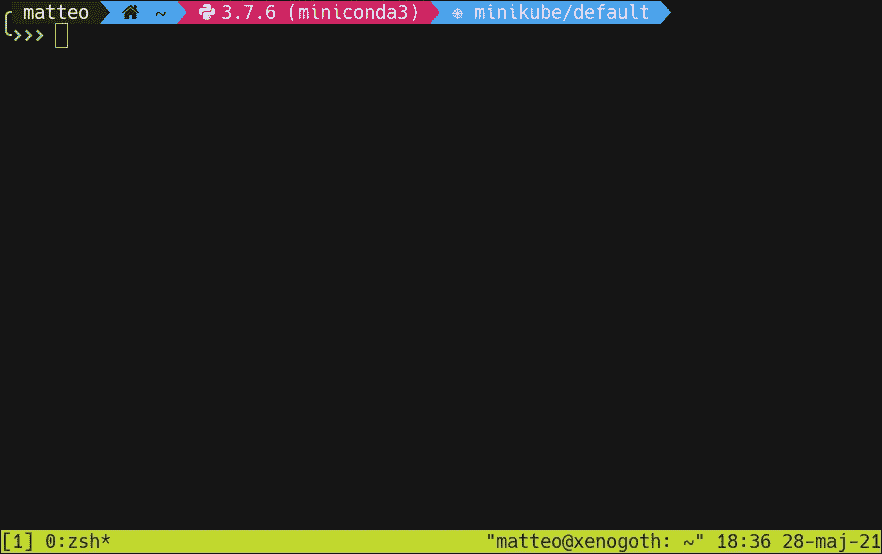
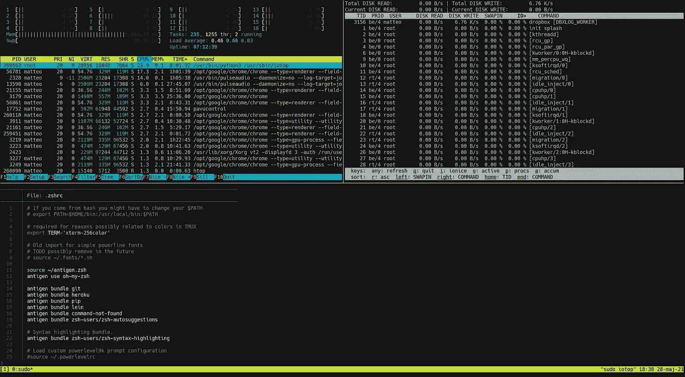
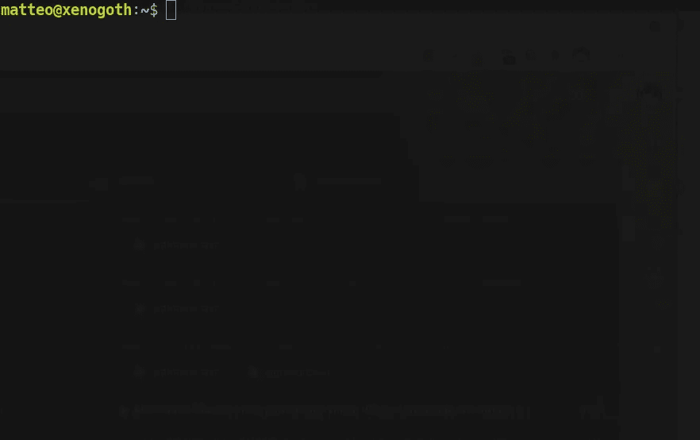
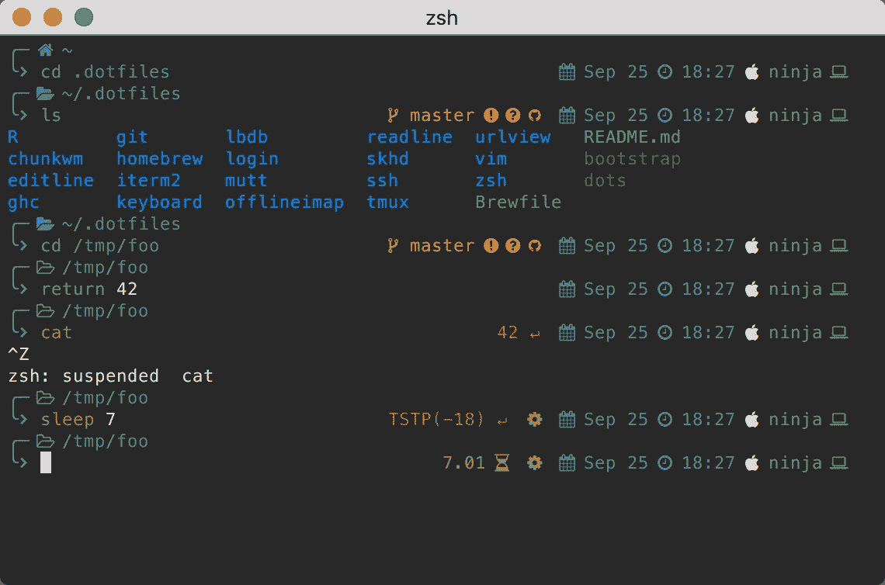

# tmux、oh-my-zsh 和别名:在 Unix 终端上少吸的 3 个技巧

> 原文：<https://medium.com/geekculture/3-tips-to-suck-less-at-unix-terminal-e6133fab2a4?source=collection_archive---------16----------------------->

如果你有不到 30 秒的时间，这里是这篇文章的核心！

# TL；速度三角形定位法(dead reckoning)

1.  看在上帝的份上，**永远**用`tmux`([https://github.com/tmux/tmux](https://github.com/tmux/tmux))
2.  `bash`是丑 AF:用`zsh`代替，尤其是`oh-my-zsh`(及其主题)([https://ohmyz.sh/](https://ohmyz.sh/))
3.  使用`aliases`可以节省很多时间。

# 语境

如果我不是在和别人通话，告诉他们在不说话的时候要么用耳机，要么把自己静音，我会花很多时间在工作中使用终端。无论我是在训练一个模型，写代码，还是做其他事情，我的屏幕通常都是一个黑色的矩形，上面有文字。

正因为如此，在我生命中的某个时刻，我决定花些时间尝试用颜色、插件和各种生活质量改进来创造一个美好的环境。

天哪，变化真大。

这是那些直到你拥有了才注意到的事情之一，然后你会问自己，你到底是怎么熬过来的，直到现在还没有。

我想澄清一点:这些变化并不是让你的终端*看起来更漂亮*(尽管这绝对是一件好事)，而是*重大改进*，让你可以更快更好地做你正在做的事情。我们去看看。

Photo by [Martin Katler](https://unsplash.com/@martinkatler?utm_source=medium&utm_medium=referral) on [Unsplash](https://unsplash.com?utm_source=medium&utm_medium=referral)

# tmux

如果你的大部分工作需要使用终端，你可能需要不止一个可用的提示:你将有一个运行一些**脚本**，一个打开存储**数据**的目录，可能有两个**监视**机器的资源，可能还有更多。通常情况下，这需要您打开与当前正在执行的任务数量一样多的终端实例。这不太好，因为这将迫使您花费大量的时间按 ALT-TAB 在所有这些窗口之间移动，顺便说一下，这些窗口可能彼此无法区分，所以祝您好运。另外，它会让你的桌面变得杂乱，因为你可能不需要同时看一两个以上的内容。这就是`tmux`派上用场的地方。

`tmux`是一个 **t** 终端**mu**ple**x**er，它是一种运行在现有 shell 会话之上的*附加层*。一旦您在您的**一个**终端实例上运行`tmux`，一个新的 **tmux 会话**将被创建。

A new tmux session. Image by author.

与常规终端会话的唯一视觉差异是底部的绿色条，但是从这里您可以访问许多选项，这些选项允许您从单个终端实例完成所有工作。

在一个单独的`tmux`会话中，可以有多个**窗口**，如果你愿意，也可以是独立的屏幕，依次可以包含一个或多个**窗格**，它们是实际的交互外壳。这意味着不再需要为不同的任务打开多个终端，现在可以在同一个会话内将它们组织在不同的`tmux`窗口中，**命名**它们，并从一个终端跳到下一个终端，而不必在所有终端之间来回切换，希望能碰巧找到正确的终端。

此外，在同一个窗口中，可以将屏幕分成几个独立的窗格，如果需要的话，这允许你同时关注多个事物。

The beauty of multiple panes. Image by author.

但是最好的还在后面:`tmux`实际上使用了一个服务器/客户端范例，你实际上可以*从一个现有的会话中分离*而不用终止它，这样你就可以*在将来重新连接*到它。在实践中，这意味着一旦您的工作日结束，您只需离开您已经启动的会话，其所有窗口和窗格仍在运行，第二天您只需重新连接到它并从您停止的地方继续，而不必重新创建所有窗口。

如果您必须在一台远程机器上工作，并且需要同时打开几个 shells，这一点特别有用:使用`tmux`您可以**首先**通过 ssh 访问那台机器，一旦到达那里，就创建一个会话。这样做有几个很好的理由:

*   每个新的*会话*、*窗口、*和*窗格*都将在您正在访问的远程机器上创建*，这样您就不必每次创建它们时都重新执行 ssh。*
*   如果您的连接断开，会话中的所有进程将继续运行，就像什么都没发生一样(在“常规”ssh 会话中，这些进程会被中断)，一旦连接恢复，您可以简单地重新加入会话。如果您正在运行任何需要大量时间才能完成的任务，例如训练神经网络，这一点尤其重要。

我希望我已经说服你试一试，它已经改变了我的游戏规则，现在我无法想象没有它的工作。

不管怎样，这只是主菜，让我们看看菜单上还有什么。

# [哦-我的-]zsh

在一个标准的 Linux 系统中(以 Ubuntu 为例)，默认的终端如下所示:

A very sad terminal. Image by Author.

默认的 shell 是`bash`:简单，快速，完成工作，不特别花哨。

好吧，这实际上是相当轻描淡写:这是相当丑陋的，并没有真正给你除了“你目前在哪个文件夹”的任何信息。不要误解我的意思，如果你不花太多时间在上面，并且基本上只有在被迫的情况下才打开终端，那没关系，但是如果你一直读到这里，你可能需要每周花相当多的时间来使用它。

如果是这样的话，你可能要考虑投资一点时间让它成为一个更舒适的环境，就像你在任何其他类型的工作中调整你的工作站或办公桌一样。

我对此的建议很简单:抛弃`bash`，切换到`zsh`并安装 [oh-my-zsh](https://ohmyz.sh/) ，这是一个带有大量插件的框架，会让你的 shell 体验好得多。下面是一个使用 oh-my-zsh 最流行的插件( [powerlevel10k](https://github.com/romkatv/powerlevel10k) )的主题的示例:

This is how your terminal could look like. Image from [https://github.com/Powerlevel9k/powerlevel9k/wiki/Show-Off-Your-Config](https://github.com/Powerlevel9k/powerlevel9k/wiki/Show-Off-Your-Config)

好多了，对吧？除了漂亮的小图标(你将需要安装一套特殊的字体来工作，但这很容易做到，说明在插件的页面上)和右边的日期和时间，你可以在几行(黄色的东西)上看到运行中的 **git** 插件，显示你所在的库的状态。这可能看起来不多，但是能够一眼看到您在哪个分支，如果您的 repo 中有新的或修改的文件，或者如果您有未推送的提交仍然需要推送，这可能会使您在将来避免一些令人讨厌的麻烦。

而 **git** 只是其中一个有专用插件的服务:一个用于显示当前活动的 **conda** 环境，一个用于 **kubernetes** ，一个用于 **nodejs，**等等！

无论你的工作是什么，oh-my-zsh 都可以让你在候机楼的生活变得更好，并且一定会让你看起来不那么无聊。虽然这可能看起来是次要的方面，但想想看，如果你每天花几个小时看着终端，无论它是一个丑陋的黑匣子还是一个更有色彩、更令人愉快的黑匣子，都有所不同。我是说，看看这个房子图标有多可爱！！！

# 别名

Photo by [Vlad Hilitanu](https://unsplash.com/@vladhilitanu?utm_source=medium&utm_medium=referral) on [Unsplash](https://unsplash.com?utm_source=medium&utm_medium=referral)

最后，同样重要的是，我们来谈谈**别名**。

`alias`是任意长命令的自定义快捷方式。语法非常简单:`alias la='ls -lah'`。现在每次你在终端中使用`la`(在提示的开头)的时候，别名的内容都会被代替执行。您的默认 shell 可能已经设置了一些默认别名(`la`可能是其中之一，尽管不一定是上面的确切形式)，但是您可以定义自己的别名。在实践中，最好的方法是把它们放在你的 home 文件夹中的一个文件`.aliases`(每行一个别名)中，并确保每当你打开一个新的终端窗口时它都是源代码(我认为这是许多 shells 默认发生的，无论如何检查你的`{bash,zsh}rc`)。

然而，关于别名最好的事情是它们也可以(并且应该)用于*部分*命令，就像在**更长的**命令的开始，然后你将使用附加参数来完成。主要的例子是分别将`conda activate`和`conda deactivate`混叠到`.a`和`.d`。激活环境就变得像`.a pytorch`一样简单。

巧妙使用别名的例子有:

*   前述激活/停用`conda`环境的快捷方式
*   一个字母访问你经常使用的程序(我用`v`代替`vim`
*   添加或改进默认启用自定义选项的变体常用命令(由于时间原因，我将`tmux`替换为`tmux -2`)。不知道为什么)
*   对特定远程服务器的快速 ssh 访问(确保您已经设置了密钥认证以获得最大舒适度):
    `alias s.gipsy-danger='ssh matteo@gipsy-danger'`

虽然这看起来不多，但实际上会节省你很多时间。不仅仅是因为你要在键盘上键入更少的*字符，更主要的是因为更短的命令意味着更少的打字错误。*

额外功能:人们会认为你是一个巫师！🧙🏼

然而，在某些情况下，别名并不是正确的解决方案:如果您需要编写多行代码。为此，您需要编写某种 shell 脚本。嘿，没有什么是免费的！

目前就这些。如果你喜欢这些内容，请保持联系，我还有一些锦囊妙计，人类可能会从中受益。和皮条客您的终端，生命太短了单色屏幕！