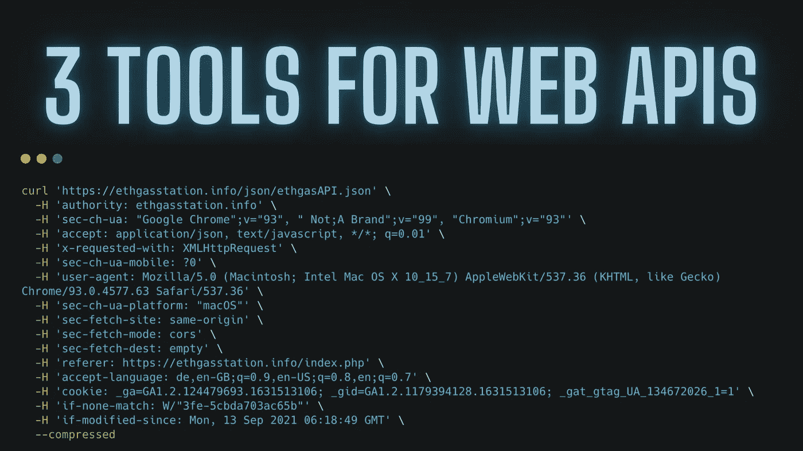
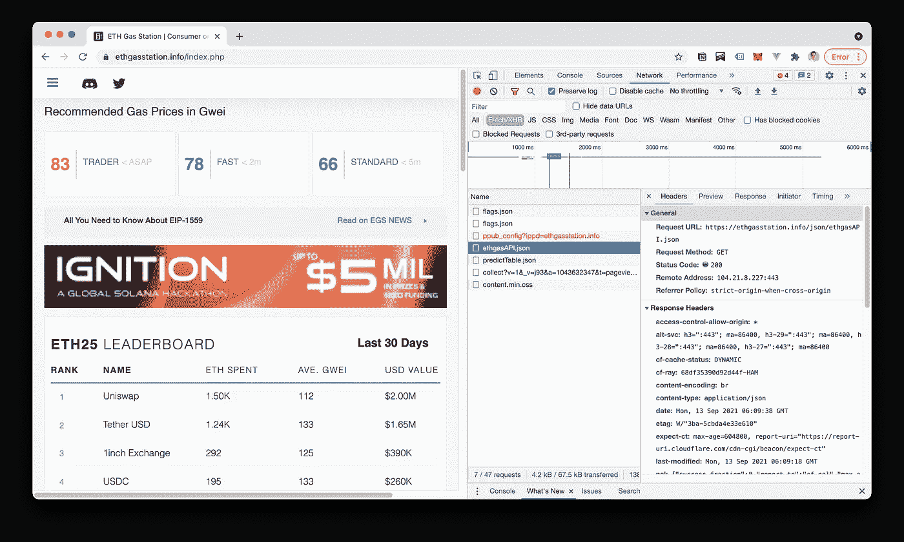
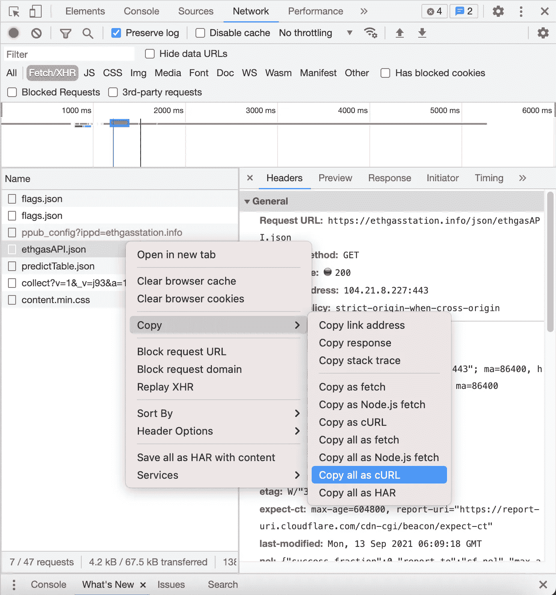
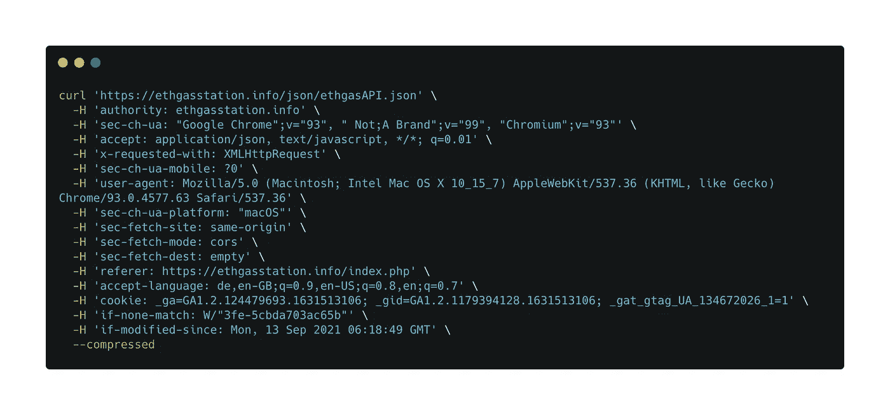
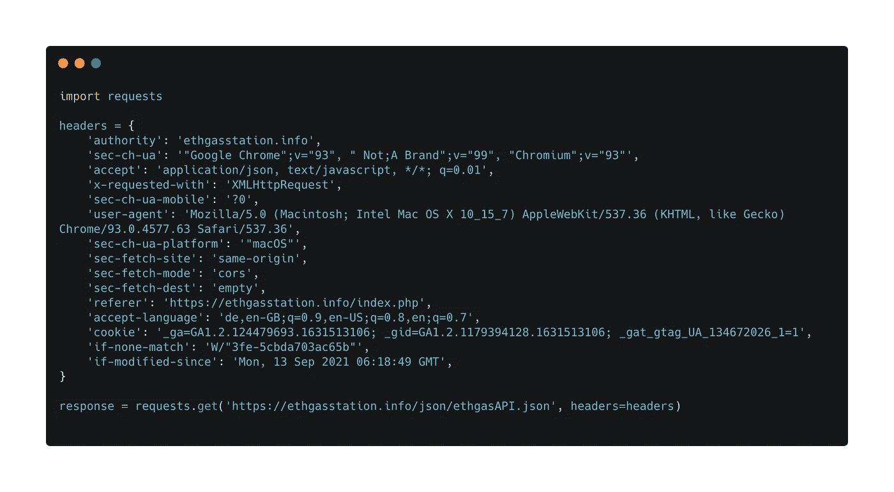
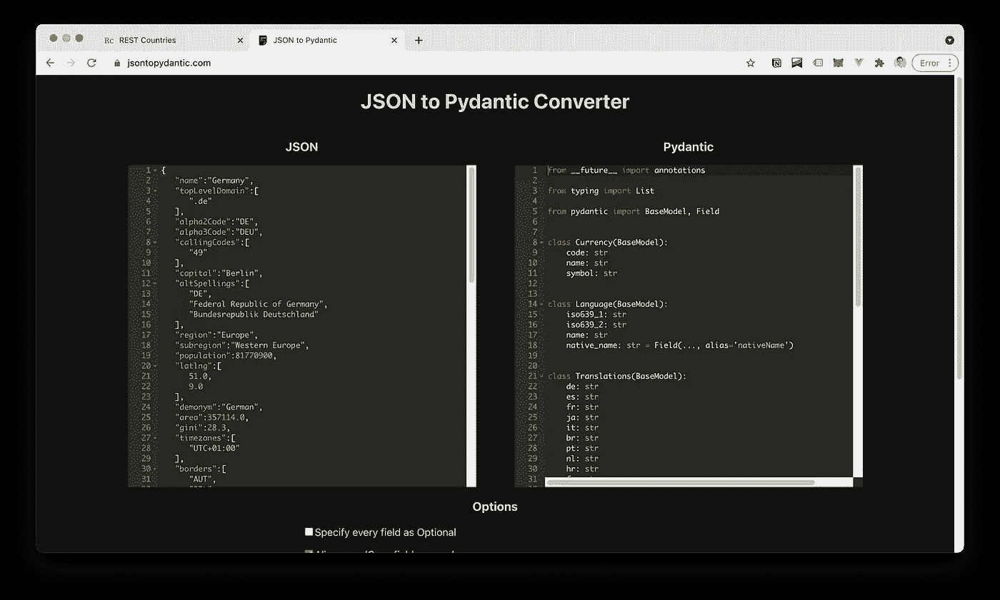
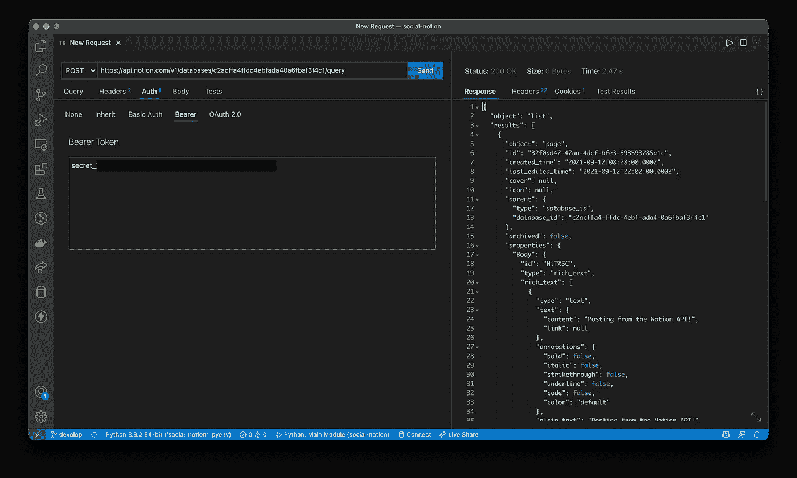

# 使用 Python 与 Web APIs 轻松交互的 3 个工具

> 原文：<https://medium.com/geekculture/3-tools-for-easy-interaction-with-web-apis-using-python-f19b2149fc1c?source=collection_archive---------17----------------------->



最初发布于:【https://www.pythoneur.com/easy-interaction-with-web-apis/ T3

*与应用编程接口(API)交互并不困难。在这篇文章中，我分享了我最喜欢的三个工具和窍门，来快速使用 API，让你的生活变得简单。*

# [Curl to Requests](https://curl.trillworks.com/) :通过几次点击生成 API 请求

假设我们希望监控并记录 [**ETH 加油站**](https://ethgasstation.info/index.php) 的 Etherum 气费。使用正确的工具，您可以在几秒钟内创建一个 API 请求。

## 1.转到[网站](https://ethgasstation.info/index.php)，检查网络选项卡中的请求并复制为 cCurl:



## 2.接下来，将来自 cCurl 的数据转换为请求[这里](https://curl.trillworks.com/)得到以下输出:



## 3.如果需要，修改任何报头或有效载荷，并测试您的请求:

[](https://replit.com/@pythoneur/Requests-ETH-Gas-Station) [## 请求 ETH 加油站

### 向 Eth 加油站索取样品

replit.com](https://replit.com/@pythoneur/Requests-ETH-Gas-Station) 

# 带 [pydantic](https://pydantic-docs.helpmanual.io/) 的超棒数据模型

使用 Pydantic，让来自 API 的所有 JSON 响应得到验证并转换成 pythonic 对象变得非常容易。

> **使用 Python 类型提示的数据验证和设置管理。快速和可扩展，pydantic 可以很好地与你的 linters/IDE/brain 配合。定义数据在纯的、规范的 Python 3.6+中应该是怎样的；用 pydantic 验证一下。**

然而，从嵌套的 JSON 手动创建模型仍然不是很有趣。使用 jsontopydantic.com[**节省宝贵的时间并通过几次点击创建模型。您需要做的就是复制 JSON 响应来生成 pydantic 模型。**](https://jsontopydantic.com/)



生成模型后，您可以进行一些微调:

*   仔细检查输入类型，如果需要的话，利用一些很棒的[](https://pydantic-docs.helpmanual.io/usage/types/#pydantic-types)**数据类型，比如`SecretStr`或`PaymentCardNumber`**
*   **增加一些 [**级配置**](https://pydantic-docs.helpmanual.io/usage/model_config/) `arbitrary_types_allowed`或者同样流行的`orm_mode`**

**一旦一切就绪，就可以简单地将响应解包到模型中，并使用原始别名轻松地将其转换回 JSON:**

```
response = requests.get("https://restcountries.eu/rest/v2/alpha/de")model = Model(**response.json())print(f"Borders: {model.borders}")
print(f"Flag URL: {model.flag}\n")print(f"JSON Serialization: {model.json(by_alias=True, exclude={'borders'})}\n")
```

**和之前的博文一样，我也制作了一个互动的小例子供你尝试:**

**[](https://replit.com/@pythoneur/PyDantic-Showcase#main.py) [## PyDantic 橱窗

### 如何使用 pydantic 的示例。

replit.com](https://replit.com/@pythoneur/PyDantic-Showcase#main.py) 

# 使用[迅雷客户端](https://marketplace.visualstudio.com/items?itemName=rangav.vscode-thunder-client)从 VSCode 发送 API 请求

许多人都知道 [**Postman**](https://www.postman.com/) 是与 web APIs 交互时必不可少的工具。现在，您也可以使用[**Thunder Client**](https://marketplace.visualstudio.com/items?itemName=rangav.vscode-thunder-client)扩展在 VSCode 中无缝地做同样的事情。特别是对于初学者来说，这是一个很好的方法，也可以进行更复杂的 API 调用，这些调用需要身份验证、参数和某些头:



# TLDR

我希望你喜欢这篇关于一些便利工具的快速博文，这些工具让我在与 API 交互时变得更加容易。简而言之，我们了解到的情况如下:

1.  检查来自浏览器的请求，并使用[**Curl to Requests**](https://curl.trillworks.com/)快速将它们转换成 pythonic 请求。
2.  保存一些 tpying，用[【jsontopydantic.com】](https://jsontopydantic.com/)**生成经过验证的 pythonic 数据模型。**
3.  使用令人敬畏的 [**Thunder 客户端**](https://marketplace.visualstudio.com/items?itemName=rangav.vscode-thunder-client) 从 VSCode 开始试验和使用 API。

**寻找更多技巧和窍门？查看我最近关于处理脏文本数据的博文:**

[](https://www.pythoneur.com/top-3-python-data-cleaning-libraries/) [## 使用这三大 Python 库节省数据清理时间

### 如果您知道针对特定数据清理问题的正确库，清理数据会简单得多…

www.pythoneur.com](https://www.pythoneur.com/top-3-python-data-cleaning-libraries/)**