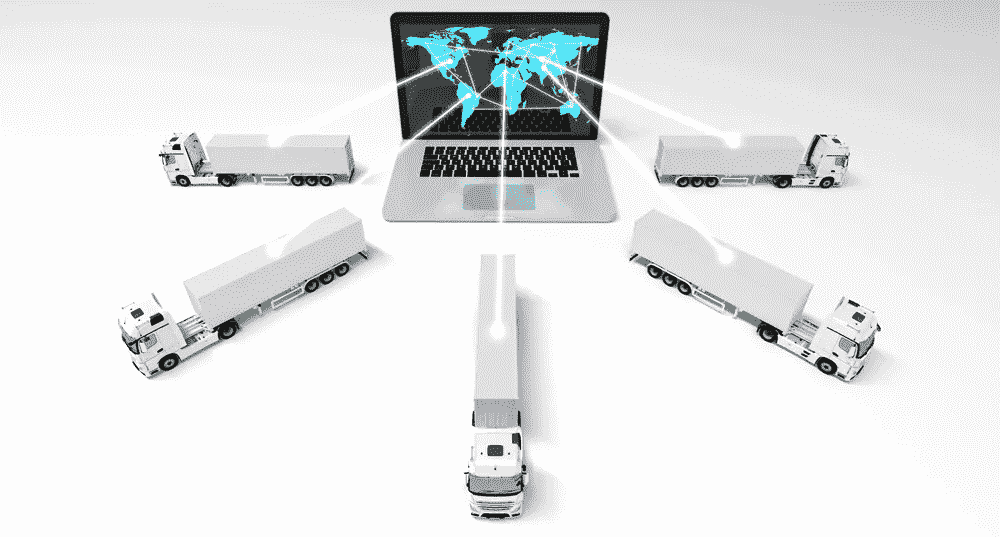

# 3 种跟踪技术以及它们将如何改变未来

> 原文：<https://medium.com/geekculture/3-types-of-tracking-technologies-and-how-they-will-change-the-future-4b44f5c989eb?source=collection_archive---------13----------------------->

3 Types of Tracking Technologies and How They Will Change the Future

[**来源**](https://thefinanser.com/2020/01/2020-a-decade-in-technology.html/future-tech/)

小企业总是努力与大企业竞争。他们不仅缺乏资金和资源，还必须应对不断变化的技术环境。为了跟上形势，小企业需要采用新的跟踪技术，从而获得竞争优势。

这篇博文将讨论改变未来的三种跟踪技术，以及如何在你的业务中使用它们。保持领先，确保您使用最新的工具来帮助您的业务增长！

敬请期待！

# 追踪技术的五大优势

## 1.精确的时间跟踪

Accurate time tracking

[**来源**](https://www.actitime.com/time-tracking/what-is-time-tracking)

跟踪员工的工作时间并不一定是一件麻烦的事情，尤其是当你的员工有加班费的时候。员工可以使用时间跟踪工具来记录他们的工作时间，使您可以轻松跟踪他们的工作效率，通过避免猜测项目需要多长时间来节省您的时间和金钱，相反，员工在计划时间之外的工作应该获得多少报酬。允许您的团队成员通过在线时间跟踪应用程序从远程位置打卡，使他们在办公室或家里工作时更容易跟踪他们的工作时间。这种简化的流程减少了文书工作，简化了您和员工之间的沟通。

## 2.改善员工沟通

**跟踪工作时间**或出勤有助于正式化和改善员工、经理和人力资源部门之间的沟通。对工作职责、何时何地的期望、目标和绩效评估有一个清晰的了解，可以更有效地记录员工的活动。如果错过了最后期限或没有达到预期，经理将更好地处理纪律处分。员工将受益于每个项目或任务所需时间的明确指导方针。跟踪技术使收集员工活动数据变得容易，因此双方可以跟踪成绩并交流需要改进的地方。

## 3.简化时间管理

Simplifies Time Management

[**来源**](/inc./simplify-your-time-management-with-the-rule-of-4-e884883c0173)

跟踪和报告员工工作时间对于时间管理非常有用。如果你的员工跟踪他们的工作时间并向你汇报，你就可以让他们为在应该工作的时候没有工作而负责。如果时间表有变化或员工需要休假，您可以相应地调整班次。监控用户活动将让您确定哪些方面需要关注，并帮助人们在不重要的任务上花费太多时间。

适当的时间管理会让员工在该工作的时候对工作负责。记录员工工作时间有助于您确保‌your 员工不会在项目上落后，不会在较慢的时间段出现任何覆盖缺口，并尽早标记问题以采取纠正措施。

## 4.准确计费

当使用 [**时间追踪软件**](https://www.workstatus.io/best-time-tracking-software-online?utm_source=guest-post&utm_medium=geekcuture-rn&utm_campaign=RN) 测量员工工时时，可以确保你的计费系统是准确的。这将让客户满意，减少投诉，实现利润最大化。重要的是要记住，对企业来说，通过准确地向员工收费来控制成本是至关重要的。如果一家公司对员工的工作收费过低，尤其是按小时或按周收费，这可能会导致所有员工工资过低，或者引发法律问题。

如果您的企业使用时间跟踪软件，您可以深入了解员工的活动，使他们能够掌控自己的工作量，并确保他们的工作得到合理的补偿。

## 5.实时监控

Real-time monitoring

[**来源**](https://servion.com/blog/why-how-what-real-time-contact-center-monitoring/)

通过实时监控，员工可以记录他们的工作时间，为经理提供关于工作时间和生产率的准确信息。这在工资处理过程中节省了大量时间，并鼓励员工监控自己的时间。它可以提示他们在换班前几小时或任何其他时间进行更新。

通过创造一种鼓励员工对自己的时间负责的文化，而不是在休息或早退之前依赖管理层的批准，您可以跟踪用户活动和**员工时间跟踪**。这些进步通过减少不必要的雇佣和库存积压来降低成本，同时通过更好的工作条件来提高公司士气。

# 追踪技术的三大类型

## 1.GPS 跟踪

GPS Tracking

[**来源**](https://techglobule.com/2018/08/tracking-technologies-that-will-change-the-future/)

GPS 代表全球定位系统。这是一种利用卫星追踪人或车辆位置的技术。 [**GPS 追踪系统**](https://www.workstatus.io/best-gps-time-tracking-software-online?utm_source=guest-post&utm_medium=geekcuture-rn&utm_campaign=RN) 通常包括一个 GPS 追踪器(一种接收并记录卫星信号的设备)和一个在地图上显示追踪器位置的软件应用程序。GPS 跟踪系统用于各种目的，包括监控紧急响应者的位置、跟踪车辆和资产的移动以及监视出差的员工。

**GPS 追踪技术为商家提供了许多好处，包括以下五点:**

**1。提高效率和生产力**——借助 GPS 跟踪，企业可以跟踪员工的行动，提高工作效率。这也有助于增强责任感，避免浪费时间或资源。

**2。改善客户服务** —通过快速、轻松地找到员工，企业可以迅速解决问题并减少等待时间，从而提供更好的客户服务。

**3。降低运营成本** —借助 GPS 跟踪技术，企业可以节省燃料成本和其他运输费用，从而优化路线并减少旅行时间。

**4。增强员工和客户的安全性** —借助准确的实时位置数据，企业可以通过快速识别和应对潜在危险来确保员工和客户的安全。

**5。遵守法律要求** —许多企业必须遵守要求跟踪特定类型车辆或货物的政府法规。GPS 跟踪技术可以帮助企业遵守这些法规。

**跟进问题:**您是否正在寻找一款 **GPS 时间跟踪应用**来跟踪您的移动工作人员？

[**报名试用最好的 GPS 跟踪软件**](https://app.workstatus.io/auth/register/?utm_source=guest-post&utm_medium=geekculture-rn&utm_campaign=RN) **，更有效、更高效地管理您的业务-**

## **2。牲畜跟踪**

[**来源**](https://e-peas.com/news/industry-leading-energy-harvesting-technology-from-e-peas-enables-accurate-continuous-animal-tracking/)

牲畜跟踪是‌监控牲畜在整个生命周期中的移动和位置。这可以通过射频识别(RFID)标签、电子耳标或全球定位系统(GPS)项圈来实现。牲畜跟踪旨在通过确保动物不被错误处理或丢失来改善动物福利，通过防止疾病传播来改善食品安全，并通过减少土壤侵蚀和动物废物来减少环境影响。

## 牲畜跟踪技术为企业带来的一些显著优势包括:

**1。减少食物浪费** —牲畜跟踪可以帮助企业监控牲畜的活动，确保食物不被浪费。这对于拥有大量肉类或乳制品的大型企业尤为重要。

**2。利润增加**——通过减少浪费的肉类或奶制品数量，企业可以看到利润的增加。这是因为他们可以出售他们生产的所有肉类或奶制品，而不是因为腐败而扔掉一些。

**3。更准确的库存** —牲畜跟踪使企业能够更准确地跟踪他们的库存。这是有益的，因为它减少了产品缺货和在最后一分钟订购更多的机会。

**4。更好的客户服务** —企业可以通过拥有准确的库存来提供更好的客户服务。这是因为他们可以准确地告诉他们的客户一种产品有多少库存，什么时候可以再次供应。

## **3。雾计算**

[**来源**](https://www.globalitsvcs.com/fog-computing-is-this-the-future-of-cloud-computing/)

随着企业不断寻找变得更加高效和有效的方法，他们转向新技术来帮助他们实现目标。一种这样的技术是雾计算，它使计算和数据存储更接近活动点。

雾计算是一个术语，用于将计算和数据存储分布到离需要它们的用户和设备更近的地方。这可以通过将设备直接相互连接或连接到物理上更靠近它们的服务器来实现，而不是通过集中式云。

## 雾计算为企业带来的一些显著优势包括:

**1。提高效率**:通过让计算和数据存储更靠近活动点，雾计算可以帮助企业减少延迟并提高效率。

**2。成本节约**:由于雾计算有助于减少数据延迟，它还可以帮助企业节省带宽和其他相关成本。

**3。更好的性能**:通过减少在不同位置之间来回发送数据的需求，雾计算有助于提高系统和应用的整体性能。

# 结束语

这三个‌technologies 都有可能彻底改变我们追踪物体的方式。GPS 跟踪已经被广泛使用，其准确性和多功能性将继续使其成为一个重要的工具。牲畜追踪有助于提高农业和牧场经营的效率。雾计算可以在从医院到工厂的各种环境中使用。

随着这些技术越来越受欢迎，它们将极大地影响我们与环境的互动方式。

试试**追踪工作时间的最佳应用**，它带有一个带 GPS 的**时钟**，用于有效的**用户活动监控**这里 **-**

你知道其他追踪技术吗？请在下面的评论中告诉我们

感谢阅读！！