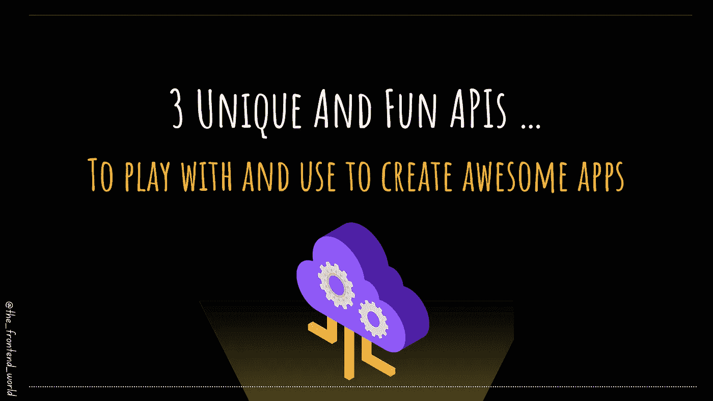

# 3 个独特而有趣的 APIs

> 原文：<https://medium.com/geekculture/3-unique-and-fun-apis-6f9be2d65423?source=collection_archive---------15----------------------->

## 来玩和创建一个很棒的应用程序

By FAM

这里有一个很好的 API 列表，可以不费吹灰之力地为你的应用添加许多功能和魔法。也有鼓舞人心的应用程序，并将其添加到您的投资组合。

# 1-背景去除 PI