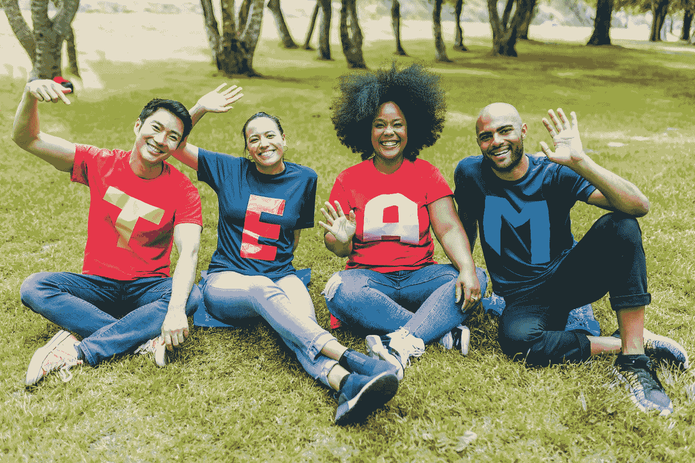

# 应用行为科学适应数据变化的 3 种方式

> 原文：<https://medium.com/geekculture/3-ways-to-apply-behavioural-science-to-adopt-data-change-6fb6e743f1eb?source=collection_archive---------22----------------------->

## 利用行为科学在你的组织中进行可持续的变革

Photo by [RODNAE Productions](https://www.pexels.com/@rodnae-prod?utm_content=attributionCopyText&utm_medium=referral&utm_source=pexels) from [Pexels](https://www.pexels.com/photo/people-sitting-on-green-grass-waving-their-hands-7551760/?utm_content=attributionCopyText&utm_medium=referral&utm_source=pexels)

作为人类，我们天生抗拒改变，尤其是那些挑战我们满意的现状的改变。我们的身体和思想发现环境的变化很难理解。