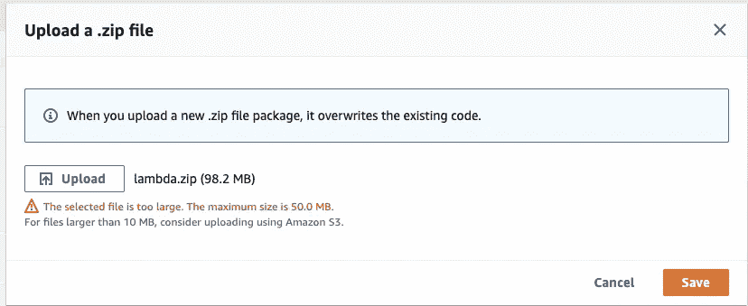

# 克服 AWS Lambda 部署规模限制的 3 种方法—第 1 部分

> 原文：<https://medium.com/geekculture/3-ways-to-overcome-aws-lambda-deployment-size-limit-part-1-f2eb2170b75b?source=collection_archive---------0----------------------->

Photo by [pine watt](https://unsplash.com/@pinewatt?utm_source=medium&utm_medium=referral) on [Unsplash](https://unsplash.com?utm_source=medium&utm_medium=referral)

对于经常将无服务器功能部署到 AWS Lambda 的工程师来说，可能会遇到以下错误:

