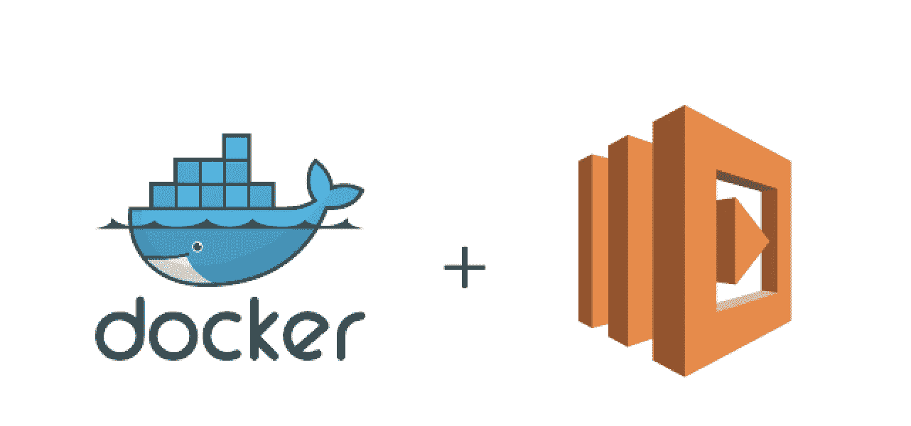

# 克服 AWS Lambda 部署规模限制的 3 种方法—第 2 部分

> 原文：<https://medium.com/geekculture/3-ways-to-overcome-aws-lambda-deployment-size-limit-part-2-8d0e8d0264b0?source=collection_archive---------3----------------------->

AWS Lambda with container image

[在上一篇文章](/geekculture/3-ways-to-overcome-aws-lambda-deployment-size-limit-part-1-f2eb2170b75b)中，我分享了如何克服 AWS Lambda 部署规模限制的两种方法，即使用 S3 或 AWS EFS 来存储大型数据文件/依赖项。在这篇文章中，我将分享我们如何使用 Lambda 和容器图像来达到同样的效果。

一点背景， [AWS 在 2020 年底宣布](https://aws.amazon.com/blogs/aws/new-for-aws-lambda-container-image-support/)AWS Lambda 现在将提供容器图像…