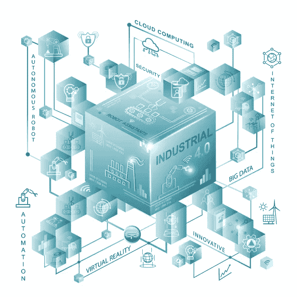

# 简单描述复杂技术的 3 种方法

> 原文：<https://medium.com/geekculture/3-ways-to-simply-describe-complex-technology-406ccc1d453d?source=collection_archive---------9----------------------->

清晰沟通的能力是所有 IT 专业人员的关键技能。随着技术的不断发展，技术主题变得越来越复杂。向业务团队解释这些复杂的技术主题对于确保每个人都保持一致至关重要。

但是你怎么能简单的描述一个复杂的话题呢？

如果你从事 IT 工作，这里有 3 种方法可以把复杂的技术变成简单的描述。

# 1.使用类比使事情变得相关

对于商业利益相关者来说，软件应用程序的内部工作是一个谜。有些人可能理解编码语言或者应用程序如何组合在一起。但是那些人很少。

类比是一种强有力的工具，可以让事情变得有关联。你可以用日常生活中的例子来解释几乎任何事情。大多数人都经历过的事情。以下是一些例子:

*   防火墙就像城堡的墙。
*   数据传输就像水管一样，因为在给定的时间内，只能有这么多的数据通过管道传输。
*   搜索非结构化数据就像在图书馆中查找某本书一样。在黑暗中。被龙卷风袭击后。这将是困难和耗时的(徒劳的！)

类比不需要复杂，甚至不需要真实。他们只需要为你的主题提供一个相关的背景。如果使用得当，他们可以把复杂的事情变成简单的描述。

# 2.永远不要向业务用户显示系统图

系统图很复杂。一些开发人员和架构师以创建尽可能复杂的图表为荣。即使是经验丰富的 IT 专业人员也需要时间来理解复杂的系统图。

事情是这样的——商业利益相关者不关心细节。他们不需要看到它。

业务用户关心最终结果——系统能完成他们需要的工作吗？这才是你应该关注的。

我敢打赌，你从来没有见过你住的房子的蓝图和建筑计划。它们是存在的，如果建筑者没有看到它们并使用它们，你的房子就不会屹立不倒。但对你来说，作为最终用户，你不需要看到房子的平面图。

想象一下，你打电话给一个管道工，在修理管道之前，他们向你展示了整个系统的布局。带你走过房子里所有的管道、水泵和阀门。你会介意吗？不。你想修好漏洞。

这就是业务用户对您想要向他们展示的系统图的感受。

(哦，你注意到类比的用法了吗？)

# 3.在开头做一个简短的总结

你的大脑需要知道一个主题的目的，然后才能对新信息进行分类和处理。让你的听众有最好的机会理解你的信息——从一个简短的总结开始。

1.  陈述你努力实现的目标。
2.  陈述阻碍你实现目标的问题。
3.  描述您想要、需要或正在实施的解决方案。

几乎所有的工作主题都适合这个结构。您可以在此阅读更多关于[目标、问题、解决方案总结方法的信息。](https://chrisfenning.com/3-steps-to-create-amazing-summaries/)

当你整天深入技术系统时，你就成了它如何工作的专家。你的专业知识越多，你就越会忘记其他人对它的了解有多么少。

# 结论

你对一个主题的专业知识越多，你就越需要用简单的语言来解释事情。这并不意味着你要以高人一等的态度对待业务团队，或者像对待孩子一样对待他们。这意味着使用他们能理解的共同语言。类比有助于把事情联系起来。系统图总是包含太多的信息。每次谈话都以清晰的总结开始会更好。

如果你运用这三种方法将复杂的信息技术转化为简单的描述，你的商业利益相关者会感谢你的。

在获奖书中了解更多如何简洁明了:[第一分钟](https://chrisfenning.com/books/)

(图片[鸣谢:弗朗切斯科](https://www.istockphoto.com/nl/portfolio/francescoch?mediatype=photography))