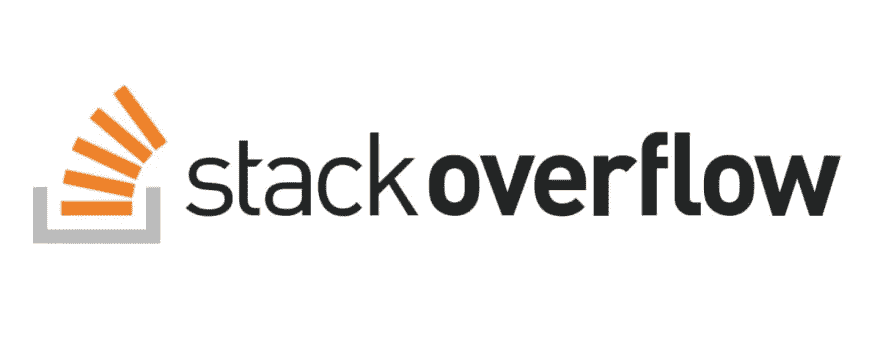
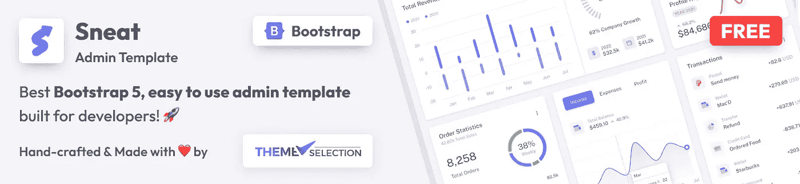
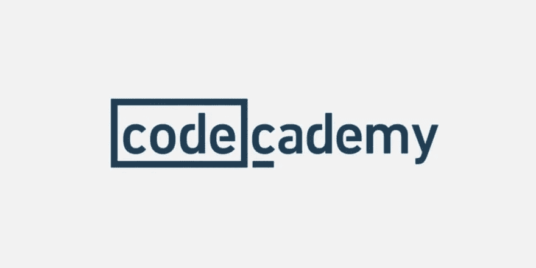
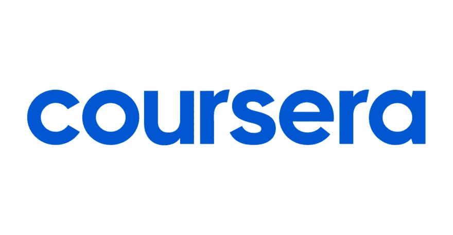
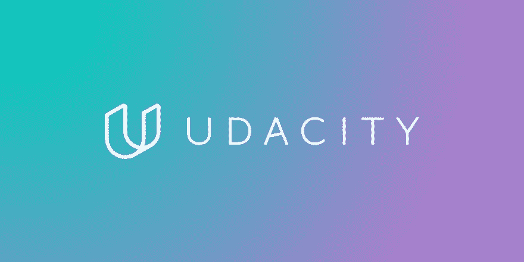
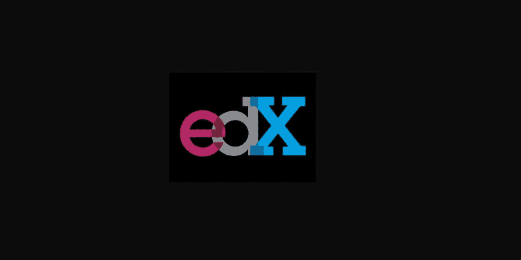
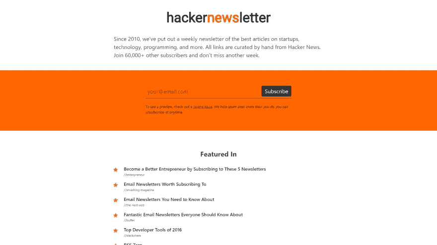
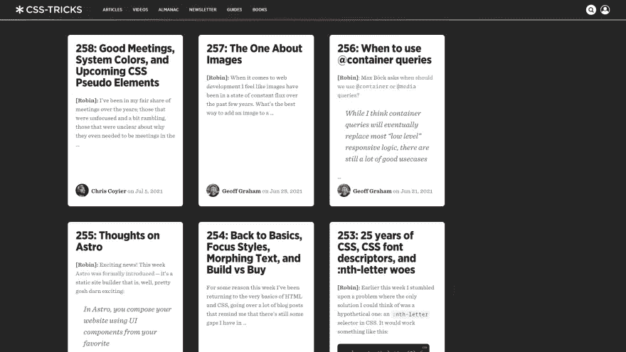
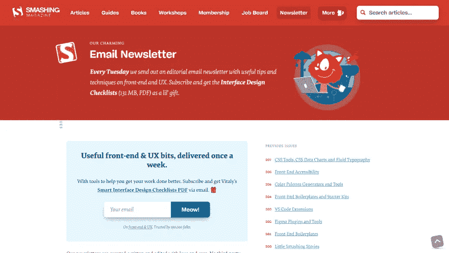

# 30 多种学习资源帮助您提高编程技能👨🏻‍💻

> 原文：<https://medium.com/geekculture/30-learning-resources-to-boost-your-programming-skills-20bd33ff28e9?source=collection_archive---------12----------------------->

Credit: [FreePik](https://www.freepik.com/free-photo/front-view-stacked-books-graduation-cap-open-book-education-day_21745450.htm#query=Learning&position=30&from_view=search&track=sph)

Ola 开发者..！！

期待在 2023 年掌握自己在 web 开发领域的技能？为此你肯定需要资源。在这个列表中，我们收集了一些非常有用的学习资源& GitHub repos，你会发现值得注意的。

如果你认为这是一些随机的点击诱饵列表，那么等一下！！我们的目的是为开发人员分享实际有用的学习资源。

# 值得查看的开发人员学习资源:

学习是一个永无止境的过程。没有人能声称自己完全掌握了事物。这同样适用于 web 开发领域，因为它是一个不断发展的领域。一个人必须随时了解变化、趋势和更新。因此，我们收集了定期维护的学习资源，这些资源不仅能帮助您学习基础知识，还能让您了解最新趋势。

以下是一些对开发人员来说最好的，也是最可能没听说过的学习资源。虽然你可能对其中一些很熟悉，但是这个列表并不像你经常会发现的随机列表…！

> *提到的来源&平台是根据它们的活跃性、规律性&用户评论选择的。我们绝不声称这是完整的列表，因为可能还有许多其他的列表。所以，如果你知道任何其他资源可以被包括在列表中，请给我们建议。提到的资源都不属于我们。我们真诚地试图收集最好的资源来帮助那些愿意学习的人掌握他们的技能。*

现在，让我们开始资源列表..！！

# 开发者的最佳 GitHub 库

以下是一些对开发者和学生来说最好的 GitHub 库。

## [FreeCodeCamp.org](http://freecodecamp.org/)357k⭐&成长…！！

 [## freeCodeCamp.org

### freeCodeCamp.org 是一个友好的社区，在这里你可以免费学习编程。它是由一个捐助者支持的 501(c)(3)…

github.com](https://github.com/freeCodeCamp) 

FreeCodecamp 包含了你正在寻找的所有东西。无论你是新手还是专业开发人员，在这里你都会得到一切。它也有一个单独的论坛，在那里你可以分享你的问题和意见，甚至创建你自己的主题。

这是一个学习、分享和理解编程基础以及轻松获得问题答案的绝佳平台。

## [你不知道的 JS](https://github.com/getify/You-Dont-Know-JS) 161k ⭐ &成长..！！

 [## GitHub-getify/You-don-Know-JS:JavaScript 系列丛书。推特上的@YDKJS。

### JavaScript 系列丛书。推特上的@YDKJS。为 getify/You-don-Know-JS 开发做出贡献，创建一个…

github.com](https://github.com/getify/You-Dont-Know-JS) 

如果你是一个 JavaScript 爱好者，那么这里是你深入了解 JavaScript 的地方。顾名思义，它包含了许多 JavaScript 开发人员不熟悉和未知的事实、代码和资源。

如果你认为你了解 JavaScript，那么请访问这个报告，因为它将证明你对 Js 的不了解是错误的..！！

## [JavaScript 算法](https://github.com/trekhleb/javascript-algorithms) 155k ⭐ &成长..！！

 [## GitHub-trek Hleb/JavaScript-算法:📝用…实现的算法和数据结构

github.com](https://github.com/trekhleb/javascript-algorithms) 

面向 web 开发人员的另一个面向 JavaScript 的 GitHub repo。好吧，如果你热衷于了解 JavaScript 的算法，那么这是了解用 JavaScript 实现的算法和数据结构的最好地方，有解释和进一步阅读的链接。

## [30 秒的代码](https://github.com/30-seconds/30-seconds-of-code) 105k ⭐ &成长..！！

 [## GitHub - 30 秒/30 秒代码:适用于您所有开发的简短 JavaScript 代码片段…

### 满足您所有开发需求的简短 JavaScript 代码片段请访问我们的网站，查看我们的代码片段集。使用…

github.com](https://github.com/30-seconds/30-seconds-of-code) 

30 秒代码是一个面向所有技能水平的开发人员的可访问的高质量知识库，建立于 2017 年。从那时起，在一个大型贡献者社区的帮助下，我们已经创建了数百个简短的代码片段和编程文章。我们的目标是通过帮助人们学习编码，使软件开发更加容易，并帮助开源社区繁荣发展。

## [科技面试手册](https://github.com/yangshun/tech-interview-handbook) 82.5k ⭐ &成长..！！

 [## GitHub -阳顺/科技-采访-手册:💯为…策划编码面试准备材料

### 不是每个人都有时间做几百道 LeetCode 题。这里有免费的和策划的技术访谈…

github.com](https://github.com/yangshun/tech-interview-handbook) 

不是每个人都有时间做几百道 LeetCode 题。这里是为忙碌的工程师准备的免费和精心策划的技术面试准备材料。任何想在科技公司找到一份工作但对技术面试不熟悉的人，久未参加过面试的经验丰富的工程师，或者任何想在技术面试方面做得更好的人。

这个知识库有实用的内容，涵盖了技术面试的所有阶段，从申请工作到通过面试，再到提供谈判机会。有技术能力的候选人可能仍然会发现非技术内容很有帮助。

## [清理代码-javascript](https://github.com/ryanmcdermott/clean-code-javascript) 75.6k ⭐ &增长..！！

 [## GitHub-ryanmcdermott/Clean-Code-javascript:适用于 JavaScript 的干净代码概念

### 《软件工程原理》,来自 Robert C. Martin 的书，改编为 JavaScript。这不是一个风格指南。这是…

github.com](https://github.com/ryanmcdermott/clean-code-javascript) 

顾名思义，它是一组适用于 JavaScript 的干净的代码概念。如果你没有意识到干净代码，这意味着**首先你为你自己和你的同事写代码，而不是为机器**。你的代码必须易于人类理解。

在这个报告中，你会发现这样的干净的代码结构，你可以很容易地理解和实施，而实践你的项目。

## [我们热爱的论文](https://github.com/papers-we-love/papers-we-love) 65.8k ⭐ &成长..！！

 [## GitHub-Papers-we-love/Papers-we-love:来自计算机科学社区的论文，可以阅读和…

### 我们热爱的论文(PWL)是一个围绕阅读、讨论和学习更多学术计算机科学知识而建立的社区…

github.com](https://github.com/papers-we-love/papers-we-love) 

我们热爱的论文(PWL)是一个围绕阅读、讨论和学习更多计算机科学学术论文而建立的社区。这个存储库充当了社区可以找到的一些最佳论文的目录，将分散在网络上的文档汇集在一起。您也可以访问我们热爱的报纸网站了解更多信息。获取所有值得关注的论文和研究期刊。

## [每个程序员都应该知道](https://github.com/mtdvio/every-programmer-should-know) 64.1K ⭐ &成长..！！

 [## GitHub-MTD VIO/every-programmer-should-know:一个(大部分)技术性的东西的集合，每个…

### 每个软件开发人员都应该知道的(大部分)技术知识的集合- GitHub …

github.com](https://github.com/mtdvio/every-programmer-should-know) 

每个软件开发人员都应该知道的(大部分)技术知识的集合。不管你的技能水平如何，这个回购肯定会帮助你找到最好的解决方案，技术和工具。

## [前端清单](https://github.com/thedaviddias/Front-End-Checklist) 62.8K ⭐ &增长..！！

 [## github-the daviddias/前端清单:🗂现代网站的完美前端清单…

### 前端清单是一份详尽的清单，列出了你在启动网站之前需要测试的所有元素…

github.com](https://github.com/thedaviddias/Front-End-Checklist) 

基于前端开发人员多年的经验，它是迄今为止现代网站和一丝不苟的开发人员的最佳&完美的前端清单之一。这个列表包含了在你的网站/ HTML 页面投入生产之前，你需要测试的所有元素。

## [33js 概念](https://github.com/leonardomso/33-js-concepts) 53k ⭐ &成长..！！

 [## GitHub-Leonardo MSO/33-js-概念:📜每个开发者都应该知道的 33 个 JavaScript 概念。

### 创建这个库的目的是帮助开发人员掌握他们在 JavaScript 中的概念。这不是一个…

github.com](https://github.com/leonardomso/33-js-concepts) 

如果你想掌握 JavaScript，那么这就是适合你的 repo，因为它包含了深入学习 JavaScript 所需的文章、视频、课程和资源的必要列表。

## [算法可视化器](https://github.com/algorithm-visualizer/algorithm-visualizer) 41.1k ⭐ &增长..！！

 [## GitHub-algorithm-visualizer/algorithm-visualizer:可视化的交互式在线平台…

### 算法可视化工具是一个交互式在线平台，它将代码中的算法可视化。学习一个算法得到…

github.com](https://github.com/algorithm-visualizer/algorithm-visualizer) 

想要检查您的代码将如何工作？那么，算法可视化工具是一个交互式在线平台，它将代码中的算法可视化。您可以在工作时检查代码输出。不需要单独检查。编写您的代码并查看结果..！！

## [开发文档](https://github.com/freeCodeCamp/devdocs) 30.2k ⭐ &增长..！！

 [## GitHub-freeCodeCamp/dev docs:API 文档浏览器

### API 文档浏览器。在 GitHub 上创建一个帐户，为 freeCodeCamp/devdocs 的开发做贡献。

github.com](https://github.com/freeCodeCamp/devdocs) 

DevDocs 将多个开发者文档结合在一个整洁有序的 web UI 中，具有即时搜索、离线支持、移动版本、黑暗主题、键盘快捷键等等。它的目标是使阅读和搜索参考文献变得快速、简单和愉快。

## [现代 JS 小抄](https://github.com/mbeaudru/modern-js-cheatsheet) 23.7k ⭐ &成长..！！

 [## GitHub-mbeaudru/modern-js-cheatsheet:关于 JavaScript 知识的 cheat sheet，您将经常…

### 图片来源:艾哈迈德·阿瓦斯·⚡️如果你喜欢这个内容，你可以 ping 我或者在 Twitter 上关注我👍这份文件是…

github.com](https://github.com/mbeaudru/modern-js-cheatsheet) 

这是一个处理得非常好的 JavaScript 备忘单，您会在现代项目和大多数当代样本代码中经常遇到。本指南旨在帮助具有基础知识的开发人员，由于使用了 JavaScript 概念，他们可能很难熟悉现代代码库(比如说学习反应)。

## [JavaScript 信息](https://javascript.info/) 19.4k ⭐ &增长..！！

 [## 现代 JavaScript 教程

### 现代 JavaScript 教程。现代 JavaScript 教程有 66 个可用的存储库。遵循他们的准则…

github.com](https://github.com/javascript-tutorial) 

基本资源和技术的完整列表。它分为 3 个部分:JavaScript 语言，浏览器:文档，事件，界面和附加文章列表。从基础到高级主题，有简单而详细的解释。

看看我们对开发人员最友好的 [**下一个 js 管理模板**](https://themeselection.com/item/category/next-js-admin-template/) ，它有一个现代的、引人注目的设计…

# 论坛、博客平台和社交平台:

以下是一些以开发者为中心的社交平台、论坛和博客平台，在这里你可以找到最好的指南、文章和问卷。你还会找到一定会激励你的项目。

## [开发到](http://dev.to/)

嗯，对于初学者来说，即使是专业开发人员，DevTo 也是目前最好的内容共享平台。在这里，你不仅可以找到我们在这里展示的资源列表，还可以获得最好的教程、技巧和指南。除此之外，如果你是一个喜欢炫耀你的项目的爱好者，那么 DevTo 会通过黑客马拉松鼓励你。在这里你可以展示你的工作并赢得奖励。

## [StackOverflow](https://stackoverflow.com/)

当然，开发者最喜欢去的地方..！！它是最大、最值得信赖的在线社区，供开发人员学习、分享他们的编程知识和发展他们的职业生涯。如果您有任何问题，并且无法找到解决方案，不要担心，StackOverflow 是一个有经验的开发人员可以回答您的地方。不仅如此，您甚至可以与社区共享您的项目，以获得对您代码的评审。这是迄今为止开发者最好的社区论坛之一。

## [哈克农](https://hackernoon.com/)

HackerNoon 是为技术人员阅读、写作和发布而构建的。这是一个开放的国际社区，有 15000 多名投稿作者，为每月 300 多万好奇而有洞察力的读者发布故事和专业知识。在这里，您可以分享、撰写或阅读与技术相关的文章、教程和技巧。

## [主题选择](https://themeselection.com/)

ThemeSelection 为您提供了最好的[免费管理模板](https://themeselection.com/item/category/free-admin-templates/) & [UI 套件](https://themeselection.com/item/category/ui-kits/)，您可以在学习的同时将其用于您的项目。使用这些产品，您可以根据您的项目需求开发任何类型的 web 应用程序。除此之外，你会发现一些最好的信息丰富的& [**有助于学习的博客**](https://themeselection.com/blog/) 。

## [黑客新闻](https://news.ycombinator.com/)

黑客新闻是一个专注于计算机科学和创业的社会新闻网站。它由投资基金和创业孵化器 Y Combinator 运营。您可以提交您的项目链接以及任何与 web 开发相关的内容，如文章、指南、新闻等。

## [Reddit](https://www.reddit.com/)

其中一个著名的和最常用的社交媒体平台兼论坛。有很多致力于 web 开发领域的子网站，开发者可以在这里分享他们的项目，提问或回答问题，撰写他们的经验，或者阅读与 web 开发相关的内容。不像 StackOverflow，在这里你不需要担心你的问题会被拒绝。🧐:你可以简单地问任何关于网络开发、编程/编码的问题，你会得到正确的回答。不仅如此，你还会看到大量的项目创意，以及许多开发人员在 Reddit 上分享他们的工作。

以下是 Reddit 上一些值得开发者关注的子编辑。

*   [r/WebDev](https://www.reddit.com/r/webdev/)
*   [r/前端](https://www.reddit.com/r/Frontend/)
*   [r/CSS](https://www.reddit.com/r/css/)
*   [r/ask 编程](https://www.reddit.com/r/AskProgramming/)
*   [r/learn 编程](https://www.reddit.com/r/learnprogramming/)
*   [r/编码](https://www.reddit.com/r/coding/)
*   [r/JavaScript](https://www.reddit.com/r/javascript/)
*   [r/learnjavascript](https://www.reddit.com/r/learnjavascript/)
*   [r/LearnPython](https://www.reddit.com/r/learnpython/)
*   [编码帮助](https://www.reddit.com/r/CodingHelp/)

除此之外，我们建议您使用 [Sneat 免费 Bootstrap 5 HTML 管理模板](https://themeselection.com/item/sneat-free-bootstrap-html-admin-template/)，它是开源且易于使用的。

[**Sneat Free Bootstrap 5 HTML Admin Template**](https://themeselection.com/item/sneat-free-bootstrap-html-admin-template/)

免费管理使你能够使用它的预建页面来节省大量的时间和金钱，并且变得更有效率。

## [不和](https://discord.com/)

主要由游戏玩家使用，但近年来，程序员和开发人员正在非常频繁地使用这款应用程序。事实上，许多公司正在使用它作为他们的客户处理平台&用于项目管理。它上面有很多专门针对 web 开发领域的频道。这是一个分享你感兴趣的项目、代码审查、新闻、迷因、问题/答案等的绝佳媒介。

以下是一些值得开发者关注的渠道

*   [程序员的聚集地](https://discord.me/coding)
*   [开发记录](https://discord.me/devcord)
*   [反应通量](https://discord.gg/reactiflux)
*   [编码窝](https://discordapp.com/invite/code)
*   [SpeakJS](https://discord.me/speakjs)
*   [代码支持](https://discord.me/codesupport)
*   [Nodeiflux](https://disboard.org/server/425824580918181889)
*   [懒惰的开发者](https://discordsl.com/server/4837/lazy-developers)
*   [张量流](https://disboard.org/server/395520812347686912)
*   [程序员幽默](https://discordapp.com/invite/ph)
*   打字稿
*   [拉勒韦尔](https://discordapp.com/invite/mPZNm7A)
*   [Python](https://discordapp.com/invite/python)

# 教程和课程

教程和课程是掌握你技能的非常有用的资源。以下是一些最好的电子学习平台，提供免费和付费认证课程。这些课程也将帮助你建立一个强大的投资组合。

## [YouTube](https://www.youtube.com/)

YouTube 是最好的视觉内容分享平台之一。由于通过视频学习很容易，开发者可以在 YouTube 上找到值得注意的教程和课程。你可以浏览各种与 web 开发相关的渠道，获得学习特定主题的最佳教程。

以下是 YouTube 上一些值得开发者关注的频道。

*   [CsDojo](https://www.youtube.com/@CSDojo)
*   [学院名称](https://www.youtube.com/@academind)
*   [LevelUpTuts](https://www.youtube.com/@LevelUpTuts)
*   [网络忍者](https://www.youtube.com/@NetNinja)
*   爱德华卡

> *参考*[***YouTube 网站开发 20 强频道***](https://dev.to/theme_selection/top-20-web-development-youtube-channels-for-beginners-mn9) *获取更多建议..！！*

## [代码学院](https://www.codecademy.com/)

Codecademy 是通过在线教程和课程学习的最佳平台之一。在这里你会找到掌握特定学科的最佳课程。与其他在线学习环境相比，主要的技术企业重视并承认 Codecademy 认证。Codecademy 的流行也是它提供的教育机会的结果。由于课程提供了众多的技能水平，改变职业选择是非常简单的。

## [Coursera](https://in.coursera.org/)

另一个广受好评的学习编程平台是 Coursera。Coursera 证书被广泛认可，和大学证书或学位一样有价值。你可以把它们加入到你的简历中，就像对待任何大学文凭一样。所有的证书都是全球认可的，值得追求。

## [乌达城](https://www.udacity.com/)

Udacity 也是广为人知的电子学习平台之一。Udacity 提供的课程更加专业化，旨在提高个人、组织和政府的数字技术能力。因此，课程类别更加有限，但也包括更详细的子类别，以帮助您在选择的领域取得成功。它最适合那些在科技行业寻求职业生涯/晋升的人。

## [edx](https://www.edx.org/)

eDX 由世界顶尖的两所大学哈佛大学和麻省理工学院创办，是美国在线课程提供商。它为全球学生提供各种领域的在线大学课程，其中一些是免费的。学生可以通过参加 edX 课程和获得证书来发展自己的职业生涯。edX 上提供的课程由顶尖大学的讲师提供。此外，学生们参加由著名大学选择的自定进度的课程。

## [W3Schools](https://www.w3schools.com/)

W3Schools 是一个免费的在线学习编程的教育网站。它提供涵盖 web 开发所有方面的课程。此外，它还发布免费的 HTML 管理模板。这对学习绝对的基础知识很有帮助——这个东西/功能/标签/无论什么是做什么的，如何使用它？它会帮助你在制作糟糕的网站时变得自信。这些证书得到了希望雇佣熟练开发人员的公司的认可和重视。

## [Udemy](https://www.udemy.com/)

Udemy 拥有 5000 多万名学生和 75 多种语言的 204，000 多门课程，是最受欢迎和最受好评的学习网站之一。Udemy 将适合那些对认证不太关心的人，他们希望获得大量专业且有趣的课程。嗯，在这里你既可以注册为学生，也可以注册为教师。也有一些免费课程。如果练习是你的主要目的，那么 Udemy 就是合适的地方。

# 时事通讯:

在网络开发者的世界里，时事通讯扮演着重要的角色。由于很难关注每一个更新，简讯可以帮助你节省时间，让你更容易保持更新。

以下是一些值得注意的时事通讯，将有助于您了解最新的趋势、资源和更多信息。

## [JavaScript 周刊](https://javascriptweekly.com/)

这是另一个流行的时事通讯，每周发布关于 JavaScript 环境的所有新东西。今天，有超过 116，000 的用户，它有很多关于 JavaScript 的资源和新闻。

## [Hackernewsletter](https://hackernewsletter.com/)

如果你喜欢黑客新闻,《黑客快讯》是你最好的时事通讯。基本上，这是一个关于技术、编程和创业的最佳文章的每周综述。所有链接都来自黑客新闻。它拥有超过 6 万名用户。

## [Nodejs 周刊](https://nodeweekly.com/)

拥有超过 54k+的订阅者，这份时事通讯由 JavaScript Weekly 的同一位编辑策划，但它更专注于 Node.js 平台。如果没有 Node.js，你的 JavaScript 堆栈就不会满。因此，如果你想了解所有最新的 Node.js 新闻，这将是一份非常棒的时事通讯，现在有超过 36k 的订阅者。

# [CSS 招数简讯](https://css-tricks.com/newsletter/)

有很多方法可以让你了解 CSS-Tricks，他们也有一个很棒的时事通讯，让你了解前端开发和整体网页设计的最新情况。它涵盖了很多主题，比如教程、插件，当然还有 CSS 技巧。一般来说，这个网站是任何一个前端开发者的必备。

## [粉碎简讯](https://www.smashingmagazine.com/the-smashing-newsletter/)

Smashing Magazine 对于 web 开发人员和设计人员来说并不陌生。这是领先的网站之一。它有一个单独的简讯部分，每周一次将简讯发送到您的收件箱，提供关于前端 UX 设计的有用提示和技术。

它包含了一系列与设计和创意内容开发相关的精彩内容。除了与设计相关的想法之外，它似乎涵盖了更多的东西。它提供了对 WordPress 文章、HTML、插件、Illustrator、CSS、Android 以及所有与设计相关的主题的洞察。

> *Fore 更多此类简讯，查看* [*前 15+简讯📄面向 Web 开发人员👨‍💻2023 年*](https://dev.to/theme_selection/top-15-newsletters-for-web-developers-in-2021-57p9) *。*

# 结论:

如前所述，学习是一个永无止境的过程。你学得越多，理解得越多，你挣得就越多..！！因此，了解能帮助你学习和掌握该领域的最佳资源是很有必要的。

嗯，通过这个集合，我们尽力为开发者和程序员收集了一些最好的学习资源。这里的目的是为您提供最佳选择。

我们包括 GitHub Repos，它提供了基本编程概念、技巧、技术和当前趋势的详细列表。此外，我们还提到了以开发者为中心的论坛、博客和社交平台。此外，提供专业编程课程证书的 e-Learning 平台也在列。

你可以借助任何提到的学习资源来掌握你的技能。我们希望你能找到值得保存和分享的列表。

快乐学习..！！

# 关于我们

我们在 [ThemeSelection](https://themeselection.com/) 提供精选的高质量、现代设计、专业易用的高级免费 [VueJS 管理模板](https://themeselection.com/item/category/vuejs-admin-templates/)、[Asp.NET 管理模板](https://themeselection.com/item/category/asp-net-dashboard/)、 [NextJS 管理模板](https://themeselection.com/item/category/next-js-admin-template/)、 [Laravel 管理模板](https://themeselection.com/item/category/laravel-admin-templates/)、& [免费 UI 套件](https://themeselection.com/products/category/free-ui-kits/)。

*最初发布于 2022 年 12 月 14 日*[*https://dev . to*](https://dev.to/theme_selection/learning-resources-for-developers-165d)*。*