# 用于网页设计的 33 博客卡 CSS

> 原文：<https://medium.com/geekculture/33-blog-card-css-for-web-design-726a037217b5?source=collection_archive---------0----------------------->

博客卡是在你的博客页面上显示你的文章的组件。它包括许多组成部分，如创建日期和时间，标题，内容，插图，文章类型…要创建一个美丽的博客卡，我们需要依靠许多因素，如:它是一个清晰的布局，易于理解，合理的组件划分…所以在今天的文章中，我们将看到美丽的博客卡在网站设计年的例子。

# Flexbox CSS 的博客卡

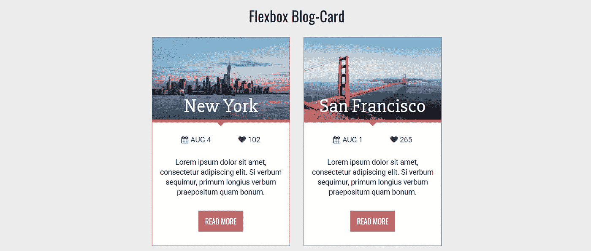

你可以在下面看到结果。

[链接](https://codepen.io/MartijnBrands/pen/gabzqB)

# 响应博客卡片滑块

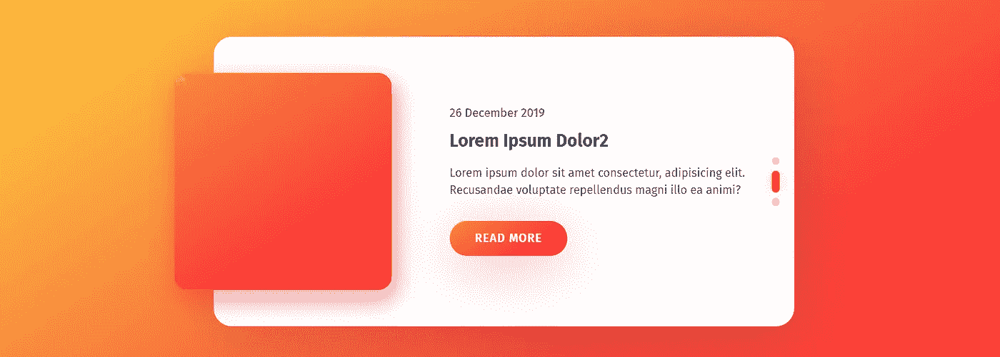

你可以在下面看到结果。

[链接](https://codepen.io/JavaScriptJunkie/pen/WgRBxw)

# 博客卡片 HTML CSS

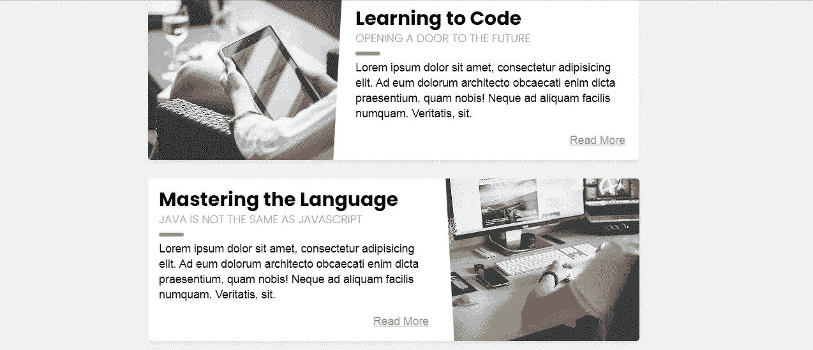

你可以在下面看到结果。

[链接](https://codepen.io/ChynoDeluxe/pen/bdXeqQ)

# 带有透明文本动画的博客卡

你可以在下面看到结果。

[链接](https://codepen.io/daiquiri/pen/GWpPKP)

# 博客卡片布局 CSS

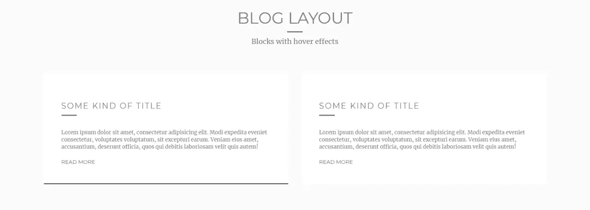

你可以在下面看到结果。

[链接](https://codepen.io/JeffAspen/pen/GZNqPm)

# 博客卡片阴影 CSS

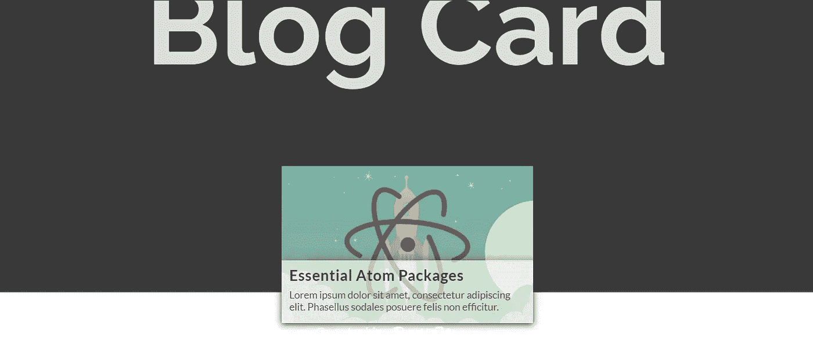

你可以在下面看到结果。

[链接](https://codepen.io/tterb/pen/KoNzXw)

# 博客卡片 CSS3

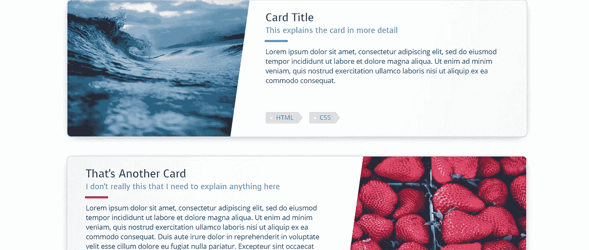

你可以在下面看到结果。

[链接](https://codepen.io/rabakilgur/pen/RYpVQz)

# 博客卡片页面

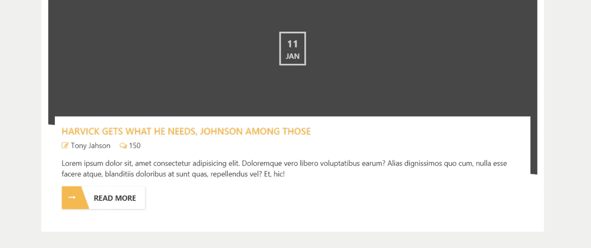

你可以在下面看到结果。

[链接](https://codepen.io/ChuiSauCE/pen/KGpQbe)

# 悬停博客卡片效果

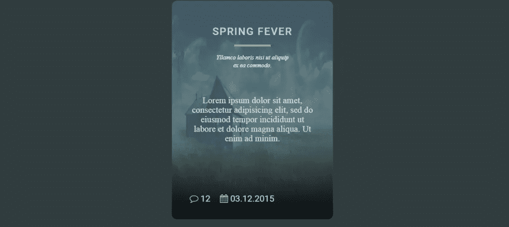

你可以在下面看到结果。

[链接](https://codepen.io/AlecMenke/pen/bNxgRR)

# Flexbox 博客卡网格 CSS

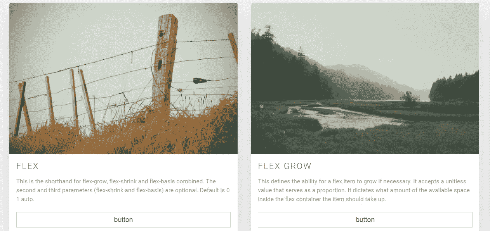

你可以在下面看到结果。

[链接](https://codepen.io/mcraiganthony/pen/NxGxqm)

# 博客帖子卡片布局 CSS3

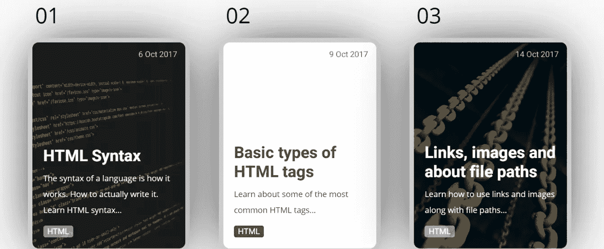

你可以在下面看到结果。

[链接](https://codepen.io/Booligoosh/pen/mKPpQp)

# CSS 过滤卡

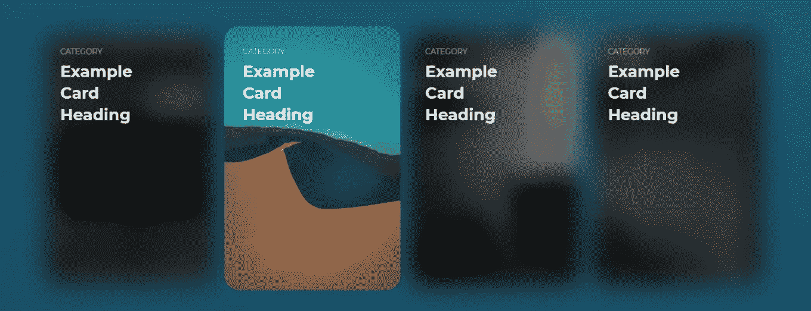

你可以在下面看到结果。

[链接](https://codepen.io/steveeeie/pen/NVWMEM)

# 博客帖子卡片项目

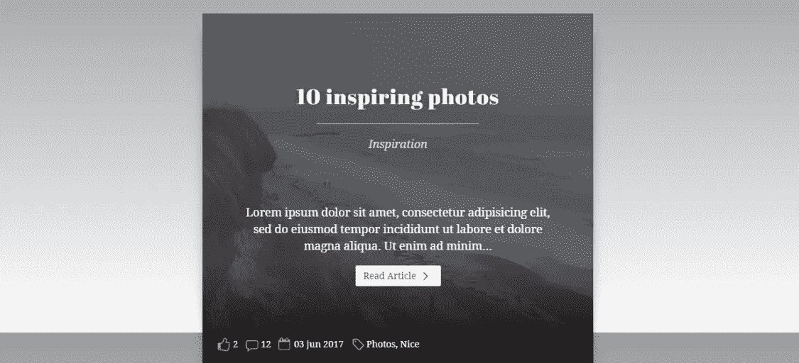

你可以在下面看到结果。

[链接](https://codepen.io/nodws/pen/ZpZjpQ)

# 博客卡片界面

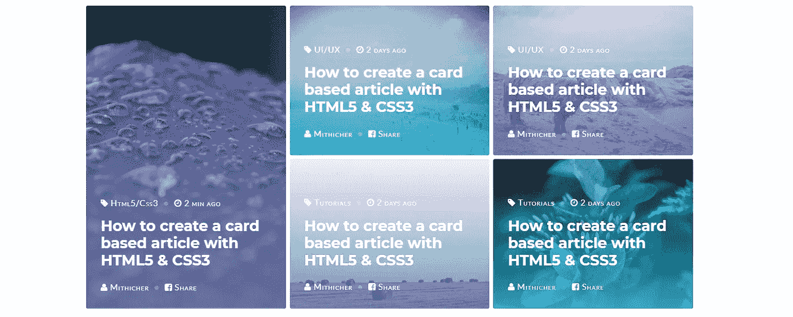

你可以在下面看到结果。

[链接](https://codepen.io/mithicher/pen/ojdXBa)

# Bootstrap 博客卡布局

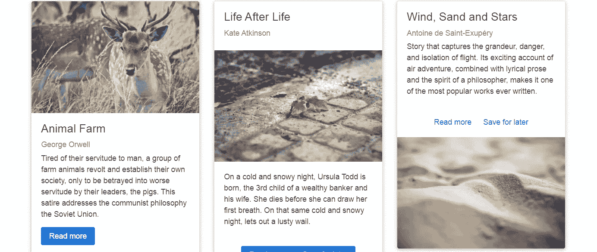

你可以在下面看到结果。

[链接](https://codepen.io/alexdevero/pen/JYpMEO)

# Flexbox 博客卡

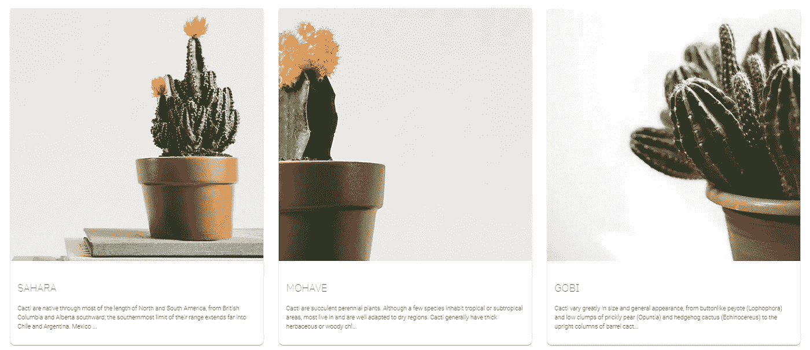

你可以在下面看到结果。

[链接](https://codepen.io/ccania/pen/LmjveK)

# CSS 制作的漂亮的博客卡

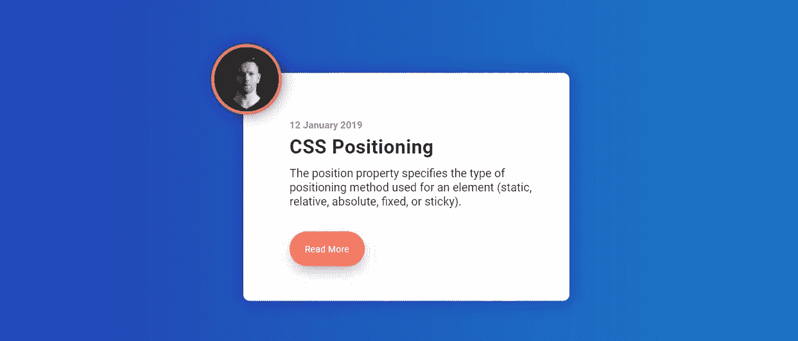

你可以在下面看到结果。

[链接](https://codepen.io/sdcrowe23/pen/OeMqGV)

# 简单的博客卡 CSS

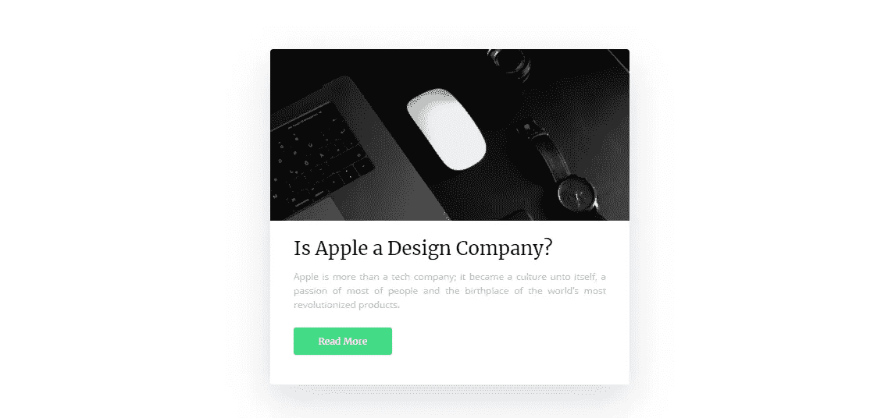

你可以在下面看到结果。

[链接](https://codepen.io/laheshk/pen/MQqzWo)

# 卡片网格 CSS 布局

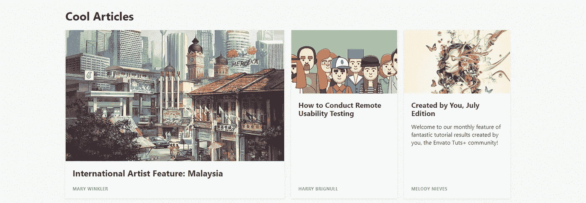

你可以在下面看到结果。

[链接](https://codepen.io/jmegs/pen/opbyXg)

# 卡片网格动画 CSS

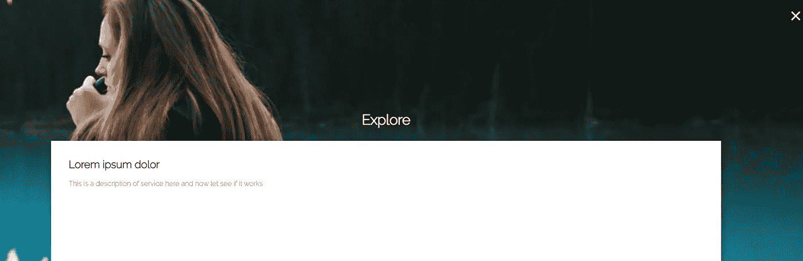

你可以在下面看到结果。

[链接](https://codepen.io/architechnium/pen/xpJRZw)

# HTML5 博客卡

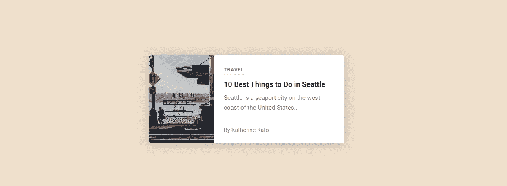

你可以在下面看到结果。

[链接](https://codepen.io/kathykato/pen/xzRQyp)

# 博客卡片设计 UI

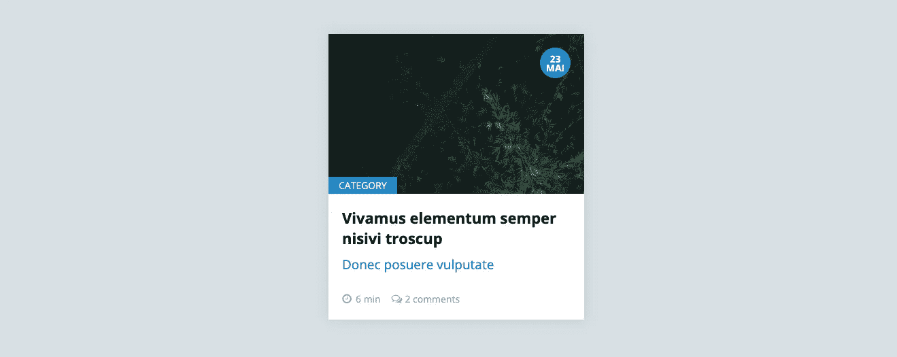

你可以在下面看到结果。

[链接](https://codepen.io/Stephane/pen/XbjGxO)

# 简单的博客卡

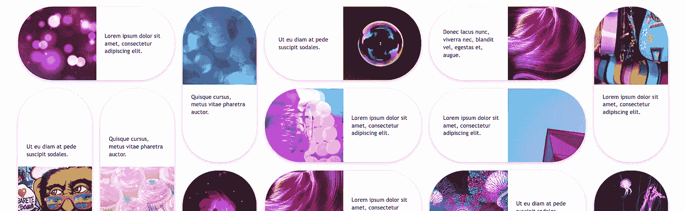

你可以在下面看到结果。

[链接](https://codepen.io/abcretrograde/pen/oddaaa)

# 博客卡片模板

你可以在下面看到结果。

[链接](https://codepen.io/russbeye/pen/MYeroq)

# 带滑块的博客卡

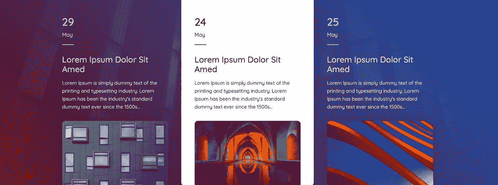

你可以在下面看到结果。

[链接](https://codepen.io/JavaScriptJunkie/pen/ZMMRRQ)

# 材料设计博客

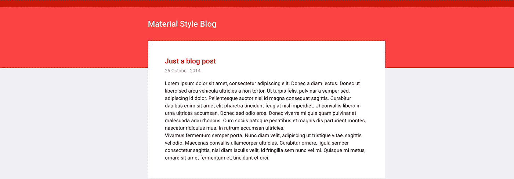

你可以在下面看到结果。

[链接](https://codepen.io/chrisfrees/pen/AzsID)

# CSS3 中的平面博客卡片布局

你可以在下面看到结果。

[链接](https://codepen.io/renaudtertrais/pen/xJFny)

# 文字环绕的博客卡

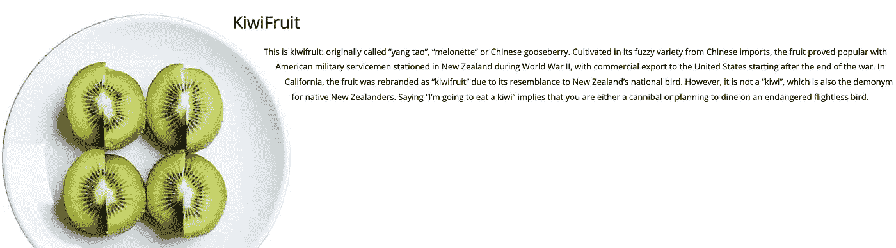

你可以在下面看到结果。

[链接](https://codepen.io/dudleystorey/pen/FvJDB)

# 博客展示布局

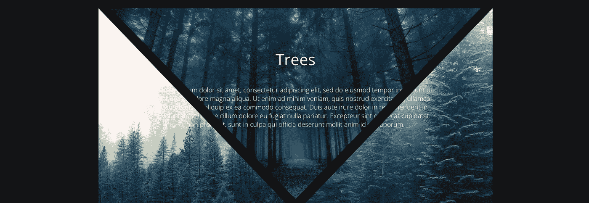

你可以在下面看到结果。

[链接](https://codepen.io/LloydJames/pen/mOWmYY)

# 高级 CSS 卡

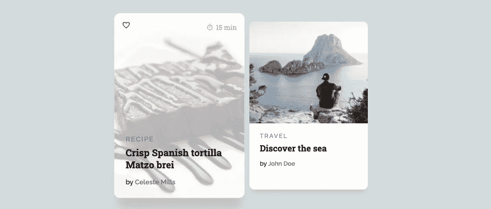

你可以在下面看到结果。

[链接](https://codepen.io/veronicadev/pen/WJyOwG)

# CSS 网格布局卡

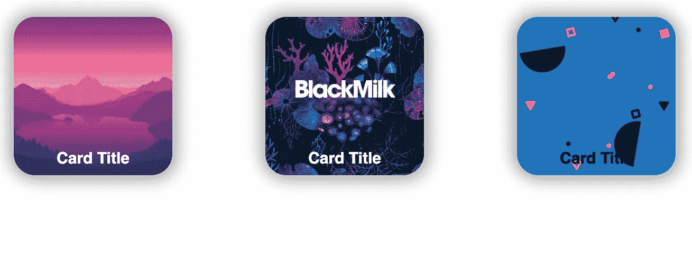

你可以在下面看到结果。

[链接](https://codepen.io/abhishek747/pen/BbWKVa)

# HTML 卡片

你可以在下面看到结果。

[链接](https://codepen.io/carlita712/pen/mNLzye)

# 卡片的骨架加载

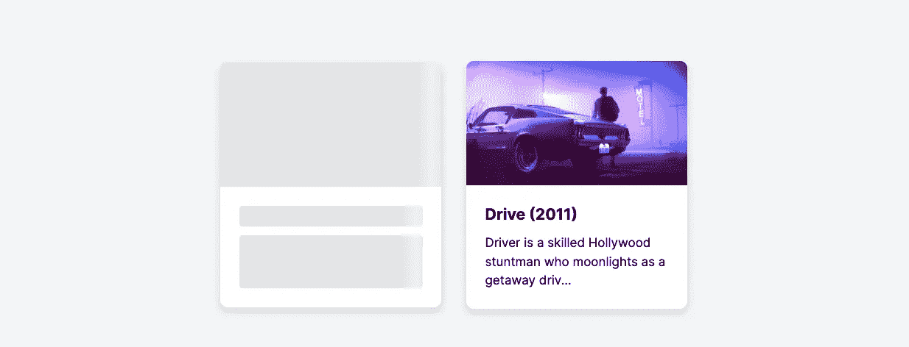

你可以在下面看到结果。

[链接](https://codepen.io/havardob/pen/dyGGGzq)

相关文章:

*   [网页设计 Css 翻转动画](https://us.niemvuilaptrinh.com/article/15-html-css-javascript-flipcards-for-websites)
*   [网页设计 CSS 产品卡](https://us.niemvuilaptrinh.com/article/33-css-product-cards-for-web-design)
*   [网站自举卡](https://us.niemvuilaptrinh.com/article/10-bootstrap-cards-for-websites)
*   [用于 Web 开发的 CSS 悬停卡效果](https://us.niemvuilaptrinh.com/article/28-hover-card-effects-for-web-development)

# 总结:

我希望这篇文章能为你的网络开发提供有用的博客标签，如果你有任何问题，请发邮件给我，我会尽快回复。希望大家继续支持页面，让我能写出更多好文章。祝你有愉快的一天。