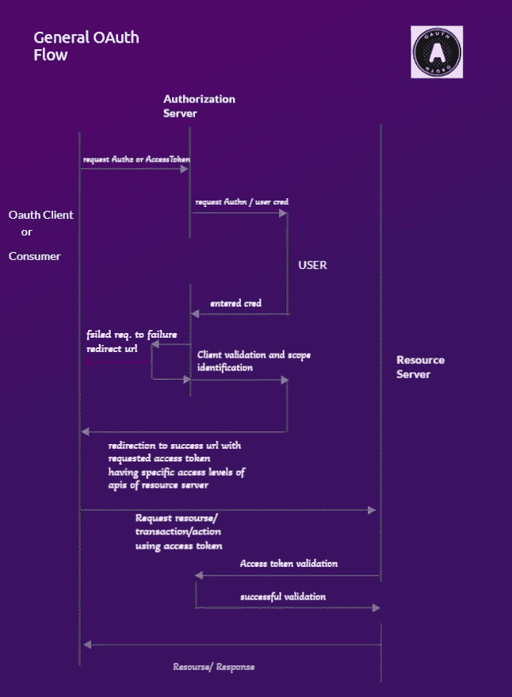

# 绕着 OAuth 度

> 原文：<https://medium.com/geekculture/360-degrees-around-the-oauth-6286d161a29e?source=collection_archive---------12----------------------->

OAuth 指的是开放授权机制/协议，它工作在授权层而不是 Authn 层。但是，对于使用 OAuth 功能的客户端应用程序来说，可以通过 Auth 服务器经由 Authz 执行 Authn。人们经常会对这些兄弟姐妹术语感到困惑。所以让我们先来了解它们:

身份验证意味着证明您是一个合法用户，持有特定应用程序/系统的有效凭证(用户名和密码)。例如，您可以在 Gmail 帐户登录页面输入您的电子邮件和密码来访问它。另一方面，授权涉及代表用户(基本上是持有凭证的人)提供访问功能的特权，而不直接共享凭证。例如，允许第三方应用 say Spotify 在脸书上直接分享你的音乐，而无需将你的脸书凭据分享给 Spotify。

让我们回到 OAuth，

那么，它是如何工作的呢？作为一名开发人员，应用程序 X 无权访问您的应用程序 Y 的凭证，但您通过提供委托访问权限，允许 X 对应用程序 Y 执行操作 A。在这里，您需要授权 X 这样做，这可以通过请求 Y 的授权服务器来完成。反过来，授权服务器提供一个访问令牌，该令牌可用于从 Y 的资源服务器(处理 DB 操作)进行事务处理，或者使用预构建的 API 在 Y 执行任何操作，这些 API 基于 Y 授权服务器提供的令牌。



OAuth Flow

***三足&二足***

上面描述了一般的 OAuth 流程，它是一个三脚 OAuth，这意味着用户(资源所有者)和 Auth 的参与。服务器和客户端这就是为什么 3 条腿，因为 3 个连接链接。如果用户不再参与 OAuth 过程，也存在 2 legged。如果遵循无状态机制，比如 jwt/app 访问令牌，那么您的应用程序中的客户端和服务器可能会进行通信。它不需要用户参与，就像客户端使用 jwt 令牌调用服务器的 API 来实现特定的作用域和功能一样。因此，2-leg 似乎是您的客户端和服务器与同一个应用程序或一方相关，而 3-leg 通常是客户端在域外，需要专门注册到 OAuth 方的门户以获得客户端 id 和密码。尽管它也可以用两条腿来完成或使用。

***用户通过 OAuthZ 进行申请的 AuthN***

如今，为用户提供便利的应用程序使用社交登录来代表 authZ 通过 OAuth 验证用户的合法性。也就是说，如果应用程序的 OAuth 客户端可以通过社交媒体应用程序认证服务器获得 OAuth 访问令牌，该服务器显示用户是合法的，允许用户在没有应用程序凭据的情况下访问应用程序(一种无密码方式)。这被称为联合身份验证。比如说。你只是使用你的谷歌账户登录并在亚马逊上购物，而没有亚马逊的信用。

试一试。在这里查看我的另一篇文章。

***OAuth 2.0&OAuth 1.0***

先说 OAuth 2.0 ( [RFC 6749](https://datatracker.ietf.org/doc/html/rfc6749) )，OAuth 的版本有上图提到的流程(*授权码授予*)。它首先向 OAuth 服务器发送一个带有`client_id`和`redirect_url`的请求，并允许客户端直接向授权服务器提供凭证。然后，Auth 服务器向 OAuth 客户机(基本上是代表用户要求授权的应用程序)提供授权代码。OAuth 客户端通过`authorization_code`和`redirect_url`再次向 OAuth 服务器发送请求，请求接收 Auth 服务器经过`code`和`redirect_uri`验证后返回的访问令牌。现在，OAuth 客户端使用提供的`access_token`,这是一个不需要任何加密功能的承载令牌，通常在服务器端应用程序使用时与报头一起发送。这些令牌的行为与两条腿的流 jwt 承载令牌相同。

以下是 OAuth 中涉及的参数:

*   `client_id`:向 OAuth 提供者注册后提供给客户端，以识别客户端。它应该包含在获取授权码的请求中。
*   `client_secret`:提供给 OAuth 客户端的机密秘密。
*   `redirect_uri`:OAuth 请求成功时应用程序的重定向 URL。
*   `grant_type`:需要在请求中添加这种类型(比如授权码授予、隐式授予等。)
*   `access_token`:如果流程成功，auth server 返回 JSON 响应。该访问令牌可以进一步用于向资源服务器请求动作/数据。它们通常寿命很短。
*   `refresh_token`:该令牌用于在新的访问令牌过期时再次生成新的访问令牌，而无需重新访问相同的过程。
*   `expires_in`:由于`access_token`和`refresh_token`都有到期日或有效期，如果都到期了，需要重新发起流程。
*   `scope`:表示访问级别。例如，仅向 OAuth 客户端提供电子邮件访问。

**对 reddit 认证服务器的典型请求:**

```
https://ssl.reddit.com/api/v1/authorize?response_type=code&redirect_uri=http%3A%2F%2Flocalhost%3A8888%2Freddit%2Fredirect&scope=identity&state=crypticString &client_id= client_id
```

**典型的回复重定向 URI:**

```
http://localhost:8888/reddit/redirect?state=cryptic string&code=auth_code#_
```

**对资源服务器的典型请求:**

```
https://api.spotify.com/v1/artists/access_token/albums
```

***其他授予类型***

**隐式授权**:目前没有使用，因为它适用于客户端应用程序(基于浏览器的 OAuth 客户端)，这些应用程序通过不安全的浏览器存储和执行所有操作，place &仅通过有泄漏风险的浏览器发送`access_token`。该授权不提供刷新令牌。从安全角度来看，这笔拨款并没有获胜。

**资源所有者密码授予**:这需要用户输入凭证。当第三方应用程序是由授权或 OAuth 服务器方管理的第一方应用程序时，使用此授权，以向内部应用程序提供`access_token`来访问资源。

**PKCE** :这种方法可以防止当请求从认证服务器返回到带有授权码的客户端时，授权码被破坏。恶意应用程序或攻击者可以窃取代码，并从 Auth 服务器请求访问令牌。因此，为了减轻这种情况，使用了用于代码交换的证明密钥，这里称为`code_verifier`或加密字符串，它在转换后通过`code_challenge`方法与授权请求一起发送到 Auth 服务器。因此，即使服务器返回给 OAuth 客户端的`authorization_code`被恶意客户端或其他应用程序破坏。它需要从认证服务器请求`access_token`的`code_verifier`。所以，`code_challenge` = t( `code_verifier`)其中 t →SHA256 或者密码算法。更多的熵将更好地避免容易猜测的`code_verifier`可以帮助更好地实施 PKCE 方法。有关 PKCE 的更多信息，请访问 [rfc7636](https://datatracker.ietf.org/doc/html/rfc7636) 。

**客户端凭证授予**:这里，客户端要求`access_token`为整个应用集成功能，而不是单个用户。所以这仅仅涉及到`client_id`和`client_secret`来命中对 auth 服务器的请求。例如，OAuth 客户端的应用程序需要 google Maps 集成或其他服务集成，因此可以直接使用客户端凭证授权。有时，当数据存储在应用程序之外时，完全的数据库访问可以通过这个授权来完成。

**刷新令牌授权**:此授权类型在`access_token`到期时生效，无需重复 OAuth 流程，客户端可以从授权码授权流中检索的`refresh_token`中检索新的`access_Token`。然而，与`refresh_tokens`相关的风险是，如果它们被攻击者捕获，攻击者可以生成新的访问令牌，并可以获得对系统的访问。

***OpenID 连接***

OpenId Connect 是一种身份包装器或协议，它工作在 OAuth 2.0 之上，允许客户端基于授权服务器的认证向用户提供访问。这是如上所述的联合认证。它还允许客户端根据 Auth 服务器声明的范围访问用户的身份参数，如`email_id`、`first_name`和`last_name`。更多信息(如关注人数、个人资料图片等。)也可以根据身份提供者策略和请求的范围，从身份提供者的身份验证服务器收集有关终端用户的信息。在最终用户成功认证后，客户端获得`id_token`和`access_token`，其中包含与认证相关的信息。`id_token`是签名的 jwt 令牌，具有声明信息，如发布者标识符(iss)、发布时间(iat)、到期时间(exp)等。

现在，迁移到***OAuth 1.0(***[***RFC 5849***](https://datatracker.ietf.org/doc/html/rfc5849)***)****，* OAuth 1.0 现在已经不流行了，趋于贬值甚至被很多服务提供商贬值。

消费者(OAuth2.0 中的客户端)的注册在 OAuth1.0 中以非常相似的方式获得消费者密钥和消费者秘密。

OAuth 1.0 使用请求令牌来请求访问令牌，以获得代表用户执行操作和获得受保护资源的权限。

OAuth1.0 流程如何工作:

消费者首先向服务提供商发送带有`consumer_key`和`consumer_secret`的请求，服务提供商反过来向消费者授予请求令牌(`oauth_token`)。现在，消费者获得最终用户完成的授权，并点击带有几个参数的请求，即`consumer_key`、`oauth_token`、`oauth_signature_method` (HMAC-SHA1)、`oauth_signature`、`time_stamp`等。服务提供者现在向消费者提供`access_token`,通过它可以获得用户的受保护资源。

使用 OAuth1.0 进行用户验证时的 Twitter URL

https://api.twitter.com/oauth/authenticate?oauth _ token = BOothwAAAAA bujzeacsbgurus 4u

OAuth 1.0 使用加密算法来防止任何未经授权的干预。它使用`oauth_signature`参数，并涉及消费者对请求的签名和通过服务提供者(Auth 服务器)的验证。它通常提供 3 种算法，即 HMAC-SHA1，RSA-SHA1 和明文。加密算法的应用对开发人员来说似乎很棘手，这也是 OAuth1.0 使用率下降的原因之一。此外，由于涉及签名，该机制不需要 OAuth2.0 中要求和推荐的 TLS/SSL(HTTPS)传输。OAuth1.0 不支持刷新令牌的概念，并提供长期访问令牌，这可能会增加通过它们进行非法活动的可能性。

***超越 OAuth2.0***

OAuth 2.1 的研究和草案层出不穷，它通常会加强 OAuth 2.0 规范中一些更标准的安全考虑，如授权码授权中 PKCE 的参与、`redirect_url`的精确字符串匹配，以及其他一些变化。

因此，OAuth 2.0 在安全性方面仍然有很大的改进空间，这可能导致 OAuth 3.0 的形成，这可能需要时间，但肯定会发生。

就是这样！

感谢您的阅读！希望对你有帮助！