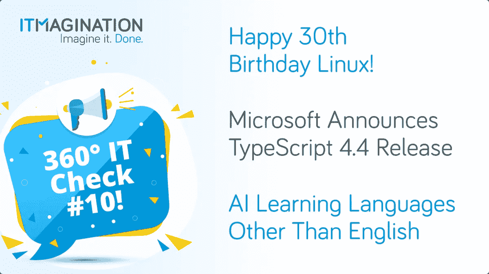
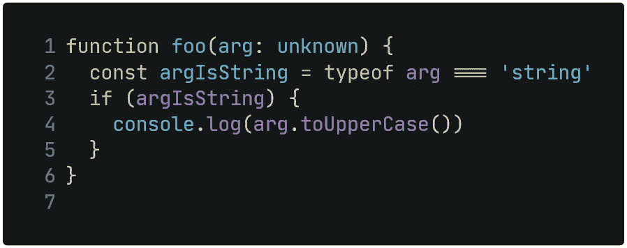
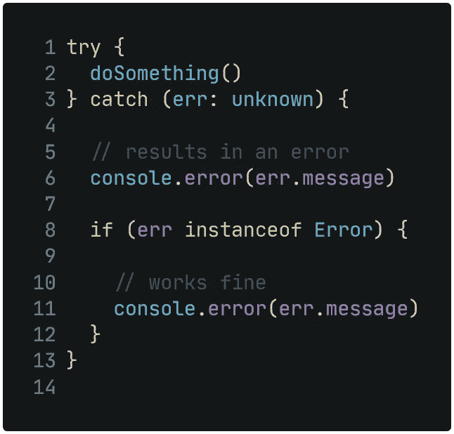

# 360 IT 检查#10 — Linux 庆祝其 30 岁生日，微软发布 TypeScript 4.4，等等！

> 原文：<https://medium.com/geekculture/360-it-check-10-linux-celebrates-its-30th-birthday-microsoft-releases-typescript-4-4-88853c01fbce?source=collection_archive---------44----------------------->

360 IT Check 是一份每周出版的刊物，在这里我们为您带来世界上最新最棒的技术。我们涵盖了新兴技术框架、创新创业公司的新闻以及其他直接或间接影响科技世界的话题。

喜欢你正在读的东西吗？请务必订阅我们的[每周简讯](https://www.itmagination.com/newsletters/360-it-check)！‍

# 30 岁生日快乐，Linux！

Linux，曾经是芬兰学生 Linus Torvalds 的一个项目，上周已经 30 岁了。这个人的爱好改变了 IT 世界，并允许许多创新，是它的前身。托瓦尔兹的创造是第一个以互联网为中心的大型开源项目——我们现在认为这是理所当然的。然而，正如他在 1991 年的原始邮件中所承认的那样，有些人可能会感到惊讶，这个操作系统不应该是严肃的或“专业的”。

> *出发地:托瓦尔兹@克拉瓦。Helsinki.FI(林纳斯·本纳第克特·托瓦兹)
> 新闻组:comp.os.minix
> 主题:你最希望在 minix 中看到什么？
> 摘要:关于我的新操作系统的小投票
> 消息 ID:
> 日期:91 年 8 月 25 日 20:57:08 GMT
> 组织:赫尔辛基大学*
> 
> *使用 minix 的各位好-*
> 
> *我在 clones 做一个 386(486)的(免费)操作系统(只是爱好，不会像 gnu 那样大而专业)。这从 4 月份就开始酝酿，并开始准备。我希望得到关于人们喜欢/不喜欢 minix 的任何反馈，因为我的操作系统有点像它(文件系统的相同物理布局(由于实际原因)等等)。*
> 
> *我目前已经移植了 bash(1.08)和 gcc(1.40)，看起来一切正常。这意味着我将在几个月内得到一些实用的东西，我想知道大多数人想要什么样的特性。欢迎任何建议，但我不保证会实施:-)*
> 
> *莱纳斯(Torvalds @ kru una . Helsinki . fi)*
> 
> *PS。是的—它没有任何 minix 代码，并且有一个多线程 fs。它是不可移植的(使用 386 任务切换等)，它可能永远不会支持除了 AT-harddisks 之外的任何东西，因为这是我所有的东西。*

然而，正如 Linuxes 的父亲自己承认的那样，该系统直到 0.03 版本才变得“可用”。

> *它【Linux 0.01】确实管用，甚至有人试用过。有几个严重的错误(没有软驱，没有虚拟机，什么都没有)，而且 0.02 不是很好用。*
> 
> 此后不久，0.03 就发布了(即使在当时，两次发布之间的时间间隔也最多是 2-3 周)，而且 0.03 非常可用。下一个版本被编号为 0.10，因为事情实际上开始工作得很好。

幸运的是，对我们所有人来说，这个爱好项目开始了，为了让你知道它做了多少，这里有一些在系统上运行的东西:

简而言之，这个项目几乎在每一个方面都主宰着 IT 世界，你可以在任何地方看到它。只有一个领域，它没有设法建立一个重要的存在。这是个人电脑市场。造成这种状况的原因可能不多。首先，打包软件的问题。这是困扰开发者和用户的问题。甚至莱纳斯·托瓦尔兹[自己也承认这是一件没有发行版做对的事情](http://meetings-archive.debian.net/pub/debian-meetings/2014/debconf14/webm/QA_with_Linus_Torvalds.webm)(跳到第六分钟左右)。其次，事实是当你进入电脑商店时，99.9%的情况下电脑都已经预装了系统。这一点，以及人们不想或不知道如何安装另一个系统的事实，导致了微软和苹果的双头垄断。

多年来，有许多重要的里程碑:

*   **1993 年**——世界见证了 Patrick Volkerding 创造的 [Slackware Linux](http://slackware.com) 的首次发布。这是第一个成功的 Linux 发行版。同年， [Debian](https://www.debian.org/) Linux 也问世了。今天，它是诸如 [Mint](https://linuxmint.com/) 或 [Ubuntu](https://ubuntu.com/) 等发行版的基础。
*   **1994**——[红帽 Linux](https://en.wikipedia.org/wiki/Red_Hat_Linux) 由马克·欧文(Marc Erwing)创建。将近 10 年后，该项目因支持红帽企业 Linux 而中止。这个项目创造了 Red Hat Software——迄今为止最受欢迎的 Linux 公司。
*   **1996**——[KDE](https://kde.org/)，库尔桌面环境的简称，开始了。这是第一个主要的 Linux 桌面界面。目前，它用一个光滑的、透明的用户界面来吸引用户。
*   **1997 年**——[侏儒](https://www.gnome.org/)诞生了。与 KDE 一起，它们将成为两个最主要的桌面环境。
*   **2000 年**——IBM 向 Linux 投资 10 亿美元。这反过来为系统打开了企业计算的大门
*   **2004** — [Ubuntu](https://ubuntu.com/) 创建。许多人认为它是进入开源系统世界的入口。它还赢得了 LinkedIn 最受欢迎 Linux 发行版的投票。有趣的是，elementaryOS 在‍的推特上赢了
*   **2007 年** —安卓宣布。几年后，它将成为世界上最受欢迎的终端用户操作系统
*   **2012** —红帽赚了第一个十亿。这表明了莱纳斯·托沃兹的小爱好项目是如何有利可图的
*   **2016** —在微软宣布热爱 Linux 之后，它利用其针对 Linux 的 Windows 子系统，开辟了在 Windows 上开发适用于 Linux 的应用的可能性。

Linux 的未来是什么？所有迹象表明，这可能是对整个代码库的补充，因为它提供了更多的安全性。重要的是，它是增加和扩充，而不是转换。很快可能会看到大量生锈的地方是车手。莱纳斯·托沃兹说了下面的话:

> Rust 的首要目标似乎是驱动程序，因为在那里你可以找到许多不同的可能目标，而且你有这些相当小且独立的内核部分。对一些人来说，这可能不是一个非常有趣的目标，但却是显而易见的。

# 人工智能学习英语以外的语言

在 OpenAI 的 GPT-3 取得成功后，有些人可能会问——除了英语之外的其他语言呢？

可以理解的是，第一个目标语言是英语——世界通用语言。然而，我们必须记住，其他语言也存在，这是德国人工智能公司 Aleph Alpha T1 发现的。还有其他公司正在尝试引入不同语言的高级语言模型。有华为的[盘古-α](https://arxiv.org/abs/2104.12369) (中文)，还有 Naver 的 HyperCLOVA(韩文)。

人们必须注意到，与印欧语系的其他语言相比，英语是一种相对容易的语言。这还没提到其他语系的语言。

# 微软宣布推出 TypeScript 4.4

TypeScript，JavaScript 的大规模应用的超集，发布了 4.4 版本。

有一些变化会让语言对用户来说更舒服。

第一个变化是对“别名条件和判别式”的更好分析。在此版本中，以下代码不再导致问题。

以前，第 4 行将会导致问题，因为“arg”仍将被视为“unknown”类型的变量这个简单的例子说明了这个更新修复了类型检查器的一个重要问题。尽管这个问题不会在每个代码库中出现，但它已经足够严重了。

另一个新颖之处是“捕捉变量”现在将被视为“未知”类型的值，而不是“任何”类型的值。让我们看一个简单的例子:

还有显著的性能改进——使用“严格标志”时，增量构建更快，对于大输出，源映射生成更快——准确地说大约 8%。“强制构建”也变得更快，因为跳过了对哪些文件必须重建的检查——无论如何，一切都将从头开始重建。

变化的列表很长，在这里我们无法深入讨论。完整列表包括但不限于，[精确可选属性类型](https://devblogs.microsoft.com/typescript/announcing-typescript-4-4/#exact-optional-property-types)、[类中的静态块](https://devblogs.microsoft.com/typescript/announcing-typescript-4-4/#static-blocks)或[JavaScript](https://devblogs.microsoft.com/typescript/announcing-typescript-4-4/#spelling-corrections-js)的拼写建议。

微软的开发博客上有完整的帖子。

*最初发表于*[*【https://www.itmagination.com】*](https://www.itmagination.com/blog/360deg-it-check-10-happy-30th-birthday-linux-microsoft-releases-typescript-4-4-ai-other-languages-english)*。*