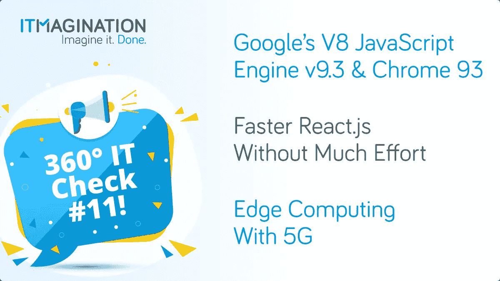
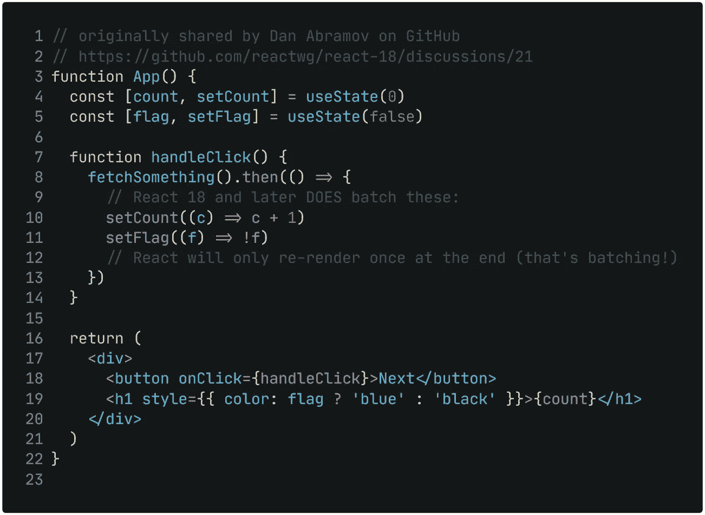

# 360 IT 检查#11 — React 的“并发模式”，V8 引擎 v9.3，Chrome 93，5G 的边缘计算等等！

> 原文：<https://medium.com/geekculture/360-it-check-11-reacts-concurrent-mode-javascript-s-v8-engine-v9-3-54e2b449c651?source=collection_archive---------24----------------------->

*更新 2021–09–14 这篇文章更新了* [*以展示到我们的 GitHub 资源库*](https://github.com/itmaginationdemos/React-18-Demo) *的链接，我们在那里演示 React 的新功能。*

**360 IT Check 是一份周刊，在这里我们为您带来世界上最新最棒的技术。我们涵盖新兴技术&框架、创新创业公司的新闻以及其他直接或间接影响科技世界的话题。 **‍****

请务必[订阅我们的简讯](https://www.itmagination.com/newsletters/360-it-check)！

# 谷歌的 V8 JavaScript 引擎 v9.3 和 Chrome 93 发布

世界上最流行的网络浏览器 Chrome 的最新更新[在这里](https://developer.chrome.com/blog/new-in-chrome-93/)，它有一些值得注意的功能。首先，浏览器发布周期的一个重要变化。每 4 周就会有新的互动出现，这比以前更频繁了。

至于实际的更新，有一组对渐进式 Web 应用程序(PWA)生态系统的更新。其中之一是对可安装 web 应用程序处理链接的改进。简而言之，你现在可以指定你想让所有链接都在应用的新窗口中打开，而不是在普通的浏览器标签中。另一个改进是关于 [PWAs](https://www.itmagination.com/blog/progressive-web-apps-the-way-to-reach-your-mobile-customers) 的外观。他们现在会感觉比以前更加自然。

当然，Chrome 的 JavaScript 引擎也有改进——V8 引擎。有一个变化应该会让每个互联网用户兴奋不已。新的实时编译器斯派克普拉在 V8 v9.1 中推出。然而，直到现在，引擎背后的团队才设法优化它，导致惊人的结果。在一项基准测试中， [JavaScript 的编译时间下降了 44%。](https://v8.dev/blog/v8-release-93)当然，这对所有 JavaScript 工程师来说都是一个好消息，因为 [Node.js](https://www.itmagination.com/open-jobs/NodejsDeveloper-8050000012856481) 最终也将受益于这一巨大的改进。这也将继续让使用 Node.js 的[创业公司和使用 Node.js](https://www.itmagination.com/blog/5-reasons-why-startups-love-node-js) 的[企业受益匪浅。](https://www.itmagination.com/blog/node-js-changed-corporate-software-engineering)

之前，我们曾与 ITMAGINATION 的高级 Node.js/JavaScript 软件开发人员 Artur abudzi324ski 谈过全栈 JavaScript 开发的利与弊，他谈到了 V8 引擎的工作，以及这是 JavaScript 被广泛采用的主要原因:

> *【JavaScript 在云中流行&后端用例】，对我来说，是因为它的速度。因为它的优化，因为谷歌在 V8 上真的很努力，这是运行 JavaScript 的引擎。他们优化了它，编写了几个编译器，这就是为什么它启动很快，同时也可以优化自己，因为 JIT 代表“实时编译”。*
> 
> 得益于此，我们现在有了一种可以在任何地方运行的像样的编程语言。Node.js 是一个运行在 V8 上的 JavaScript 环境，它连接到操作系统，允许我们编写更严肃的后端和应用程序，而不仅仅是显示一个网站。

要查看 Chrome 的完整变化列表，[点击这个链接](https://developer.chrome.com/blog/new-in-chrome-93/)，要查看 V8 的完整变化列表，[点击这里](https://v8.dev/blog/v8-release-93)。

# Windows 11 将于 10 月 5 日发布

微软(Microsoft)操作系统的下一个重要版本 Windows 11 即将推出。我们将很快看到它，因为它预计将于今年 10 月 5 日开始上市。

微软团队在他们的内部博客上最好地描述了今年秋天你可以期待的一系列功能。该公司继续保持将其众多解决方案更紧密整合的趋势。

在你的个人电脑上运行 Android 应用程序的预期可能性[最初将缺乏](https://www.theverge.com/2021/8/31/22650000/microsoft-windows-11-android-apps-support)，尽管该功能将在以后推出。

# 反应更快，无需太多努力

在稳定、安全的[反应](https://www.itmagination.com/open-jobs/ReactDeveloper-8050000012874788) 17 之后，准备一些[新引入的来自脸书的 JavaScript 框架的方面](https://blog.openreplay.com/react-18-alpha-is-out-this-is-what-you-need-to-know)。

首先，我们改进了自动“批处理”(分组)。从 React 18 开始，我们组件中的更多代码将被组合在一起，以节省渲染时间。这不是我们第一次看到的，因为 DOM 事件处理程序已经这样优化过了。

然而，我们现在知道，更多的状态更新将一起运行以获得额外的改进。这个例子也许最好地说明了这一点:

**最令人兴奋的新奇事物无疑是“并发渲染”**或者像有些人可能记得的那样——“并发模式”。期待已久的新功能将“帮助 React 应用程序保持响应，并根据用户的设备功能和网络速度进行优雅的调整。”要点是，以前，所有的更新都是不可中断的。一旦开始，就不可能被中断——这导致了人为的延迟。现在这种情况发生了变化——更新将“同时”进行。重要的是，这个变化不会对我们使用框架的方式产生太大的影响。它会“正常工作”

关于新渲染模式的深入细节，[React 团队已经准备好了一篇写得非常好的博文](https://reactjs.org/docs/concurrent-mode-intro.html)。**然而，底线是框架应该更快，不需要太多额外的时间。**

我们必须感谢核心团队努力实现向后兼容的承诺，以及向新版本的简单迁移过程。React 的核心团队无疑已经从 Angular 的发布和围绕 Vue 3 的对象 API/组合 API 争议的模糊中吸取了教训。

如果你想在野外看到 React 的新特性，请访问我们的 GitHub 库。

# 5G 边缘计算

合伙经营世界，在这种情况下也不例外。威瑞森与微软合作，为[提供专用云平台](https://www.crn.com/news/networking/verizon-microsoft-azure-roll-out-private-mobile-edge-cloud-for-enterprises)，致力于减少网络延迟。超高速 5G 网络与内部部署解决方案相结合，应能实现闪电般的响应时间。这项服务是对今年开始在美国[兴起的私有 5G 网络的补充。](https://www.crn.com/news/networking/verizon-business-launches-first-private-enterprise-5g-network-in-u-s-)

这当然也不是该地区的终结。正如 [Maciej Gos](https://www.linkedin.com/in/maciejgos/) 所说，ITMAGINATION 的 [DevOps &云能力负责人](https://www.itmagination.com/blog/meet-the-innovators-maciej-gos-devops-cloud-competence-leader)告诉我们:

> *边缘计算和私有 5G 领域只会加速发展。越来越多的设备支持 5G 连接，这意味着享受快速网络的好处变得更加容易。*
> 
> *在不久的将来，人们可能不再需要一台“普通”的个人电脑——我们只需要一台连接到下一代蜂窝网络的 iPad，就可以使用极其耗电的应用程序，因为我们可以将 Windows 365 流式传输到我们的平板电脑上。*

喜欢你正在读的东西吗？确保[订阅](https://www.itmagination.com/newsletters/360-it-check)，或查看我们的网站，看看我们是否是您一直在寻找的[技术合作伙伴](https://www.itmagination.com/)，或者我们是否有适合您的[工作](https://www.itmagination.com/open-jobs)！

*最初发表于*[*【https://www.itmagination.com】*](https://www.itmagination.com/blog/360deg-it-check-11-react-js-concurrent-mode-chrome-93-v8-9-3-edge-computing-with-5g-windows-11)*。*