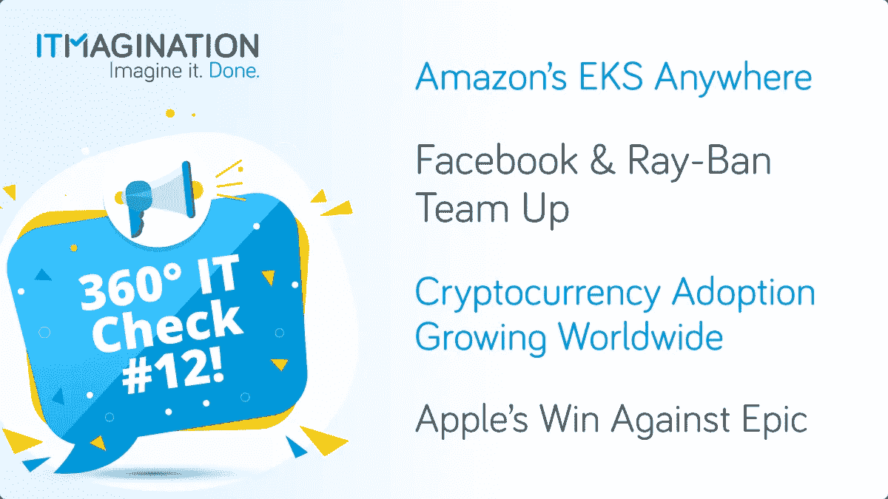

# 360 IT 检查#12:亚马逊 EKS 无处不在，雷朋的故事，加密货币的采用越来越多，等等！

> 原文：<https://medium.com/geekculture/360-it-check-12-amazon-eks-anywhere-ray-ban-stories-cryptocurrency-adoption-growing-and-more-7965de6dc877?source=collection_archive---------31----------------------->

360 IT Check 是一份周刊，在这里我们为您带来世界上最新最棒的技术。我们涵盖新兴技术&框架、创新创业公司的新闻以及其他直接或间接影响科技世界的话题。 **‍**

请务必[订阅我们的简讯](https://www.itmagination.com/newsletters/360-it-check)！

# 亚马逊 EKS 随处可得

[亚马逊 EKS Anywhere 现已全面上市](https://aws.amazon.com/blogs/aws/amazon-eks-anywhere-now-generally-available-to-create-and-manage-kubernetes-clusters-on-premises/)。新的部署选项允许 AWS 客户在他们自己的基础设施上管理他们的 Kubernetes 集群。

这是 AWS 吸引商业客户的方式。正如亚马逊首席执行官安迪·杰西在创新大会上承认的那样

> *【公司】仍然有许多……容器需要在内部运行，因为【他们】正在向云过渡，他们真的希望拥有与 AWS 内部相同的管理和部署机制——客户要求我们在这方面努力。*

# 加密货币在全球范围内的应用日益广泛

股票交易和投资应用程序 robin hood[现在将允许您在预先确定的时间基础上自动投资加密货币。](https://www.theverge.com/2021/9/8/22663251/robinhood-cryptocurrency-recurring-investment-dollar-cost-averaging-bitcoin-ethereum)这是将加密货币带给日常用户的又一步。这表明他们正慢慢地被早期的大多数人所接受。

上周的另一个重大进展是萨尔瓦多宣布比特币为法定货币的第一周。这个决定引起了极大的兴趣，导致服务器崩溃和对解决方案的抗议。

一方面，这一变化将使萨尔瓦多人向该国转移现金变得更加容易，避免了许多供应商的规定。另一方面，近 50%的公民没有接入互联网。

# 脸书和雷朋推出新款智能眼镜

在脸书和雷朋宣布他们合作的结果后，互联网正在蓬勃发展。

299 美元的“雷朋故事”看起来就像是另外一对。他们的外表具有欺骗性。它们配备了两个 500 万像素的摄像头，能够录制 30 秒的视频。您也可以在通话时进行呼叫，以增加主要功能。

这一宣布引起了很多争议。双方都有很多围绕这个话题的推文。一些人提出了一些合理的问题，比如智能眼镜的未来会是什么样子。其他人在欣赏风景。

# 在与苹果的诉讼中，法院裁定 Epic 败诉

[臭名昭著的苹果诉 Epic 案被解决](https://www.theverge.com/2021/9/12/22670269/epic-files-appeal-fortnite-legal-battle)，而且……苹果赢了。罗杰斯法官表示，苹果确实可能存在不公平的垄断。

> *有证据表明，凭借其可观的市场份额，苹果公司正处于强大市场力量或垄断力量的边缘*

然而，苹果公司的两个最糟糕的情况并没有发生。苹果仍然没有允许第三方应用商店，也没有被迫整合第三方支付选项。然而，Epic 确实赢得了一场小胜利。根据裁决，iOS 开发者不允许其他支付选项的广告是非法的。

Epic 决定上诉。有关周五裁决的详细内容，请点击此链接。

喜欢你刚刚读的吗？请务必[订阅我们的简讯](https://www.itmagination.com/newsletters/360-it-check)！

*原载于*[*https://www.itmagination.com*](https://www.itmagination.com/blog/360deg-it-check-12-facebook-rayban-amazon-eks-epic-apple-robinhood-cryptocurrency)*。*