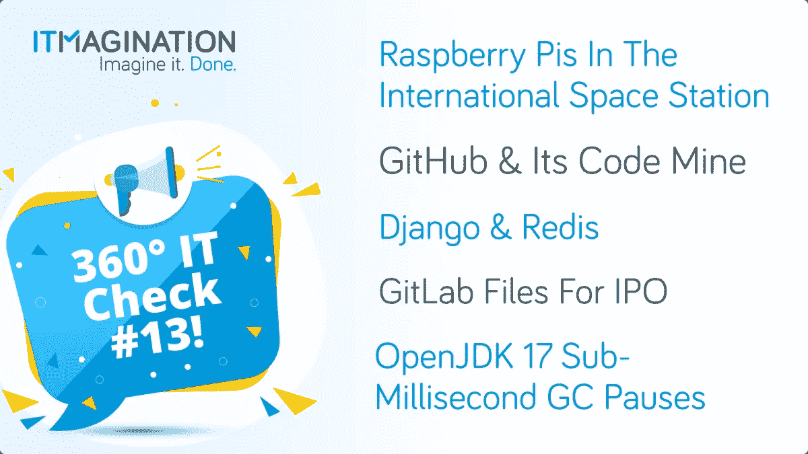

# 360 IT 检查#13:树莓 Pi 上太空，Gitlab 文件 IPO，等等！

> 原文：<https://medium.com/geekculture/360-it-check-13-raspberry-pi-goes-to-space-gitlab-files-for-ipo-and-more-cf29da64f12c?source=collection_archive---------38----------------------->

360 IT Check 是一份每周出版的刊物，在这里我们为您带来世界上最新最棒的技术。我们涵盖了新兴技术&框架、创新创业公司的新闻以及其他直接或间接影响技术世界的话题。

喜欢你正在读的东西吗？请务必订阅我们的[每周简讯](https://www.itmagination.com/newsletters/360-it-check)！

# 树莓派正在前往 Station‍国际太空

如果你曾经对你的树莓派感到沮丧，想把它送上太空…你的梦想再次[成为现实](https://www.raspberrypi.org/blog/astro-pi-2021-news-rocket-launch-hardware/)。Astro Pi 是为业余爱好者设计的普通计算机的特殊版本，它将被欧洲航天局搭载。这些新电脑基本上由一个 8 GB 内存的 Raspberry Pi 4 Model B、一个高质量的摄像头、 [Google Coral](https://www.youtube.com/watch?v=Jgm25QdF90A) 机器学习加速器、颜色和亮度传感器以及一个被动红外传感器组成。

除了这些设备，计算机背后的基金会还宣布了两项竞赛——任务零和任务空间实验室。他们都将给年轻人团队一个在太空运行他们算法的机会。

# GitHub 及其代码矿

你可能永远也不会有机会在 GitHub 管理事情，不过多亏了对该公司首席运营官埃里卡·布雷西亚的采访，现在你可能知道它是什么样子了。

Erica Brescia 于两年前加入 GitHub，这是微软在 2018 年收购该公司后的一段时间。在采访本身中，布雷西亚提到了几个有趣的话题，如平台的扩展，他们与微软之间的合作性质，GitHub 将如何继续成为所有开发者的家园，安全等。

你可以在这里找到完整的文章。

# 姜戈-雷迪斯公司

为“有期限的完美主义者”设计的 [Python](https://www.itmagination.com/open-jobs/DevOpsEngineerwithPythonCloud-8050000012352153) web 框架 Django 获得了一个非常有用的特性。我们现在知道框架的下一个版本将在 [Redis](https://redis.io/) 中获得对缓存后端的支持。

Redis 是内存中的数据结构，主要用于缓存目的。尽管它支持持久性，但通常是禁用的。它是用 ANSI C 编写的，这意味着它速度快，内存占用少。

由于以前 Django 开发人员不得不依赖第三方包来使用内存存储缓存数据，他们现在将欣喜若狂地从核心团队获得第三方支持。

有关详细信息，请参见此[拉动请求](https://github.com/django/django/pull/14437)。

# git lab IPO 文件

GitHub 最大的竞争对手 git lab[申请了 IPO](https://www.cnbc.com/2021/09/17/github-rival-gitlab-files-to-go-public-on-revenue-over-200-million.html) 。如果你不熟悉 GitLab 的产品，你可以放心地相信他们会提供你日常工作中需要的一切。

该公司现在处于一个非常好的位置，因为世界对未来工作的拥抱使所有的科技公司转向远程优先或混合工作。指标显示，该公司即使不需要获得新客户也在增长，因为其“净收入保留率”[([上个月的每月经常性收入+通过升级和交叉销售产生的收入-通过降级损失的收入-通过流失损失的收入] /上个月的每月经常性收入)](https://www.smartkarrot.com/resources/blog/net-revenue-retention/)超过 100%。

# OpenJDK 17 亚毫秒 GC 暂停

“垃圾收集”是自动内存管理的一种形式。它将您从手动内存管理的想法中解放出来。但是，需要注意的是，程序的执行通常必须停止，直到垃圾收集停止工作。这就是为什么 Red Hat 的最新声明会引起所有 Java 开发人员的兴趣。

open JDK(Java 的实现之一)中的垃圾收集器“Shenandoah”得到了进一步的改进，实现了亚毫秒级的暂停。完整的公告，请阅读红帽的[帖子](https://developers.redhat.com/articles/2021/09/16/shenandoah-openjdk-17-sub-millisecond-gc-pauses#benchmarking_shenandoah_gc)，详细解释“谢南多”如何工作，请阅读其[维基页面](https://wiki.openjdk.java.net/display/shenandoah/Main)。

*原载于*[*https://www.itmagination.com*](https://www.itmagination.com/blog/360deg-it-check-13-raspberry-pi-github-django-redis-gitlab-openjdk)*。*