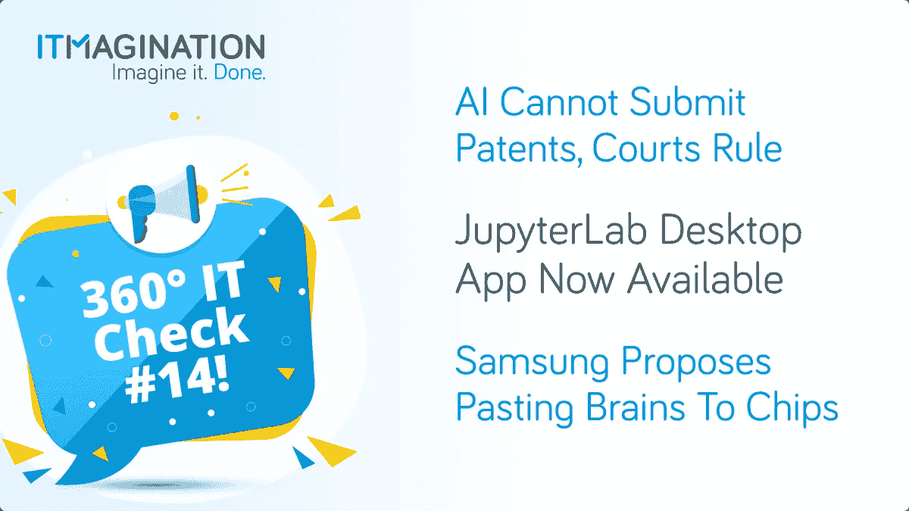

# 360 IT Check #14 —人工智能和专利、JupyterLab 桌面应用、新的私人视频通话服务等等！

> 原文：<https://medium.com/geekculture/360-it-check-14-ai-patents-jupyterlab-desktop-app-new-private-video-calling-service-and-c791a1cd52bd?source=collection_archive---------20----------------------->

360 IT Check 是一份每周出版的刊物，在这里我们为您带来世界上最新最棒的技术。我们涵盖了新兴技术&框架、创新创业公司的新闻以及其他直接或间接影响技术世界的话题。

喜欢你正在读的东西吗？请务必订阅我们的[每周简讯](https://www.itmagination.com/newsletters/360-it-check)！

# 法院裁定人工智能不能提交专利

在一个具有里程碑意义的案件中，英国上诉法院裁定[人工智能**不能**成为新专利](https://www.bbc.com/news/technology-58668534)的发明人。在法官的推理中，[伊丽莎白·莱恩女士写道](https://www.bailii.org/ew/cases/EWCA/Civ/2021/1374.html):

> *只有人才能拥有权利。一台机器不能*

尽管一开始原因很简单，而且这个决定可以被认为是显而易见的，但不清楚专利法是否会在未来被重新修订。似乎没有人预测到机器在我们生活中已经并将继续扮演越来越重要的角色。

目前，我们不必担心有意识的机器存在的可能性，尽管这可能是未来的事。因此，他们有没有我们的人权？回到核心问题——机器能够提交专利吗？

美国的法官同意他们英国同事的观点。一个重要的“但是”。美国地区法官 Leonie M Brinkema 写道:

> 随着技术的发展，可能会有一天人工智能会达到一个复杂的水平，以满足人们对发明创造的认可。

# JupyterLab 桌面应用程序现已推出

数据科学界会很高兴地知道，现在建立 Jupyter 实验室变得更容易了。上周，我们已经看到了一个 JupyterLab 应用程序的重启—[“JupyterLab 的跨平台独立应用程序分发”](https://blog.jupyter.org/jupyterlab-desktop-app-now-available-b8b661b17e9a)

想法是一样的——您仍然运行一个 Python 环境，其中有几个流行的 Python 库(NumPy、SciPy、pandas、ipywidgets、Matplotlib)随时可用。现在的不同之处在于，web 浏览器与环境捆绑在一起，使得设置更加容易。

从[项目的 GitHub 页面](https://github.com/jupyterlab/jupyterlab_app#download)下载安装程序。

# 勇敢的谈话

Brave，Brave Browser 和 Brave Search 背后的公司，现在想要在视频电话和视频会议市场分一杯羹。他们的最新产品“勇敢对话”面向注重隐私的市场。因此，不要指望广告、剖析或记录元数据。

在幕后，它是一个[“Jitsi 即服务”](https://jaas.8x8.vc/#/)产品。Jitsi 已经是一个非常流行的解决方案。它提供免费使用的端到端加密视频聊天。与竞争对手的服务相比，最大的优势在于你不需要下载额外的软件——它就在你的浏览器中运行。

尽管 Brave Talk 比其竞争对手有优势，但如果你没有听说过它(很可能是这种情况)，你就会知道在这个领域引入另一个竞争对手的问题是什么——人们倾向于坚持默认设置和/或坚持使用他们的朋友/同事/客户已经在使用的产品。

你可以去 https://brave.com/talk/的[试试《勇敢的对话》](https://brave.com/talk/)

# 三星提议将大脑粘贴到芯片上

韩国巨头三星提出了自己制造类脑芯片的方法。他们的方法？[在 3D“神经形态芯片”中模仿自然的大脑结构](https://www.engadget.com/samsung-copy-and-paste-brain-neuromorphic-chips-185359994.html)这可以被称为“大脑逆向工程”，因为神经形态工程通常是模仿人脑和/或我们的神经系统对系统进行建模的过程。

如今，新闻只是一种好奇心，对我们的生活没有影响。然而，在未来，我们可能会看到人工智能像真正的大脑一样运转，甚至“包括学习新概念和适应变化条件的灵活性。”解决方案的障碍是这种系统的复杂性。人类大脑有“大约 1000 亿个神经元”,还有更多突触连接。一个“神经形态”芯片需要大约 100 万亿个存储单元。‍

*原载于*[*https://www.itmagination.com*](https://www.itmagination.com/blog/360deg-it-check-14-ai-jupyterlab-brave-samsung)*。*