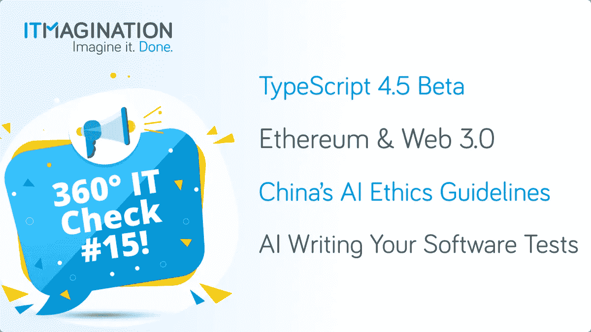

# 360 IT Check # 15-TypeScript 4.5 Beta、以太坊、Web 3.0、中文 AI 指南等等！

> 原文：<https://medium.com/geekculture/360-it-check-15-typescript-4-5-beta-ethereum-and-web-3-0-chinese-ai-guidelines-and-more-29a022ad1efc?source=collection_archive---------32----------------------->

# ‍TypeScript 4.5 测试版发布

[TypeScript，公司的救星，](https://www.itmagination.com/blog/node-js-changed-corporate-software-engineering)已经收到了一个新的版本，4.5 测试版。其中，我们有几个有趣的新奇事物，例如(这是一个不完整的列表):

*   Node.js 中的 ECMAScript 模块支持
*   模板字符串类型作为判别式
*   —模块 es2022
*   条件类型的尾递归消除
*   私有现场存在检查
*   使用 realPathSync.native 加快加载速度
*   JSX 属性的代码片段完成
*   对未解析类型的更好的编辑器支持

## EcmaScript 模块支持

ES 模块绝不是什么新东西。在过去的几年中，为了在 Node 中更好地支持它们，已经做了大量的工作，因为从历史上看，一切的基础都是 CommonJS 模块，这是默认选项。有相当显著的差异:

*   顶级等待；
*   进口/出口报表；
*   以及更多；

TypeScript 编译器现在启用了两个新的扩展名— *。mts* ，和*。cts* 。编译完成后，*。mts* 文件将被编译成较新的 es 模块和*。cjs* 到旧的 CommonJS 模块。对于 *package.json、*中的 *exports* 字段也有新的支持，并且有一个兼容性导入语句，允许与旧模块轻松互操作。详情请见微软的博文。

## *等待中的*类型

新的*等待*类型旨在帮助开发人员键入 await/async 操作的结果，以及*的结果。然后()*法言诺。详情请看 GitHub 上的这个帖子。

## 使用“realPathSync.native”加快加载速度

TypeScript 包含了 Node 的 *realPathSync* 的本机实现，这是一个用于计算文件的“规范路径名”的函数。以前只在 Linux 上使用，现在在 Windows 和 macOS 上也使用本机实现。某些项目可以从项目加载时间的“5–13%”改进中受益。

但是，有一些突破性的变化，您一定要详细检查: *lib.d.ts* 变化，“从*等待*的推理变化”，以及*编译选项*变化。详情见[这里。](https://devblogs.microsoft.com/typescript/announcing-typescript-4-5-beta/#breaking-changes)

# 以太坊:Web 3.0 开发者的首选平台

加密货币仍然是一个有争议的话题。对一些人来说，这是一个骗局，仅仅是允许洗钱。对其他人来说，这是一场前所未见的金融革命。不管你对这个话题的立场如何，互联网有一个新的分支正在发展。这就是去中心化的互联网，或者说“Web 3.0”。碰巧的是，目前整个行业的 60%到 70%运行在以太坊的区块链之上。

这种对以太坊的依赖产生了几个问题。首先，网络的容量“非常有限”。它目前只有每秒 15 次交易，这是一个巨大的问题，因为这使得交易费用极高。较新的解决方案建立在以太坊的区块链之上，在其上运行额外的层，这大大提高了可能的交易速率。

然而，这不是问题的解决方案，而仅仅是一种变通办法。另一个问题是区块链落后于现代化。例如，从目前的“工作证明”算法到新的“利益证明”算法的转换早就应该进行了。另一个变化是数据库分片，或者换句话说，将它分成多个独立的(但链接的)实例。

这为其他区块链创造了发光的空间——包括雪崩、索拉纳和卡尔达诺。虽然它们没有那么受欢迎，但是它们解决了可伸缩性的问题，但是没有解决可用性的问题，就像最近[索拉纳出去了 17 个小时。](https://www.bloomberg.com/news/articles/2021-09-18/solana-trading-how-outage-reveals-vulnerability-of-crypto-blockchains)

对于所有的 Web3 开发者来说，未来都是激动人心的时刻，因为去中心化的 Web 将随着一些浏览器越来越受欢迎，例如 Brave，旨在简化使用下一代 web 的体验。

# 中国发布第一套人工智能伦理指南

[中国发布了一套人工智能伦理准则](https://www.scmp.com/tech/big-tech/article/3150789/chinese-ai-gets-ethical-guidelines-first-time-aligning-beijings-goal)(此处为草案，[普通话](http://www.cac.gov.cn/2021-08/27/c_1631652502874117.htm))“强调用户权利和数据控制。”总体目标是到 2030 年成为全球人工智能领导者。这套指导方针是“所有国家中最全面的努力”

墨卡托中国研究所的丽贝卡·阿塞萨蒂对公布的指导方针发表了评论:

> *中国最终选择了一种高压模式，在这种模式下，国家非常认真地思考人工智能将带来的长期社会变革，从社会异化到生存风险，并试图积极管理和引导这些变革*

此外，此举可以被视为旨在控制大型技术的又一举措。[在过去的几个月里](https://www.itmagination.com/blog/360deg-it-check-9-android-12-beta-signal-mobile-coin-chinese-tech-go-117-ddos-cloudflare)，中国政府希望惩罚所有不尊重用户隐私、数据指南或采用上瘾做法的平台。最大的玩家也未能幸免于清洗——名单中的公司包括腾讯、阿里巴巴和字节跳动。关于人工智能的新规则是一件严肃的事情——有许多业务建立在人工智能和人工智能支持的基础上，例如内容推荐或索引数据。

# 人工智能编写您的测试

软件开发过程中一个绝对重要的部分是为质量保证编写测试。不幸的是，这是一个经常被忽视的过程，因为它被认为太费时间了。 [Ponicode](https://www.ponicode.com) 的作者肯定知道这一点，这也许是他们创造这一产品的原因。

在上周的产品搜索中，该引擎目前支持 JavaScript、TypeScript 和 Python。助手承诺以一种根本不需要你写任何东西的方式为你写测试。‍

《360 IT Check》是一份周刊，在这里我们为您带来世界上最新最棒的技术。我们涵盖的主题包括新兴技术&框架、创新创业公司的新闻以及其他直接或间接影响技术世界的主题。

喜欢你正在读的东西吗？请务必订阅我们的[每周简讯](https://www.itmagination.com/newsletters/360-it-check)！

*原载于*[*https://www.itmagination.com*](https://www.itmagination.com/blog/360deg-it-check-15-typescipt-ai-china-web3-ethereum-ponicode)*。*