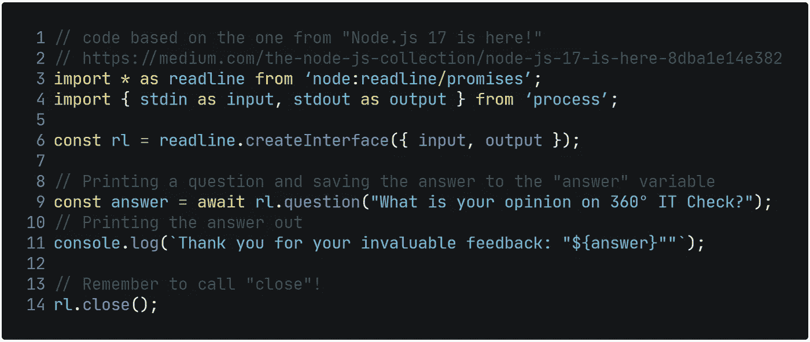

# 360 IT Check #18 — Node.js 17、浏览器中的 Visual Studio 代码等等！

> 原文：<https://medium.com/geekculture/360-it-check-18-node-js-17-visual-studio-code-in-your-browser-and-more-e86d6012550?source=collection_archive---------29----------------------->

# Node.js 17 发布。节点 16 成为 LTS 版本。

Node.js 16 已经是过去式了，版本 16 成为了长期支持(LTS)版本，版本 17 成为了当前版本。当前版本将“大约”每两周更新一次。

最重要的特征是:

*   原料药的额外“承诺”
*   OpenSSL 3.0
*   使用 Node.js 版本堆栈跟踪
*   性能改进

## 原料药的“承诺”

该项目的战略举措之一是“提供额外的基于承诺的核心 API”这项倡议只有一个目的。这是为了提高运行时的整体性能，因为基于承诺的 API 不会像同步操作那样阻止程序的执行。

这种变化由节点的*读取线*模块来说明。

如果你想在你的电脑上运行这个例子，[请看这个 GitHub 库](https://github.com/aleksanderjessitm/nodejs-17-promises)。

## OpenSSL 3.0

一个重要的升级，OpenSSL 库的新版本是 Node.js 的一大进步。到目前为止，使用的版本是 1.1.1。对于运行时版本 17，该团队决定继续前进，升级底层加密库。这是为了允许每个人在下一个长期支持版本发布之前用 OpenSSL 3.0 测试他们的代码。

## 使用 Node.js 版本堆栈跟踪

你正在使用的软件版本是调试时的一个关键信息，这就是为什么从现在开始，如果出现问题，Node 将输出它的版本。

## 性能改进

性能的提升得益于谷歌的 V8 引擎从 9.4 更新到 9.5。

# 浏览器中的 Visual Studio 代码

Visual Studio 代码可能是世界上最受开发人员欢迎的文本编辑器，现在可以在浏览器中使用…无需任何安装或注册(截至 2021 年 10 月 25 日)。

对于所有 Chrome 和 Edge 用户来说，新的网络应用提供了一些有趣的功能——这要归功于对你的文件的本地访问。由于这一点，您现在有了一个不需要任何安装的全功能编辑器。总的来说，这是网络应用的一个未被充分讨论的好处，也是一个巨大的好处。

# Microsoft Power BI 十月更新

微软的商业智能套件已经收到了 10 月份的更新，带来了一些期待已久的功能。据 ITMAGINATION 的数据开发人员 Krzysztof Nowocin 称，最显著的变化是:

*   [针对 Power BI 数据集和 Azure 分析服务的 DirectQuery】](https://powerbi.microsoft.com/en-us/blog/power-bi-october-2021-feature-summary/#post-17563-_Toc84518681)
*   [选择桌子时更加灵活](https://powerbi.microsoft.com/en-us/blog/power-bi-october-2021-feature-summary/#post-17563-_Toc84518682)
*   [性能提升](https://powerbi.microsoft.com/en-us/blog/power-bi-october-2021-feature-summary/#post-17563-_Toc84518683)

关于所有新特性的概要，请看开发者自己的视频。

# Windows 11 上的 Android 应用

微软操作系统的最新版本 Windows 11 现在可以在最新的 Windows Insiders 版本中运行 Android 应用程序。该功能是该公司与亚马逊合作的结果。安卓应用可以在 Windows 上运行，从“亚马逊应用商店”安装。这是一次奇怪的合作，因为这两家公司在云领域是巨大的竞争对手，激烈争夺客户和政府合同。

# 全部热重装

[上周，微软宣布决定重新加载一个仅支持 Visual Studio 2022 的特性，这激怒了更广泛的开源社区。](https://www.theverge.com/2021/10/23/22742282/microsoft-dotnet-hot-reload-u-turn-response)实际上，这意味着你的应用程序在改变后立即重新加载的能力将是 Windows 独有的特性。

幸运的是。NET 开发人员，这原来是一个简单的误解。正如雷德蒙公司解释的那样，他们没有禁用有问题的代码，而是删除了它。接受了恢复特性的拉请求后，我们可以期待关键特性与一起发布。下个月净 6。

*原载于*[*https://www.itmagination.com*](https://www.itmagination.com/blog/360deg-it-check-18-node-17-vs-code-dotnet-hot-reload)*。*