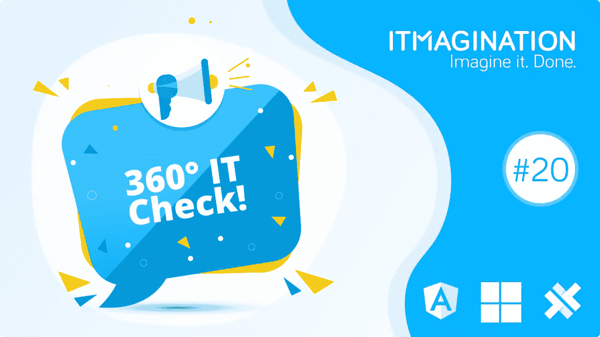

# 360 IT Check #20 — Angular 13 发布，电容 3.3，微软 Ignite 2021！

> 原文：<https://medium.com/geekculture/360-it-check-20-angular-13-released-capacitor-3-3-and-microsoft-ignite-2021-8ca4dd305f59?source=collection_archive---------16----------------------->

# Angular 13 发布——6 个重要变化

大型前端应用程序的 TypeScript 框架 Angular 现在已经进行了第十三次重大更新。正如每个版本一样，框架背后的团队研究了增强它的选项，这一次他们扩展了基于 Ivy 的特性和优化。

最重要的是，不再支持 4.4.2 之前的所有 TypeScript 版本。

## 更改角度封装格式(APF)

Angular 包格式是核心 Angular 团队的结构化约定。这就是第一方包的结构，也是第三方包的结构。

开发团队已经决定像过去一样移除旧的输出格式，从而专注于最新的格式。在其网站上，他们指定第一方角包将在 ES2015 年和 ES2020 年输出。"作为这些变化的结果，库开发者可以期待更精简的包输出和更快的执行."

## 拆除 IE11 支架

由于微软今年早些时候决定停止对它的支持，转而支持 Edge，我们再也不需要担心 Internet Explorer 11 了。

移除 IE11 支持允许所有项目更快、更轻。Angular 现在还可以利用现代浏览器功能，如 CSS 变量和通过本地 web APIs 的 web 动画。

要放弃对 Internet Explorer 最新版本的支持，只需运行 *ng update* 就足够了。

## 组件 API 更新

在过去，动态创建组件并不容易。许多必须编写的代码是重复的，而且编写起来很麻烦。现在，不需要包含 *CmponentFactoryResolver* ，因此我们可以编写更少的代码。

## 命令行界面(CLI)改进

Angular 的 CLI 也得到了一些改进。“持久构建缓存”现在默认启用。这一举措带来了“高达 68%的构建速度提升。”

## Adobe 字体的字体“内联”

两个版本之前，随着 v11 的发布，团队引入了对更快加载 Google 字体的解决方案的支持。Adobe 字体现在也启用了“内联”,而且这种做法现在默认启用。

## 重大变化

有很多突破性的变化。要了解所有这些，请看【GitHub.com 的文章[。](https://github.com/angular/angular/releases/tag/13.0.0)

阅读官方公告全文: [Angular v13 现已上市。我们带着全新的版本回来了……|作者马克·汤普森(@ marktechson)| 2021 年 11 月| Angular 博客](https://blog.angular.io/angular-v13-is-now-available-cce66f7bc296)

# 微软点燃 2021

在年度会议 Ignite 上，微软宣布了相当多的新产品和更新。

## Azure OpenAI 服务

开创性的 GPT-3 自然语言模型背后的公司 OpenAI 与来自雷蒙德的公司合作，允许通过 Azure 平台访问 OpenAI 的 API。尽管这项服务最初只接受邀请，但少数幸运者将能够获得 GPT-3 模型。‍

微软负责 Azure OpenAI 的产品经理 Dominic Divakaruni 举了一个例子来说明这种访问是如何有用的:

> *GPT-3 的潜在企业用途包括总结客户服务日志中的常见投诉，帮助开发人员更快地编写代码，而不必停下来搜索示例或生成新内容作为博客文章的起点*

## 微软网格

微软带着他们的混合现实产品进入元宇宙竞赛。该公司的团队软件将获得一套虚拟化身，你将能够在明年使用。你将不必使用虚拟现实耳机。体验会有不同程度的“被虚拟”。有一个选项可以使用你的头像作为占位符，让它对你的声音提示做出反应，例如，当你按下按钮举手时，请举手。最“虚拟”的是能够完全进入虚拟会议空间**。**

## **微软循环**

**一些人称这项新服务为新概念。事实上，它确实与该产品非常相似，增加了实时跟踪人们光标的功能——点击查看[完整公告和功能。](https://www.itmagination.com/blog/360deg-it-check-20-angular-13-microsoft-ignite-2021-and-capacitor-3-3)**

## **人工智能驱动的办公室**

**Context IQ 是该公司在其部分产品中内置的一套新的“人工智能体验”。现在，您将根据您键入的内容获得附加文件、会议时间等建议。**

**有关会议的所有新闻，请访问本页。**

# **电容器 3.3 释放**

**Capacitor 是“构建 Web 本地应用的本地运行时”它允许你运行你的网络应用作为 iOS 和 Android 应用，此外还可以作为使用一个代码库的[渐进式网络应用](https://www.itmagination.com/blog/cross-platform-mobile-apps-pwa)。**

**运行时得到了一个新的版本，[编号为 3.3](https://ionicframework.com/blog/announcing-capacitor-v3-3-0/) 。该版本没有最大的发行说明文件；然而，这样的发布同样重要。**

**这一次，有一些与 cli、核心运行时和 iOS 运行时相关的错误修复。新功能现在包括例如重新加载 WebView 的能力。你可以在这里看到[变化的完整列表。](https://github.com/ionic-team/capacitor/releases/tag/3.3.0)**

**‍**

****360 IT Check** 是一份周刊，在这里我们为您带来世界上最新最棒的技术。我们涵盖了新兴技术&框架、创新创业公司的新闻以及其他直接或间接影响技术世界的话题。**

**喜欢你正在读的东西吗？请务必订阅我们的[每周简讯](https://www.itmagination.com/newsletters/360-it-check)！**

***最初发表于*[*https://www.itmagination.com*](https://www.itmagination.com/blog/360deg-it-check-20-angular-13-microsoft-ignite-2021-and-capacitor-3-3)*。***