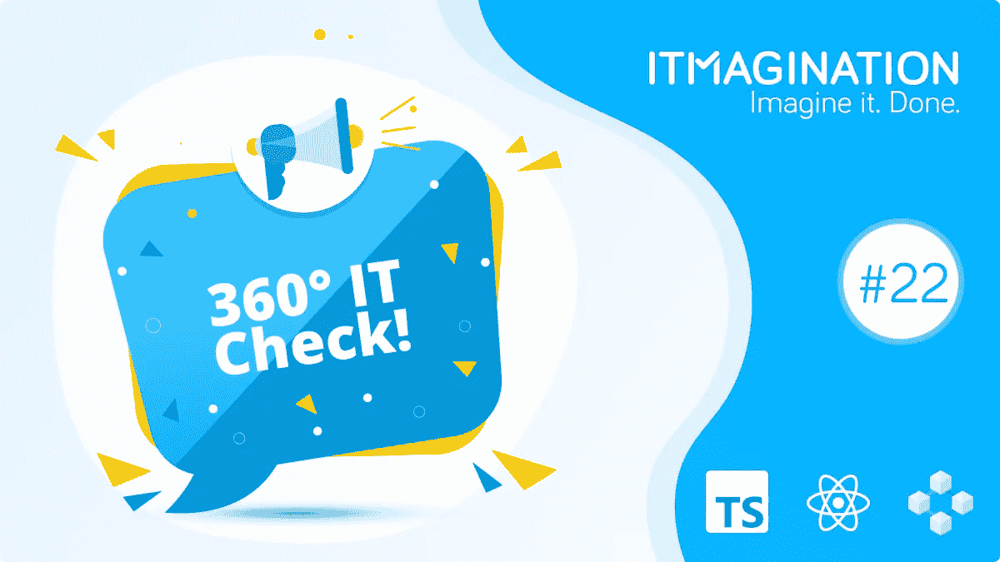

# 360 IT Check #22 —针对“AWS for Web3”、TypeScript 4.5 等的巨大系列 C！

> 原文：<https://medium.com/geekculture/360-it-check-22-huge-series-c-for-aws-for-web3-typescript-4-5-and-more-a7750835e7be?source=collection_archive---------29----------------------->

# “AWS for Web3”拥有数亿台

“Web3 的 AWS”[Alchemy](https://www.alchemy.com/)，刚刚在他们的[系列 C](https://blog.alchemy.com/blog/alchemy-series-c-release) 中筹集了令人印象深刻的 2.5 亿美元。该公司的估值高达 65 亿美元。

这笔钱将用于“继续专注于建立一个平台，为全球开发者带来区块链、去中心化和 Web3 的好处。”目前的产品包括 *Supernode* ，一个以太坊 API， *Build，*“原型开发和调试工具”或 NFT API，“轻松构建你的 NFT 应用”此外，这些工具适用于许多链，包括以太坊和多边形，以及 Flow、Arbitrum 和乐观主义。

一个全面的一体化解决方案可能正是成熟的 Web3 应用生态系统所需要的。尽管我们似乎仍处于早期采用阶段，但已经有数量惊人的应用程序运行在该解决方案之上，如 0x，处理 10 亿美元的交易。顺便说一句，如果你对未来的去中心化网络充满热情，我们有工作机会等着你。

# React 18 升级为测试版

[React 18，我们之前写过，](https://www.itmagination.com/blog/360deg-it-check-11-react-js-concurrent-mode-chrome-93-v8-9-3-edge-computing-with-5g-windows-11)现在提升到 beta 状态。开发者可以期待更多的稳定性。尽管我们建议等到稳定版本发布，React 团队还是让每个人都知道测试版“已经准备好在生产中测试了”。

然而，我们必须缓和一下激动的情绪。18.0 中将不包含服务器组件。它们将包含在“未来的 18.x 次要版本”中。

# 发布了 TypeScript 4.5

[TypeScript 4.5，我们之前也写过](https://www.itmagination.com/blog/360deg-it-check-15-typescipt-ai-china-web3-ethereum-ponicode)，现在[发布](https://devblogs.microsoft.com/typescript/announcing-typescript-4-5/)。

为了快速提醒一下这些特性，[请不要犹豫阅读我们之前的博客文章](https://www.itmagination.com/blog/360deg-it-check-15-typescipt-ai-china-web3-ethereum-ponicode)，尽管提醒一下，最重要的特性是:

*   新的*等待着*型
*   *-模块 es2022* 目标第一次稳定发布
*   更快的加载时间
*   新代码片段完成

自从测试版和 RC 版以来有了一些变化。最重要的是，对 ES 模块的支持将使它在以后成为 TypeScript。等待中的*型*得到了进一步的改进。

这绝不是一份详尽的清单。要获得稳定版的完整变更列表，请阅读微软的博客[帖子](https://devblogs.microsoft.com/typescript/announcing-typescript-4-5/)。

# 灯塔 9

流行的网站审计工具 Lighthouse 获得了一个重要的更新，编号为 9。它现在可以在命令行工具、Chrome Canary 和 PageSpeed Insights 中使用。Chrome 用户将可以在 Chrome 98 中使用它。

该工具现在可以在其生命周期中的任何时候测试您的页面。如需演示，请访问 [web.dev](https://web.dev/lighthouse-user-flows/) 。易访问性测试得到了显著的提升。该工具现在不仅检查重复的 id，还检查表单字段上的多个标签，检查对比度等等。完整的列表令人印象深刻，可以在这里找到。

‍:也有一些突破性的变化。首先，Lighthouse 移动到节点 14 作为所需的[最低版本](https://github.com/GoogleChrome/lighthouse/pull/13243)。其次，三个审计已经不存在了:appcache-manifest one 、*external-anchors-use-rel-noopener*(更多关于这个[在这里](https://github.com/GoogleChrome/lighthouse/issues/9531))和*重定向-http* [审计](https://github.com/GoogleChrome/lighthouse/pull/12643)。最后，这个版本有更多突破性的变化。如需完整列表，请访问[本期](https://github.com/GoogleChrome/lighthouse/issues/12614) GitHub。

*原载于*[*https://www.itmagination.com*](https://www.itmagination.com/blog/360deg-it-check-22-alchemy-web3-google-lighthouse-typescript-react)*。*