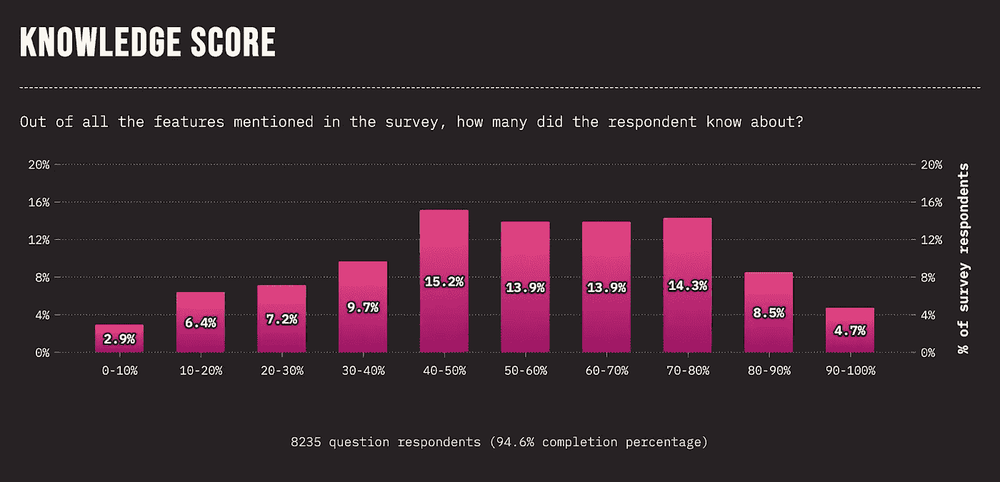
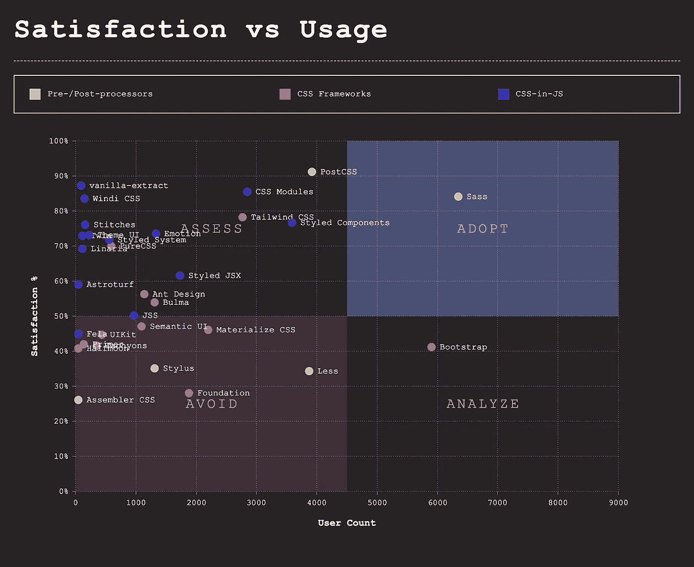
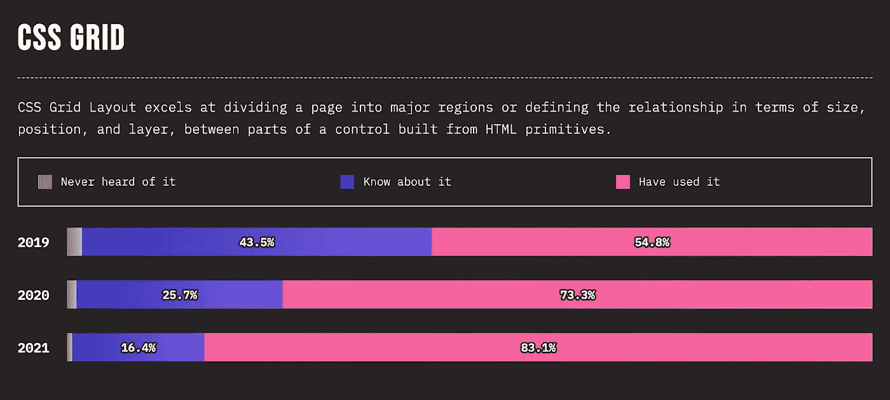

# 360 IT Check #26 — Stack Overflow 的创始故事、在公开披露之前被利用的 Log4j，等等！

> 原文：<https://medium.com/geekculture/360-it-check-26-stack-overflows-beginnings-log4j-exploited-before-public-disclosure-and-more-e03fd88214d5?source=collection_archive---------25----------------------->

# 在公开披露之前利用 Log4j 漏洞

Log4j 漏洞，俗称“Log4Shell”，最近火遍了整个互联网。上周，Cloudflare 团队在他们的博客上分享说，他们有证据表明黑客在公开披露前八天测试了漏洞 [**。**](https://blog.cloudflare.com/exploitation-of-cve-2021-44228-before-public-disclosure-and-evolution-of-waf-evasion-patterns/) 第一次尝试利用框架中的漏洞是在[宣布](https://blog.cloudflare.com/exploitation-of-cve-2021-44228-before-public-disclosure-and-evolution-of-waf-evasion-patterns/)后九分钟。

开发的最初阶段“主要是关于侦察”，而我们现在看到了数据提取的尝试。袭击的规模令人震惊。12 月 13 日，Cloudflare 平均每分钟阻塞**“24，642”个请求**。

我们提醒大家，该漏洞正在被积极利用，因此您必须采取措施保护自己免受攻击者的攻击。我们在之前的博客文章中写了如何做到这一点。

# 创始人讲述的堆栈溢出历史

很少有网站比 Stack Overflow 更受开发者青睐。一些人也想知道在网站上线之前是如何构建软件的。如果你是这些人中的一员，你会很高兴地知道，[因为公司的剧集已经到了第 400 集，创始人们决定讲述他们创业初期的故事。](https://stackoverflow.blog/2021/12/14/podcast-400-an-oral-history-of-stack-overflow-told-by-its-founding-team/)

播客这一集的文字记录可在[这里](https://the-stack-overflow-podcast.simplecast.com/episodes/oral-history-of-stack-overflow-founders/transcript)获得。

# 抖音的新游戏流媒体应用非法分叉 OBS？

来自中国字节跳动的平台抖音正在测试一项新功能，开发者可以像在 Twitch 上一样流式传输他们的游戏。

有趣的是，事实证明这家中国公司的解决方案违反了 OBS 的开源许可。OBS 是 PC 直播的标准，它是在 GNU 公共许可证(GPL)下授权的，这是一个非常宽松的许可证，只有一个限制:你必须开源他们的代码。

开发广播软件的团队成员之一 Ben Torell 在推特上表示，他们已经与该公司取得联系，以解决这个问题。

# CSS 2021 的状态

CSS——图灵完整语言使得 div 很难居中——是今年“CSS 状态”调查的焦点。

可以得出一些有趣的结论。

Source: [https://2021.stateofcss.com/en-US/](https://2021.stateofcss.com/en-US/)

首先，所有 CSS 特性的认知度都相当低。如上图所示，大约 40%的受访者对调查中提到的功能的了解不到 50%。这表明对整个社区的了解很少。

Source: [https://2021.stateofcss.com/en-US/](https://2021.stateofcss.com/en-US/)

其次，唯一在采用象限中的技术是… Sass。还有另外两种技术接近实现它——Bootstrap 和 PostCSS。

我们要提到的第三个也是最后一个亮点是 CSS 网格的日益流行。CSS Grid 可以毫不费力地划分你的布局，并以你认为合适的方式设计页面的每一部分。与 flexbox 一起使用，这是设计网站的默认方式。今年，超过 80%的受访者承认他们使用过原生网格，而只有 0.7%的人承认他们从未听说过它。

欲了解完整结果，请务必前往[https://2021.stateofcss.com/en-US/](https://2021.stateofcss.com/en-US/)。

# 奖励:GitHub 档案的年度总结

随着年底的临近，你可能已经收到了你的 [Spotify Wrapped 2021](https://www.itmagination.com/blog/spotify-wrapped-2021-design-analysis) 总结。

对于程序员来说，获得 GitHub 概要文件的摘要会很酷，对吗？现在你可以了。如果你去 https://wrapped.run/的，你可以对你的编码习惯进行个人评估。

*原载于*[*https://www.itmagination.com*](https://www.itmagination.com/blog/360deg-it-check-26-stack-overflow-log4j-tiktok-obs-css-github)*。*

360 IT Check 是一份周刊，在这里我们为您带来世界上最新最棒的技术。我们涵盖了新兴技术&框架、创新创业公司的新闻以及其他直接或间接影响技术世界的话题。

喜欢你正在读的东西吗？请务必订阅我们的[每周简讯](https://www.itmagination.com/newsletters/360-it-check)！

*最初发表于*[T5【https://www.itmagination.com】](https://www.itmagination.com/blog/360deg-it-check-26-stack-overflow-log4j-tiktok-obs-css-github)*。*