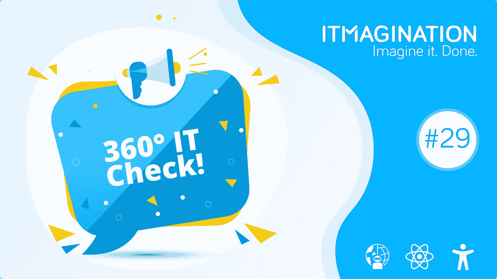
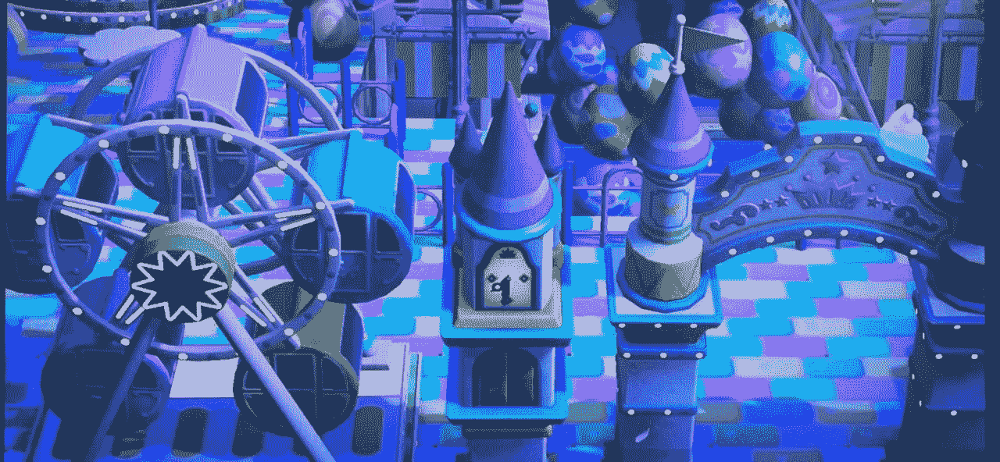

# 360 IT Check #29 —元宇宙运动、CES 2022 等！

> 原文：<https://medium.com/geekculture/360-it-check-29-the-metaverse-movement-ces-2022-and-more-5c8b2c3c8c98?source=collection_archive---------20----------------------->

# 元宇宙运动

元诗句正以飞快的速度加速。我们还没有完全意识到现在是 2022 年，我们就收到了令人震惊的消息:H M 在元宇宙的一家店。

或者我们有吗？事实证明，整个视频只是一个概念，瑞典服装巨头[的发言人否认了一切](https://www.forbes.com/sites/markfaithfull/2022/01/06/ceek-and-you-wont-find-hm-denies-metaverse-rumors/?sh=1ee90fd3244c)说:

> *我们想确认 H & M 目前没有在元宇宙开店。我们也没有与 CEEK 合作。*

虽然这样的合作对于时尚界和虚拟世界来说是向前迈出的一大步，但这只是一个聪明的营销举措(也许侵犯了版权)。

这不是关于元经文的唯一消息。事实证明，高通和微软一起为 XR(扩展现实)设计芯片。关于合作的细节知之甚少，除了公司将专注于为混合现实和虚拟的设备提供动力，而不仅仅是向人们展示他们的耳机所呈现的世界。

**底线**

正如我们在今年的预测中所写的那样，元诗句肯定会占据主导地位，甚至比人们想象的还要快。也有很好的理由。

对于品牌来说，元宇宙是一个接触更多客户、突破主流以及其他一切的机会。此外，虚拟世界不一定是“一号玩家”式的未来体验。在我们有一个完整的虚拟世界之前，我们可以退一步，设计不同的虚拟体验，这些体验不是沉浸式的，但仍然是可行的。任天堂的“动物穿越:新视野”似乎是一个吸引人的好方法。有两个很好的例子。

一个是脱口秀节目“动物对话”，一些著名的公众人物，如麦克·信田、微软的菲尔·斯潘塞或丹尼·特雷霍出现在这个大受欢迎的节目中。

还有一家是 Lush 的店。参观者可以探索品牌的岛屿，化妆品生产商在那里推广他们的产品线，接触他们的目标受众。

A screenshot from the video game “Animal Crossing: New Horizons” showcasing Lush’s piece of the virtual land.

当然，这个针对年轻人的游戏可能不会吸引老年人:我们展示这个只是为了让你知道元宇宙的竞赛已经开始了。幸运的是，每个人都有一个虚拟世界。如果你想加入这场竞赛,《哈佛商业评论》给出了一些建议。如果你想了解有哪些指针，[这里有相关文章](https://hbr.org/2022/01/how-brands-can-enter-the-metaverse)。

[正如这篇 Twitter 帖子](https://twitter.com/NimaZeighami/status/1478816178470473730)中所示，然而，重要的是**而不是**强迫任何事情只是为了炒作的一部分——如果创造这样的体验对你来说没有意义，就不要去做。

# 消费电子展 2022

CES，或称“消费电子展”是一年中第一个大型科技贸易展。当然，因为新冠肺炎，每次我们都在谈论一两次人事变动。这一次，[微软决定](https://www.reuters.com/technology/microsoft-will-not-participate-physically-ces-the-verge-2021-12-24/)不亲自出席活动，加入谷歌和亚马逊的行列。

[今年](https://www.wired.com/story/ces-2022-liveblog/)，几乎没有什么主题:远程工作，致力于让我们在家庭办公室的生活更轻松、更舒适的产品(如这款[屏幕](https://www.wired.com/story/ces-2022-liveblog/#:~:text=Dell%E2%80%99s%20UltraSharp%20Monitor%20Will%20Help%20Make%20Video%20Calls%20Less%20Horrible))、增强和虚拟现实、物联网，显然还有……移动性，索尼发布了一款令人惊喜的汽车。

可能缺少的一件事是更多由回收产品制成的产品，对环境更友好。然而，在联想的展示之后，希望之光出现了。

**底线**

CES 是年初的一个大事件，世界上一些最大的公司在这里展示他们在今年剩余时间里的产品。如果你想从硬件生产商的角度看看可能会发生什么，这个事件是值得关注的。

# 反应功能组件类型

在编写 Typescript 中的 React 应用程序时，React 功能组件的常见类型注释是 React.FC. [事实证明，这不是一个最佳选择，](https://spin.atomicobject.com/2022/01/04/think-twice-react-fc/)因为它允许组件拥有子组件，即使您没有明确声明您想要这样。你的编辑不会抱怨，让你去做你想避免做的事情。

也许没什么大不了的，尽管隐含地允许这样做的决定很重要。

**底线**

到目前为止经常使用的类型，允许一些可能不希望的结果。而不是*做出反应。FC* 使用*反应。反应 17 上的 VoidFunctionComponent* ，和*反应。功能组件*从 React 18 开始。

在代码库中检查您是否使用了正确的类型注释可能是值得的。

# 面向弱势群体的 Microsoft Office 加载项

虽然屏幕阅读器一年比一年好，但它们仍然不能可靠地识别图像上的内容。这就是为什么你的同事需要进来，并留下评论或设置 alt-text 属性。问题是…他们并不总是这样做。

来自微软的新的 [Office 插件](https://appsource.microsoft.com/en-us/product/office/WA200003509?tab=Overview)允许人们留下“可访问性提醒”来请求澄清。

**底线**

残疾人就在我们身边，如果你不经常与他们交流，有时很难记住他们。通过为这个弱势群体设计一个应用程序，他们不再需要受同事的摆布，稍微改善了他们的生活。

下一个重要的步骤是开发一个应用程序，让人们可以询问光标下有什么，或者类似的人工智能图像识别软件。

***360 IT Check****是一份周刊，在这里我们为您带来世界上最新最棒的技术。我们涵盖了新兴技术&框架、创新创业公司的新闻以及其他直接或间接影响技术世界的话题。*

喜欢你正在阅读的东西吗？请务必订阅我们的 [*每周简讯*](https://www.itmagination.com/newsletters/360-it-check) *！*

*原载于*[*https://www.itmagination.com*](https://www.itmagination.com/blog/360deg-it-check-29-metaverse-ces-2022-microsoft-365-react)*。*