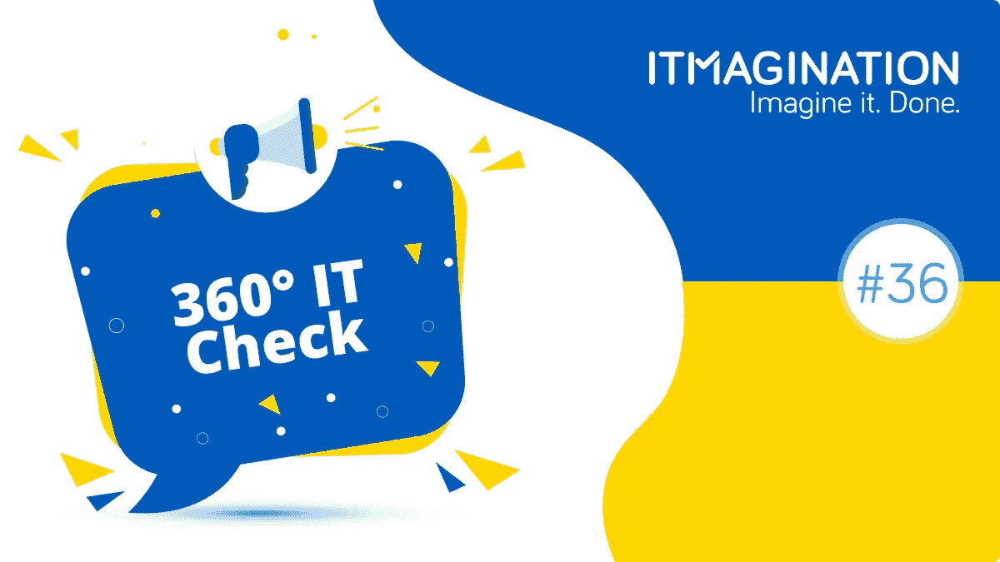

# 360 IT Check # 36——如何有意义地帮助乌克兰和乌克兰人

> 原文：<https://medium.com/geekculture/360-it-check-36-how-you-can-help-ukraine-and-ukrainians-meaningfully-1fdb5c3c61ac?source=collection_archive---------17----------------------->

2 月 24 日，欧洲停摆。俄罗斯军队进入乌克兰。我们将这一 360 IT 检查致力于当前手头最重要的事情。

它与乌克兰和乌克兰人民站在一起。我们承诺在这些困难时期帮助乌克兰的非政府组织和人民。

 [## LinkedIn 上的 it imagination:# techforukraina # support ukraina # SolidarnizUkraina

### 作为我们支持乌克兰团队成员和朋友的一部分，作为一家科技公司，我们加入了…

www.linkedin.com](https://www.linkedin.com/embed/feed/update/urn:li:share:6902594248739536896) 

# 你如何有意义地帮助乌克兰和乌克兰人？

## 非财务承诺

*   LinkedIn 上有一个[群组将乌克兰人与波兰等国的公司](https://www.linkedin.com/groups/12634357/)联系起来。乌克兰人的就业为他们提供了一个安全的住所，如果他们决定寻求庇护，还可以资助他们在波兰逗留；
*   你的公司可能会加入[科技拯救乌克兰的行动#TechForUkraine](https://techtotherescue.org/tech/tech-for-ukraine) 。你可以为乌克兰的非政府组织开发解决方案，为他们提供建议/指导，保护他们现有的解决方案，等等——所有这些都是*公益/非商业*。一切都是为了让他们更有效地帮助乌克兰平民；
*   打击虚假信息。散布关于东部局势的不真实信息是让公众扪心自问到底发生了什么的更广泛过程的一部分。Ground.news 是一个保持消息灵通的好网站，因为它汇集了来自众多来源的新闻，并对其真实性进行评级，显示谁拥有该出版物，等等。此外，有些人你可以在 Twitter 上关注，他们来自波兰的东部邻国。你可以遵循的一个列表是[这里](https://twitter.com/i/lists/1497203400232087560?s=20)；
*   联系你在乌克兰认识的人，问问他们过得怎么样。尽管这可能不会给他们所需要的心理安慰，但这种行为肯定会受到赞赏。除此之外，[你也可以给他们发一个链接，里面有一些关于在波兰逗留的资源，以及关于发送帮助和援助乌克兰同胞的资源](https://docs.google.com/spreadsheets/u/0/d/1dYssbkhJMJq5pA8q92byQ_UykCM2sC7ArL72lE07WsE/htmlview)。这个资源是我们在 ITMAGINATION 的同事和波兰的其他人发起的。
*   抵制俄罗斯亿万富翁拥有的公司提供的俄罗斯商品和服务。普通俄罗斯人不是你的敌人，也不是冲突的一方。事实上，他们中的许多人在这个国家的街道上抗议，尽管他们无疑将面临镇压；

## 向在冲突地区工作的乌克兰非政府组织捐款，例如:

*   向乌克兰红十字会捐款[https://www . ICRC . org/en/where-we-work/Europe-central-Asia/Ukraine](https://www.icrc.org/en/where-we-work/europe-central-asia/ukraine)
*   孩子们的声音【https://voices.org.ua/en/ 
*   “声援乌克兰”[波兰]【https://lnkd.in/dV2VJPkq 
*   加入 https://www.facebook.com/RazomForUkraine/fundraisers 脸书[的筹款活动](https://www.facebook.com/RazomForUkraine/fundraisers)
*   联合帮助乌克兰[http://unitedhelpukraine.org](http://unitedhelpukraine.org/)‍

如果你需要过去几年乌克兰发生的事情的背景，那么你可以看、读、听的东西很少。

*   [冬天着火](https://www.netflix.com/pl-en/title/80031666)(电影)
*   [地图和图表中解释的乌克兰和俄罗斯](https://www.aljazeera.com/news/2022/1/28/ukraine-and-russia-explained-in-maps-and-charts-interactive)
*   [乌克兰入侵—解释](https://www.npr.org/series/1082539802/russia-ukraine-invasion-explained)
*   [地球蓝如橙(2020)——IMDB](https://www.imdb.com/title/tt11394290/)(电影)

360 IT Check 是一份周刊，在这里我们为您带来世界上最新最棒的技术。我们涵盖了新兴技术&框架、创新创业公司的新闻以及其他直接或间接影响技术世界的话题。

喜欢你正在读的东西吗？请务必订阅我们的[每周简讯](https://www.itmagination.com/newsletters/360-it-check)！

*原载于*[*https://www.itmagination.com*](https://www.itmagination.com/blog/360deg-it-check-36-how-you-can-help-ukraine-and-ukrainians-meaningfully)*。*