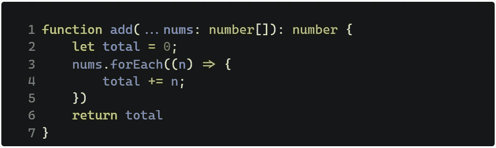

# 360 IT Check # 38—JavaScript 中的类型、Rust at 1Password 等等！

> 原文：<https://medium.com/geekculture/360-it-check-38-types-in-javascript-rust-at-1password-and-more-b1da5530f058?source=collection_archive---------15----------------------->

摘要

*   随着 TypeScript 团队的新提议，Types **可能会转向 JavaScript**
*   1Password 的高级开发人员 Nathan West 分享了 Rust 在该公司的起源，以及他们当前对安全编程语言的应用；
*   AWS 宣布专门用于内存密集型任务的新 EC2 实例正式上市；
*   在 IPFS 上运行的 Web3 应用 Functionland 旨在为应用开发者创建一个真正免费的平台。

# JavaScript 中的类型

[微软的新提议将给 JavaScript 带来“可擦除和可选”。](https://devblogs.microsoft.com/typescript/a-proposal-for-type-syntax-in-javascript/)

已经有一种指定类型的方法，既实现了编辑器内部的安全性，又是完全可选的，最终会被忽略。这就是所谓的“JSDoc”注释。下面是代码现在的样子:

一些额外的台词，但不算太糟。

如果新提案被采纳，下面是这段代码的样子:

它更短，并且实现了与更长版本相同的目的。关键的是，唯一会改变的是**语法本身**。没有团队需要对浏览器进行修改，甚至在 JavaScript 环境中也是如此。

**底线**

提案背后的团队在 Rob Palmer 和 Romulo Cintra 的指导和支持下，希望在 2022 年 3 月(本月)提出这一变化。

新提案处于第 0 阶段，监管机构还没有正式看到它。进入下一个阶段，即第一阶段，意味着该提议将被认为是“值得考虑的”如果被接受，它可以为生态系统带来一个重要的、被高度要求的特性，而不会破坏数十亿行预先存在的代码。

此外，这似乎不是臭名昭著的 EEE 计划的最后一步。JavaScript 将保持现状(至少目前如此)。

# Rust &密码

1Password 因其密码管理器而闻名，[上周受到了关注，因为 Rust Foundation 上周在他们的博客上给了他们空间](https://foundation.rust-lang.org/posts/2022-03-08-member-spotlight-1password/)。网络安全公司的高级开发人员内森·韦斯特(Nathan West)分享了 Rust Foundation 的银牌会员 1Password 的语言用法的起源。

这一切都始于 2017 年，当时 Windows 团队开始尝试这种语言。“ugs 和崩溃报告减少了”，因此整个公司也开始使用 Rust。由于该公司的应用程序运行在众多环境中，包括浏览器扩展、原生移动应用程序等，实现统一的外观是一项艰巨的任务。幸运的是，如果你正在使用 Rust，那么这根本不是一个大问题。这种语言有无数的目标。

**底线**

最重要的是，如果你的目标是开发高性能的应用程序，那么你实际上有三个选择。C、C++和 Rust。选择列表中的最后一种编程语言是兼顾速度和安全的唯一方法。C 和 C++都非常不安全。

团队在各种场景中使用 Rust。 [Discord](https://blog.discord.com/why-discord-is-switching-from-go-to-rust-a190bbca2b1f) 用它来缓解延迟问题， [Dropbox](https://dropbox.tech/infrastructure/lossless-compression-with-brotli) 用它来更好更快地压缩文件。区块链，如索拉纳的是锈基，等等。有各种各样的可能性和机会。最重要的是，自 2016 年以来，该语言一直是年度堆栈溢出调查中关于开发者满意度的第一名。

[AWS，可以说是云服务市场的领导者，宣布其专用于内存密集型任务的新 EC2 实例正式上市。](https://aws.amazon.com/blogs/aws/new-amazon-ec2-x2idn-and-x2iedn-instances-for-memory-intensive-workloads-with-higher-network-bandwidth/)

# 用于内存密集型任务的新 AWS EC2 实例

[AWS，可以说是云服务市场的领导者，宣布其专用于内存密集型任务的新 EC2 实例正式可用。](https://aws.amazon.com/blogs/aws/new-amazon-ec2-x2idn-and-x2iedn-instances-for-memory-intensive-workloads-with-higher-network-bandwidth/)

有两种类型的实例。第一个是 x2idn，这是所有运行 Apache Spark 或 Presto 的人的梦想，以便在其他应用程序中生成实时分析。

如果您有一个高性能的数据库(Oracle SQL)，或者正在使用一个高负载的内存数据库(比如 Redis)，那么 x2iedn 就是您想要的版本。

**底线**

有两种类型的实例。第一个是 x2idn，这是所有运行 Apache Spark 或 Presto 的人的梦想，以便在其他应用程序中生成实时分析。

如果您有一个高性能的数据库(Oracle SQL)，或者正在使用一个高负载的内存数据库(比如 Redis)，那么 x2iedn 就是您想要的版本。

业务处理的数据量只会越来越多，而且呈指数级增长。难怪 AWS 等公司会不断推出更强大的产品。

# IPFS 的免费应用程序平台

[Functionland](https://fx.land) ，一个 [Web3](https://www.itmagination.com/blog/developing-web3-decentralized-application-3-considerations) 的免费应用平台和存储解决方案，出现在 [IPFS 的每周总结](https://blog.ipfs.io/weekly-172/)上。该平台的用户实际上拥有它，因为所有它运行在专用的、用户拥有的机器上。这是第一个真正免费的平台，你不需要支付数据、金钱或注意力。

**底线**

Web3 为完全原创和前所未闻的解决方案开辟了新的可能性，而这些解决方案在我们当前的 Web2 上是不可能(或难以)实现的。Functionland 只是其中之一，还有更多的例子。谁知道我们还会看到多少？

# 奖金

产品亨特问，人们交付。

*最初发表于*[*https://www.itmagination.com*](https://www.itmagination.com/blog/360deg-it-check-38-javascript-rust-1password-aws-ipfs-functionland)*。*