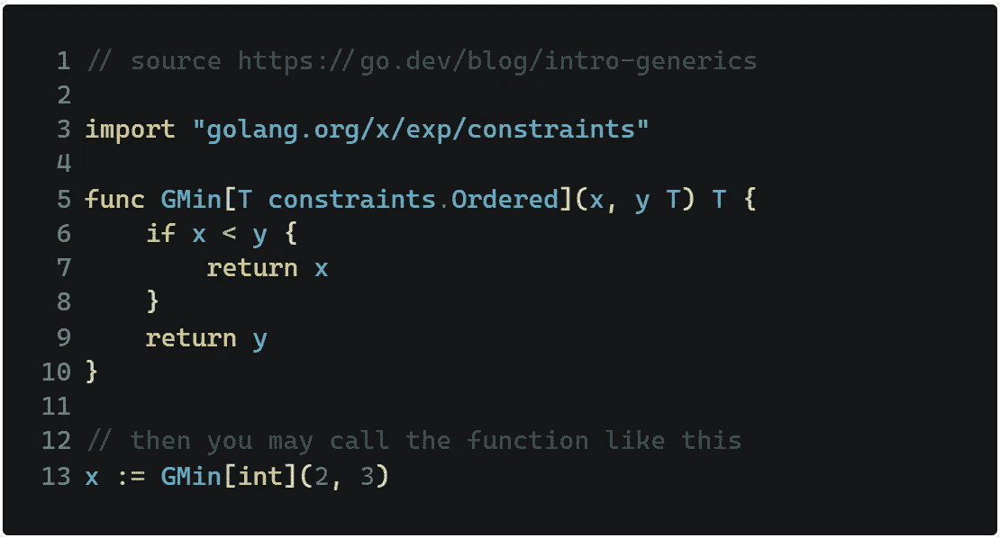

# 360 IT 检查#40 —反应岛。NET 很快就要达到支持的极限了，还有更多！

> 原文：<https://medium.com/geekculture/360-it-check-40-react-islands-net-reaches-end-of-support-soon-and-more-94047f31b46c?source=collection_archive---------24----------------------->

# 卫报的反应群岛

简而言之，现代网站的组成是一些静态的 HTML(有时更多，有时更少),上面贴满了 JavaScript。

它并不总是这样，页面完全呈现在后端。尽管在 SEO 和加载时间方面非常好，但是当你希望用户在一次访问中访问多个页面时，这对于用户体验来说并不是最好的。

输出动态内容的能力也受到了影响。解决办法？混合两种方法。这就是为什么广受欢迎的英国组织《卫报》用 JavaScript 的[“岛”(静态内容海洋中间的小的动态元素)](https://www.theguardian.com/info/2022/mar/25/react-islands-on-theguardiancom)创建完全静态的页面。有趣的是，他们使用自己的开源解决方案。查看更多详情[此处](https://github.com/guardian/dotcom-rendering/pull/3629)。

**底线**

不仅仅是《卫报》,更多的组织意识到，为了达到最佳效果，他们必须找到一种健康的方法组合，努力让机器人和用户都满意。我们还必须记住所有禁止 JavaScript 执行的人。直到最近，如果一个人禁用了流行编程语言的执行，他们将得到一个(几乎)空白页面。

尽管英国报纸有许多选项可供选择(例如 [Astro](https://www.itmagination.com/blog/360deg-tech-check-1-whats-astro-js-microsofts-major-achievement-and-more) ，但他们选择了创造自己的解决方案，你可以在 GitHub 上看到[。](https://github.com/guardian/dotcom-rendering/pull/3629)

# 。NET 5 即将达到支持极限

以防您的生产代码运行在。NET 5，[可能是考虑将](https://devblogs.microsoft.com/dotnet/dotnet-5-end-of-support-update/)切换到。NET 6。与版本 5 不同，最新的版本是一个“长期支持”版本，这意味着，您可以在相当长的一段时间内忘记必须切换。如果您需要进行迁移的激励，那么您可能会对开箱即用的性能增益感兴趣。

**底线**

[有意识地选择**不更新**你的工具会给你的公司和产品带来可怕的后果](https://www.itmagination.com/blog/refactoring-code)。推迟更新就像贷款一样:你必须为之付费，每个被忽略的主要版本就像是另一笔贷款。你可能会很快意识到，很快，你将无法负担所有的利息。所以是的，短期内，你会没事的。从长远来看，你不会。

# Salesforce GraphQL API

以 CRM 而闻名的 Salesforce 公司[上周宣布](https://developer.salesforce.com/blogs/2022/03/introducing-the-salesforce-graphql-api)引入 GraphQL API。[该解决方案](https://developer.salesforce.com/blogs/2022/03/introducing-the-salesforce-graphql-api)计划于 2022 年夏天进入测试阶段，“允许开发人员通过 GraphQL 与 Salesforce 平台进行交互，提供了一种创建丰富、高性能的移动和 web 应用程序的新方法。”

Salesforce 的 Ben Sklar 创建了一个很好的类比来比较传统的 REST APIs 和 GraphQL:

> 假设你在你最喜欢的餐馆，在这种情况下我们称之为餐馆。你的服务员走到你的桌前，问:“你想点什么？”‍回答说:“我要饺子，但是请不要在上面放奶酪。”让你懊恼的是，你的服务员解释说，“奶酪已经加进去了，不能拿走。你可以点奶酪馄饨，或者你可以点别的。”
> ‍
> 这里存在一个传统 REST 端点的基本问题——作为客户端的您无法改变奶酪馄饨端点返回给您的内容。如果这家餐厅是 GraphQL 餐厅，你可以点不加奶酪的馄饨。

**底线**

GraphQL 被认为是传统 REST APIs 的终结。正如人们可能认识到的那样，情况并非如此。很简单，每个解决方案都有它的用例，以及它会遇到困难的领域。GraphQL 应该摆脱所有不同的 API 端点，以改善后端和前端团队之间的合作，定制端点返回的内容，等等。是的，该解决方案实现了这些目标，尽管对更传统方法的需求并没有消失。如果有的话，开发商现在有更多的选择。

# Go 中的泛型

谷歌的编程语言之一 Go 最近经历了一次重大变化。这是开发人员经常抱怨的对泛型的临时支持。Go 的开发者听取了他们的意见，并引入了一个重要的改变。现在不使用*接口{}* 了，而是指定类型为 *T* ，并有可能限制可以使用的值。

**底线**

这是围棋有史以来最重大的变化之一，如果不是最重大的变化的话。尽管以前有可能获得类似的结果，但现在得到的代码更安全了。这都要归功于限制人们可以使用的类型的能力。

这是人们在 Golang 项目中使用泛型的方式:

更多信息，请观看此视频

*原载于*[*https://www.itmagination.com*](https://www.itmagination.com/blog/360deg-it-check-40-react-islands-net-reaches-end-of-support-soon-and-more)*。*